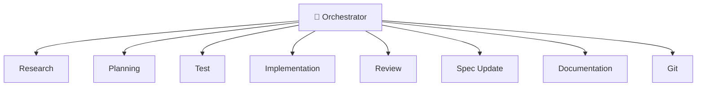

# Agent Role Definitions

This directory contains predefined agent roles for specialized task execution.

**Technology-agnostic**: These roles work with any language, framework, or stack. They reference `STACK.md` for project-specific details (test frameworks, file conventions, build commands).

## Available Roles

### 🎯 Orchestrator (Start Here!)

| Role | File | Purpose |
|------|------|---------|
| **Orchestrator Agent** | `orchestrator-agent.md` | **Coordinates all agents, ensures compliance** |

Use `@orchestrator-agent` to manage features. It delegates to specialized agents and verifies quality gates.

### Core Pipeline Agents

| Role | File | Purpose |
|------|------|---------|
| Research Agent | `research-agent.md` | Investigate tech choices, best practices |
| Planning Agent | `planning-agent.md` | Define features, write acceptance criteria |
| Test Agent | `test-agent.md` | Write tests |
| Implementation Agent | `implementation-agent.md` | Write code |
| Review Agent | `review-agent.md` | Code review, quality checks |
| Spec Update Agent | `spec-update-agent.md` | Update FEATURES.md and specs |
| Documentation Agent | `documentation-agent.md` | Update docs and README |
| Git Agent | `git-agent.md` | Commits, branches, PRs |

### Specialized Agents

| Role | File | Purpose |
|------|------|---------|
| API Design Agent | `api-design-agent.md` | Design REST/GraphQL APIs, contracts |
| Security Agent | `security-agent.md` | Security audits, vulnerability scanning |
| Refactor Agent | `refactor-agent.md` | Improve code structure, preserve behavior |
| Explore Agent | `explore-agent.md` | Codebase exploration, file finding |
| Database Agent | `db-agent.md` | Schema design, migrations, query optimization |
| Design Agent | `design-agent.md` | UI/UX design, wireframes, components |

## Usage

```
@orchestrator-agent Implement feature F-0042

@research-agent What's the best JWT library for our stack?

@implementation-agent Make the F-0042 tests pass
```

## Typical Feature Pipeline



The **Orchestrator** coordinates the pipeline, delegating to specialized agents and verifying quality gates at each step.

## How to Use These Roles

### In Claude Code

Claude Code supports sub-agents. Reference these role definitions:

```
Create a research agent using the role defined in .agentic/agents/roles/research_agent.md
```

See `.agentic/agents/claude/sub-agents.md` for full setup instructions.

### In Cursor

Cursor supports custom agents. Copy role definitions to `.cursor/agents/`:

```bash
bash .agentic/tools/setup-agent.sh cursor-agents
```

See `.agentic/agents/cursor/agents-setup.md` for full setup instructions.

## Pipeline Coordination

All agents update: `.agentic/pipeline/F-####-pipeline.md`

This file tracks:
- Current phase
- Completed agents with timestamps
- Handoff notes between agents
- Overall status

## Creating Custom Roles

Copy any role file and modify:

1. **Role name and purpose**
2. **Context to read** - What files this agent needs
3. **Responsibilities** - What this agent does
4. **Output** - What files this agent creates/modifies
5. **What you DON'T do** - Clear boundaries
6. **Handoff** - How to pass to next agent

## Why Specialized Agents?

1. **Context efficiency** - Each agent reads only what it needs
2. **Clear boundaries** - No confusion about responsibilities  
3. **Quality** - Focused agents do their job better
4. **Parallelization** - Independent tasks can run concurrently
5. **Audit trail** - Pipeline shows who did what

