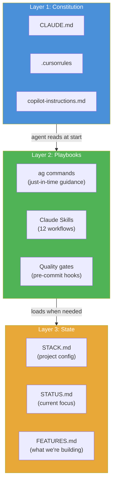
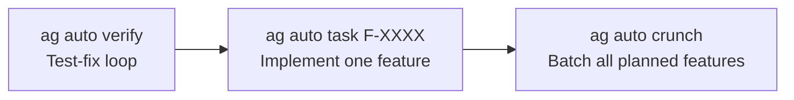

# WTF — Welcome to the Framework

> You describe what you want. The framework handles the rest.

---

## The One-Sentence Version

**Agentic AF** is a portable, tool-agnostic framework that makes AI agents build *real software* — with specs, tests, quality gates, and session continuity — instead of one-shot code dumps.

---

## The Problem

AI coding assistants are powerful but forgetful. Every session starts from scratch. There's no tracking, no enforcement, no memory. After a week you have a pile of generated code with no tests, no docs, and no idea what state anything is in.

## The Solution

Structure that persists across sessions, tools, and context resets:

```
┌─────────────────────────────────────────────────────────┐
│                    YOUR PROJECT                          │
│                                                          │
│  ┌──────────────┐  ┌──────────────┐  ┌──────────────┐  │
│  │  STACK.md    │  │  STATUS.md   │  │  JOURNAL.md  │  │
│  │  (config)    │  │  (now)       │  │  (history)   │  │
│  └──────────────┘  └──────────────┘  └──────────────┘  │
│                                                          │
│  ┌──────────────────────────────────────────────────┐   │
│  │  .agentic/                                        │   │
│  │  ├── lib/          Scripts, tools, playbooks      │   │
│  │  ├── spec/         Features, ACs, NFRs            │   │
│  │  ├── journal/      Plans, lessons, manifests      │   │
│  │  └── session/      WIP locks, engine state        │   │
│  └──────────────────────────────────────────────────┘   │
│                                                          │
│  Works with: Claude Code · Cursor · Copilot · Codex     │
└─────────────────────────────────────────────────────────┘
```

---

## How It Works — Three Layers



**Layer 1** — Short instruction files (~40 lines) that every AI tool reads. Behavioral rules only.
**Layer 2** — Workflow scripts and playbooks loaded on demand. No token cost until needed.
**Layer 3** — Durable markdown files that survive session resets, tool switches, and context compression.

---

## What You Actually Get

### Talk Naturally, Framework Responds

| You say | What happens |
|---------|-------------|
| "Build the login feature" | Checks specs exist, starts WIP tracking, creates branch |
| "Commit this" | Runs 16 quality gates, blocks if issues found |
| "We're done" | Validates tests pass, docs updated, acceptance criteria met |
| "Fix the failing tests" | Test-fix loop until green (autonomous mode) |

### Autonomous Modes — Let It Run



**Verify**: Runs tests, spawns Claude to fix failures, repeats until green.
**Task**: Reads acceptance criteria, implements each with a fresh Claude, commits passing work, creates PR.
**Crunch**: Processes all planned features from FEATURES.md. You come back to PRs ready for review.

You stay in control: `ag auto pause`, `ag auto stop`, `ag auto feedback AC-003 "use the existing auth module"`.

### Two Profiles

| | **Discovery** | **Formal** | **Autonomous Formal** |
|--|-------------|----------|---------------------|
| Best for | Prototypes, solo devs | Production, teams | Autonomous agents, CI/CD |
| Specs | Optional | Required before coding | Required before coding |
| Feature tracking | Light | F-XXXX IDs + acceptance criteria | F-XXXX IDs + acceptance criteria |
| Quality gates | Fast checks | Full validation suite | Full validation suite |
| Code review | critical_agent | human | critical_agent |
| Merge review | human | human | human |

Switch anytime: `ag set profile discovery` or `ag set profile formal` or `ag set profile autonomous_formal`

---

## Quick Start

```bash
# Install into your project
curl -fsSL https://raw.githubusercontent.com/tomgun/agentic-framework/main/remote-install.sh | bash

# Open your AI tool and start talking
"Let's build something."
```

That's it. The framework detects your project, sets up the right profile, and starts working.

---

## Deeper Reading

| Doc | What's in it |
|-----|-------------|
| [**DEVELOPER_GUIDE.md**](.agentic/DEVELOPER_GUIDE.md) | Complete usage guide — workflows, scripts, customization |
| [**PRINCIPLES.md**](.agentic/PRINCIPLES.md) | Framework values and design philosophy |
| [**START_HERE.md**](.agentic/START_HERE.md) | 5-minute orientation |
| [**HOW_IT_WORKS.md**](docs/HOW_IT_WORKS.md) | Full architecture with diagrams |
| [**INSTRUCTION_ARCHITECTURE.md**](docs/INSTRUCTION_ARCHITECTURE.md) | Three-layer design deep dive |
| [**FRAMEWORK_VALUE_PROPOSITION.md**](docs/FRAMEWORK_VALUE_PROPOSITION.md) | Problems solved, key features |
| [**CHANGELOG.md**](CHANGELOG.md) | Version history |
| [**README.md**](README.md) | Installation, tooling, feature lists |

---

*Agentic AF — because your AI deserves a framework, not just a prompt.*
