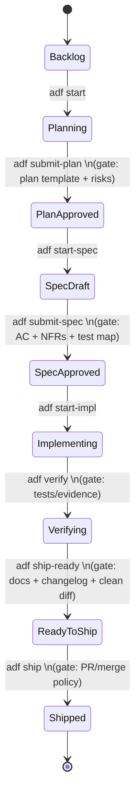
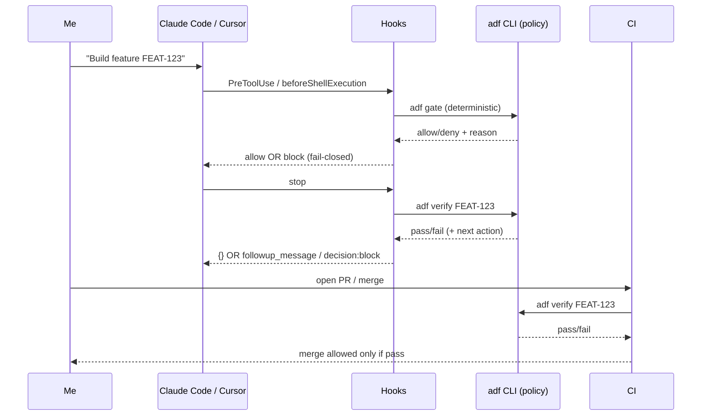

# Deterministic Enforcement for a File-Backed Agentic Development Framework Using Claude Code and Cursor Hooks

Research by ChatGPT 5.3/5.4, if Agentic framework determinism (which is now based on a CLI state machine) could be achieved only with Claude or Cursor hooks (in those tools). Note: This uses term "adf", doesn't know about our frameworks details.

## Executive summary

From my perspective, **deterministic, file-backed Agentic Development Framework (ADF) flows are achievable “enough” in practice with Claude Code hooks, and partially achievable with Cursor hooks—if I design the enforcement layer as a deterministic local policy engine (ADF CLI) and treat hooks as *guardrails + dispatch*, not as the source of truth.** Claude Code’s hooks and permissions system give me a clean way to block tool calls (especially via `PreToolUse`) and prevent “I’m done” responses (`Stop`, `TaskCompleted`) until machine-checkable gates pass. citeturn5view0turn4view1turn3view2turn4view4

For Cursor, the official hooks API *claims* comparable lifecycle interception (session/tool/shell/MCP/file/prompt/stop). citeturn13search1turn7search0turn13search6 Cursor also supports **Claude Code hooks compatibility** (via “Third-party skills”), mapping Claude events like `PreToolUse → preToolUse` and keeping the same “exit code 2 blocks” behavior, but with important limitations (notably no Claude `PermissionRequest` or `Notification`, and some tool mappings not supported). citeturn13search28

However, to be intellectually honest about “deterministic”: **Cursor’s hook ecosystem has enough reported regressions and fail-open behaviors that I should not trust it as my only enforcement boundary**. Examples include: malformed hook JSON causing silent allow (fail-open), `ask` behavior apparently not prompting in some configurations, and hook response message fields not consistently reaching the model/UI across versions/platforms. citeturn11search15turn10search9turn19search22turn19search19 That doesn’t mean I can’t build reliable ADF workflows with Cursor—it means I must use **defense-in-depth**: hooks + repo-level CLI gates + CI/branch protections.

The actionable architecture that best satisfies *spec-driven, artifact-contract enforcement* is:

- A deterministic **local ADF policy engine** (`adf` CLI, optionally also an MCP server) that computes “allow/deny/ask” for each attempted action based on file-backed state and machine-checkable rules (no LLM judgment in the enforcement path).  
- **Claude Code hooks** calling that CLI on `PreToolUse`, `UserPromptSubmit`, and `Stop` (and optionally `TaskCompleted`) to block or continue. citeturn3view2turn5view0turn4view1  
- **Cursor hooks** calling the same CLI on `beforeShellExecution`, `preToolUse`, `beforeMCPExecution`, `beforeReadFile`, `beforeSubmitPrompt`, and `stop` (with `followup_message` for autonomous loops). citeturn13search1turn19search0turn19search1turn19search3  
- **CI gates** that run the same `adf verify` checks and block merge even when hooks are bypassed.

## What Claude Code and Cursor can actually enforce

### Claude Code enforcement primitives I can rely on

Claude Code supports a structured hook lifecycle with events including `SessionStart`, `UserPromptSubmit`, `PreToolUse`, `PermissionRequest`, `PostToolUse`, `Stop`, `TaskCompleted`, `PreCompact/PostCompact`, `WorktreeCreate`, etc. citeturn5view0turn4view0

The key deterministic controls for ADF are:

- **Block tool calls before they execute** using `PreToolUse` with `hookSpecificOutput.permissionDecision` (`allow`/`deny`/`ask`) and optional `updatedInput` to rewrite tool parameters. citeturn3view2turn4view3turn4view2  
- **Prevent the agent from “stopping”** using `Stop` decision control (top-level `decision: "block"`). This is critical for enforcing “don’t claim done until gates pass”. citeturn4view2turn4view1  
- **Prevent tasks from being marked complete** using `TaskCompleted`: exiting with code 2 blocks completion and feeds stderr as feedback to the model. citeturn4view4turn4view1  
- **Inject context at session start** via `SessionStart` (`additionalContext`) and even persist environment variables using `CLAUDE_ENV_FILE` for subsequent Bash commands in that session. citeturn3view1turn18view0  

Claude Code also has a **tiered permission model** (Read-only tools require no approval; Bash and file modifications do) plus modes like `plan`, `acceptEdits`, and `dontAsk`, with deny/ask/allow precedence that can be centrally managed via settings scopes. citeturn20view1turn2view3

### Cursor enforcement primitives I can rely on, with caveats

Cursor’s hooks are described as spawned processes that exchange JSON over stdio and can “observe, block, or modify behavior.” citeturn7search0turn13search1 Its documented hook events include `sessionStart`, `preToolUse`, `beforeShellExecution`, `beforeMCPExecution`, `beforeReadFile`, `beforeSubmitPrompt`, and `stop`, among others. citeturn13search1turn13search6

Two Cursor-specific features matter for deterministic ADF loops:

- **Stop-hook loop control and `followup_message`**, enabling self-driving “keep working until verified” loops. Cursor docs describe `loop_count` and configurable `loop_limit`, and the `followup_message` mechanism is explicitly used by the official “Ralph loop” plugin pattern. citeturn19search0turn19search1turn11search13  
- **Claude Code hooks compatibility**, which lets me share a single canonical hook pack across tools—but with limitations (no Claude `PermissionRequest`/`Notification`; some tool names like `WebFetch`, `WebSearch`, `Glob` may not be supported via that mapping; plus some Cursor-native features like `loop_limit` require Cursor’s native config). citeturn13search28turn13search1

The caveats affecting reliability are substantial enough that I should explicitly engineer around them:

- Cursor’s Claude-compat docs state: **exit code 2 blocks**, but “other exit codes fail-open” (action proceeds). citeturn13search28  
- Multiple reports indicate **fail-open on malformed JSON** in `beforeShellExecution` (hook bypass). citeturn11search15turn10search18  
- There are long-running reports of **hook response message channels** (`userMessage` / `agentMessage` / sometimes `followup_message`) being inconsistent across Cursor versions/platforms. citeturn19search22turn19search19turn19search31  
- Reports suggest **`ask` semantics may be unreliable** in some modes (commands run without prompting). citeturn10search9turn7search11  

So: **Cursor hooks can still enforce**, but I should design my ADF “hard gates” to (a) be re-checkable and enforceable in CI, and (b) fail-closed inside my hook scripts (so the *script*, not Cursor, ensures denial when uncertain).

## Mapping ADF state transitions and verification points to hook types

Below is a minimal ADF state machine (I consider exact state names *unspecified / customizable*). The important part is: **every transition corresponds to an explicit, machine-checkable gate**, and hooks intercept the *actions that could violate the current state*.



### Transition-to-hook mapping table

In this table, “ADF gate” means a deterministic CLI command like `adf gate <stage>` or `adf verify`. The hook scripts are *adapters* that translate tool events into gate inputs.

| ADF stage / transition | What must be enforced (machine-checkable) | Claude Code hook(s) that can enforce | Cursor hook(s) that can enforce | Practical enforcement strategy |
|---|---|---|---|---|
| Enter Planning | No code edits; create/modify planning artifacts | Use `PreToolUse` to deny `Write/Edit/Bash` that modify code; allow writing plan files. citeturn3view2turn4view3turn18view0 | Use `preToolUse` + `beforeShellExecution` to deny code edits / risky shell. citeturn13search1turn7search0 | Gate “write to src/” when state < Implementing; allow `.adf/**` and docs. |
| Plan complete → PlanApproved | Plan file exists and passes schema checks (no LLM evaluation) | `PostToolUse` (Write/Edit) can provide feedback; `Stop` can prevent “done” until plan gate passes. citeturn3view3turn4view2 | `afterFileEdit` for detection + `stop` for enforcement loop with follow-up. citeturn13search1turn19search0 | Make the agent run `adf submit-plan <id>`; block leaving the turn (`Stop`) until it succeeds. |
| Spec ready → SpecApproved | Spec has AC + NFRs + test mapping | Same pattern: `Stop` as the hard gate; optionally `UserPromptSubmit` to block requests that skip specs. citeturn5view0turn4view1 | `beforeSubmitPrompt` to block “build now” prompts if state requires spec; `stop` loop for enforcement. citeturn13search1turn19search0 | For Cursor, assume `ask` might be unreliable; implement “deny until approved” using state files. citeturn10search9turn7search11 |
| Implementing | Only implement within scoped feature/worktree; link commits to feature ID (unspecified VCS host) | Use `WorktreeCreate` to enforce isolated worktrees (can fail creation on non-zero). citeturn5view1turn4view1 Use `PreToolUse` to deny writing outside allowed paths. citeturn4view3 | Cursor doesn’t expose Git worktree hooks directly; enforce via `beforeShellExecution` (deny `git checkout main`, `git commit` without ID, etc.). citeturn13search1turn7search0 | Defense-in-depth: hooks block obvious violations; CI enforces branch/PR rules. |
| Verify | Tests must pass; evidence captured | Claude: run `adf verify` via Bash; enforce “cannot stop” until verifies. `Stop` + `TaskCompleted` are strong gates. citeturn4view4turn4view2 | Cursor: `stop` hook returns `followup_message` if `adf verify` fails; cap via `loop_limit`. citeturn19search0turn13search1 | Prefer deterministic checks, not prompt-based hooks (prompt hooks are explicitly LLM-evaluated). citeturn16view0turn10search0 |
| Ship | PR creation, changelog/docs updated, “definition of done” satisfied | `PreToolUse` on `Bash` to block `git push`, `gh pr create`, etc. until `adf ship-ready` passes. Note: matcher matches **tool name**, so inspect `tool_input.command` in script. citeturn4view3turn17search2turn20view2 | `beforeShellExecution` blocks `git push` etc until ready. Beware Cursor fail-open on invalid JSON; script must fail-closed. citeturn11search15turn13search28 | CI must re-run `adf verify` to prevent bypass outside Cursor/Claude. |
| Session continuity | Inject “current ADF state” without re-reading repo | `SessionStart.additionalContext` injects summary; `InstructionsLoaded` helps detect when rule files load. citeturn3view1turn5view0 | Cursor has `sessionStart` in docs, but availability varies by version; treat as “best effort.” citeturn13search1turn7search18 | Always keep `adf status --short` fast and cacheable; never rely only on injection. |

## Concrete hook implementation patterns and sample scripts

### Design pattern that stays deterministic

**I keep all policy decisions in a local ADF CLI** and make hook handlers tiny “adapters.”

Minimal conceptual interface (names are illustrative; exact CLI is unspecified):

- `adf gate pretool --tool <name> --json <event>` → returns `{decision: allow|deny|ask, reason, updatedInput?}`  
- `adf gate shell --command "<cmd>" --cwd "<cwd>" --json <event>` → returns allow/deny/ask  
- `adf gate stop --json <event>` → returns allow/deny + message  
- `adf verify <feature>` → exits non-zero if failing (prints actionable summary)

This also gives me tool-agnostic enforcement: even if a tool has no hooks, I can still run `adf verify` in CI and block merges.

### Claude Code hook config: deterministic enforcement on tool calls and stop

Claude Code hooks run shell/HTTP/prompt/agent handlers at lifecycle events. citeturn4view0turn16view1 For determinism, **I prefer `type: "command"`**, because prompt/agent hooks are explicitly LLM-evaluated. citeturn16view0turn16view3

`/.claude/settings.json` (project scope) — minimal sketch:

```json
{
  "hooks": {
    "SessionStart": [
      { "hooks": [{ "type": "command", "command": ".claude/hooks/session-start.sh" }] }
    ],
    "PreToolUse": [
      {
        "matcher": "Bash|Write|Edit|EnterWorktree",
        "hooks": [{ "type": "command", "command": ".claude/hooks/pre-tool-use.sh", "timeout": 10 }]
      }
    ],
    "Stop": [
      { "hooks": [{ "type": "command", "command": ".claude/hooks/stop-gate.sh", "timeout": 30 }] }
    ]
  }
}
```

Why these events:

- `PreToolUse` can **allow/deny/ask** and even rewrite input. citeturn4view3turn3view2  
- `Stop` can **block stopping** and force continuation with a reason. citeturn4view2turn16view1  
- `SessionStart` can inject state context and persist env vars when needed. citeturn3view1turn3view1

#### Sample Claude hook: `.claude/hooks/pre-tool-use.sh`

This hook blocks unsafe git operations and blocks code edits unless the current feature state allows it.

```bash
#!/usr/bin/env bash
set -u  # no set -e: I want controlled fail-closed behavior

INPUT="$(cat)"

TOOL_NAME="$(echo "$INPUT" | jq -r '.tool_name // ""')"

# Fail-closed fallback
deny() {
  local reason="$1"
  jq -n --arg reason "$reason" '{
    hookSpecificOutput: {
      hookEventName: "PreToolUse",
      permissionDecision: "deny",
      permissionDecisionReason: $reason
    }
  }'
  exit 0
}

# Delegate deterministic decision to ADF
RESULT="$(printf '%s' "$INPUT" | adf gate claude-pretool --stdin 2>/dev/null || true)"
DECISION="$(echo "$RESULT" | jq -r '.decision // "deny"')"
REASON="$(echo "$RESULT" | jq -r '.reason // "ADF gate failed (deny by default)"')"

case "$DECISION" in
  allow|ask|deny) ;;
  *) deny "Invalid ADF decision ($DECISION). $REASON" ;;
esac

# Emit Claude-specific PreToolUse decision shape
jq -n --arg d "$DECISION" --arg r "$REASON" '
{
  hookSpecificOutput: {
    hookEventName: "PreToolUse",
    permissionDecision: $d,
    permissionDecisionReason: $r
  }
}'
```

Why I shape it this way:

- Claude Code’s `PreToolUse` decision must be in `hookSpecificOutput` and supports `allow/deny/ask`. citeturn4view3turn4view2  
- I deliberately **fail-closed** inside the script because hook handlers run with my full user privileges and should be treated as security-sensitive code. citeturn12view0

#### Sample Claude hook: `.claude/hooks/stop-gate.sh`

```bash
#!/usr/bin/env bash
set -u

INPUT="$(cat)"

# Run deterministic verification (no LLM evaluation)
if adf gate claude-stop --stdin <<<"$INPUT" >/tmp/adf_stop_gate.json 2>/dev/null; then
  # allow stop: print nothing or {}
  exit 0
else
  REASON="$(cat /tmp/adf_stop_gate.json | jq -r '.reason // "ADF gate failed"' 2>/dev/null || echo "ADF gate failed")"
  jq -n --arg reason "$REASON" '{ decision: "block", reason: $reason }'
  exit 0
fi
```

Claude Code supports top-level `decision: "block"` for `Stop`, with the reason shown to Claude, and blocking prevents stopping (forcing continuation). citeturn3view0turn4view2turn16view1

### Cursor hook config: deterministic enforcement using stop follow-ups

Cursor docs list agent hooks and provide a `hooks.json` structure plus `loop_limit`. citeturn13search1turn10search0

`.cursor/hooks.json` (project-level) — minimal sketch:

```json
{
  "version": 1,
  "hooks": {
    "beforeShellExecution": [
      { "command": ".cursor/hooks/before-shell.sh" }
    ],
    "preToolUse": [
      { "command": ".cursor/hooks/pre-tool.sh", "matcher": "Shell|Read|Write" }
    ],
    "beforeSubmitPrompt": [
      { "command": ".cursor/hooks/before-prompt.sh" }
    ],
    "stop": [
      { "command": ".cursor/hooks/stop-gate.sh", "loop_limit": 5 }
    ]
  }
}
```

This aligns with Cursor’s published hook set and example structure. citeturn13search1turn10search0

#### Sample Cursor hook: `.cursor/hooks/before-shell.sh`

```bash
#!/usr/bin/env bash
set -u

INPUT="$(cat)"
CMD="$(echo "$INPUT" | jq -r '.command // ""')"

# Fail-closed if ADF is down
if ! RESULT="$(printf '%s' "$INPUT" | adf gate cursor-shell --stdin 2>/dev/null)"; then
  echo '{"permission":"deny","userMessage":"ADF gate unavailable; blocked by policy."}'
  exit 2
fi

PERM="$(echo "$RESULT" | jq -r '.permission // "deny"')"
USER_MSG="$(echo "$RESULT" | jq -r '.userMessage // ""')"

case "$PERM" in
  allow)
    echo '{"permission":"allow"}'
    exit 0
    ;;
  deny|ask)
    # NOTE: "ask" may be unreliable in some builds; treat ask as deny operationally.
    echo "$(jq -n --arg msg "${USER_MSG:-Blocked by ADF policy.}" '{permission:"deny", userMessage:$msg}')"
    exit 2
    ;;
  *)
    echo '{"permission":"deny","userMessage":"Invalid ADF response; blocked."}'
    exit 2
    ;;
esac
```

Why I do this:

- Cursor’s Claude-compat docs explicitly say exit code **2 blocks** and other exit codes **fail-open**—so I must be deliberate about returning 2 when uncertain. citeturn13search28  
- There are reports of malformed JSON causing allow; so I should generate JSON with a tool like `jq`, not manual string interpolation. citeturn11search15turn10search18  

#### Sample Cursor hook: `.cursor/hooks/stop-gate.sh` using follow-up loops

```bash
#!/usr/bin/env bash
set -u

INPUT="$(cat)"

if adf gate cursor-stop --stdin <<<"$INPUT" >/tmp/adf_stop.json 2>/dev/null; then
  # allow stop
  echo '{}'
  exit 0
else
  REASON="$(cat /tmp/adf_stop.json | jq -r '.followup_message // .reason // "Verification failed; continue."' 2>/dev/null || echo "Verification failed; continue.")"
  jq -n --arg msg "$REASON" '{followup_message: $msg}'
  exit 0
fi
```

Cursor’s stop hook is documented to support loop-style flows with `followup_message`, bounded by a loop limit. citeturn19search0turn19search1turn19search3

### Sharing one hook pack across Claude Code and Cursor

Cursor supports loading Claude Code hook configurations when “Third-party skills” is enabled, and it maps Claude hook event names to Cursor equivalents. citeturn13search28

What I would do:

- Maintain **canonical hook logic scripts** in a neutral directory like `/.adf/hooks/` (repo-committed).  
- Generate:
  - `.claude/settings.json` for Claude Code
  - `.cursor/hooks.json` for Cursor (native, to access Cursor-only features like `loop_limit`)
  - Optionally also rely on Cursor’s Claude-compat loading for incremental adoption, but I would treat it as “compat mode,” not the end state. citeturn13search28turn13search1  

## Security, permissions, sandboxing, and operational reliability

### Hook privilege model and mitigations

Claude Code explicitly warns that **command hooks run with my system user’s full permissions** (they can modify/delete/access whatever my account can). citeturn12view0 Therefore I treat hook code as production security code:

- I follow Claude’s hook security best practices: validate/sanitize inputs; quote variables; block path traversal; use absolute paths (e.g., `"$CLAUDE_PROJECT_DIR"`); skip sensitive files. citeturn12view0  
- I keep hooks **deterministic and local**. Claude’s HTTP hooks explicitly treat non-2xx and timeouts as non-blocking (execution continues), which is the opposite of deterministic enforcement. citeturn4view1turn4view2  
- I log hook input and decisions to an append-only JSONL audit file (path unspecified). Claude Code exposes `session_id`, `transcript_path`, and `cwd` in hook inputs, which makes auditing feasible. citeturn3view0turn3view3  

### Permission systems as reinforcement rather than replacement

For Claude Code, I can use **permission modes** and deny/ask/allow rules to reduce risk and approval fatigue, but hooks are what enforce ADF invariants. Claude Code’s permission system is tiered and supports centralized settings (including disabling bypass permissions mode via managed settings). citeturn20view1turn2view3

For Cursor, the “Agent Security” docs emphasize that reading/searching often doesn’t require approval and `.cursorignore` can block access, while other sensitive actions require approval. citeturn1search2 For Cursor CLI, there is an explicit permissions configuration file (global or project-scoped), with tokens such as `Shell(...)`, `Write(...)`, and `WebFetch(...)`. citeturn10search15turn1search14 I would still keep ADF gating separate (in hooks + CI), but Cursor permissions can reduce blast radius.

### Sandboxing for safer autonomy

If I want higher-autonomy profiles without constant approvals, sandboxing is the other major lever—because it reduces “approval fatigue” while maintaining boundaries:

- Claude Code sandboxing is documented with two modes (“Auto-allow” and “Regular permissions”), and configuration for filesystem/network restrictions (for example, allowing subprocess writes only to specific paths). citeturn22view0turn20view1  
- Anthropic’s engineering write-up describes sandboxing as OS-level filesystem + network isolation, motivated partly by prompt injection risk, and reports internal reductions in permission prompts (while still maintaining boundaries). citeturn22view1  
- Cursor’s engineering blog similarly frames sandboxing as a cross-platform effort to reduce interruptions while improving security, noting trade-offs and platform primitives. citeturn22view3  

For ADF, sandboxing matters because it lets me safely run unattended “verify loops” (tests, linters) with fewer prompts, while still enforcing that “ship” and “state transitions” require explicit gates.

### Failure modes and recovery strategies I should design for

I design for these predictable failures (especially in Cursor):

- **Hook script crashes / invalid JSON → fail-open** (Cursor reports + Claude-compat docs). Mitigation: scripts must be “fail-closed” (emit deny + exit 2 on internal errors), keep runtimes predictable, and use `jq` for JSON serialization. citeturn13search28turn11search15turn10search18  
- **Cursor “ask” not prompting** in certain modes/builds. Mitigation: implement approvals as explicit ADF state (`adf approve`) and treat “ask” as operationally “deny until approved.” citeturn10search9turn7search11  
- **Hook response messages not reaching the model/UI**. Mitigation: never rely on hook messages as the only feedback channel; also write failures to a known file path and instruct the agent (via CLAUDE.md / rules) to read that file when blocked. citeturn19search22turn19search19turn15view1  
- **Agent bypass attempts**: user/agent can run git outside the tool, edit config files, or disable features. Mitigation: CI runs `adf verify`, and (if available) managed settings / enterprise policy prevents disabling critical guardrails. Claude Code has multiple config scopes with managed settings that can’t be overridden. citeturn2view3turn20view1  
- **Network outages**: avoid HTTP hooks for gating because Claude treats HTTP failures as non-blocking; keep gate decisions local. citeturn4view1

## Effort, trade-offs, and prioritized recommendations

### Claud⁠e-only vs Cursor-only vs combined

| Option | What I gain | What I lose / risk | Complexity estimate (single engineer) |
|---|---|---|---|
| Claude Code only | Strongest end-to-end enforcement: `PreToolUse` allow/deny/ask; `Stop` and `TaskCompleted` blocks; mature permissions + managed settings; good session context injection. citeturn4view3turn4view4turn20view1turn2view3 | Tool ecosystem lock-in (though still repo/CI portable). | **Medium**: 3–7 days to prototype; 2–3 weeks to harden |
| Cursor only | Stop-loop + `followup_message` makes autonomous verify loops ergonomic; native hooks cover shell/MCP/file/prompt. citeturn19search0turn13search1 | Higher instability risk: reported regressions, fail-open behaviors; message channels unreliable. citeturn11search15turn19search22turn19search19 | **Medium–High**: more time in debugging/compat |
| Claude + Cursor combined | Adapter-ready: one ADF policy engine; hooks in both tools call it; Cursor can load Claude hooks via third-party compatibility; incremental adoption. citeturn13search28turn5view0turn4view3 | Must test across Cursor versions/platforms; implement fallbacks; doubled config surface. | **High**: add ~1–2 weeks hardening overhead |

### Hooks-only enforcement vs CLI + MCP vs CI reinforcement

| Enforcement mode | Determinism | Operational reliability | Best use |
|---|---|---|---|
| Hooks-only | Medium (host-dependent, fail-open risks) | Medium–Low on Cursor; Medium–High on Claude | Fast prototype; local guardrails |
| Hooks + deterministic local CLI (`adf gate`) | High (within the tool) | High if scripts are fail-closed | Best “LLM-driven implementation” pattern: hooks become adapters |
| Hooks + MCP server for gating | Medium (network/timeouts can fail-open) | Medium | Useful when multiple hosts need shared enforcement; must still backstop with local/CI. MCP itself emphasizes validating inputs, access controls, timeouts, and logging. citeturn9search0turn9search3turn9search10 |
| CI/branch protections (always) | High (merge-level) | High | Mandatory defense-in-depth; prevents bypass outside the agent tool |

### Prioritized recommendations and quick wins

I would do these first because they produce the biggest reliability jump:

I start by making **“ship is impossible unless `adf verify` passes”** and **“done is impossible unless gates pass”**—those are the two places most workflow drift shows up.

- Quick win: implement **one deterministic “Stop gate”** in Claude Code (`Stop` hook) and in Cursor (`stop` hook with `followup_message`) that runs `adf verify` and blocks until green. This directly attacks “no definition of done.” citeturn4view2turn19search0turn19search1  
- Quick win: block `git push` / PR creation unless state is `ReadyToShip`, using Claude `PreToolUse` (inspect `tool_input.command`) and Cursor `beforeShellExecution`. citeturn4view3turn11search15turn20view2  
- Quick win: add **session continuity** by injecting `adf status` summary at Claude `SessionStart.additionalContext`. Cursor `sessionStart` can be best-effort, but I assume it may not always work across versions. citeturn3view1turn13search1turn7search18  

### Short roadmap and success criteria

I’m keeping CI/repo host/language **unspecified**, so success criteria are phrased tool-agnostically.



**Phase goals (high level):**

- Phase one: deterministic “stop gate” + “ship gate” in Claude Code; CI runs `adf verify`. Success: agent cannot claim done or push without passing checks. citeturn4view2turn20view2  
- Phase two: add Cursor hooks to call the same `adf` gates; rely on stop `followup_message` loops. Success: Cursor agent iterates until verify passes (bounded by `loop_limit`). citeturn19search0turn13search1  
- Phase three: add policy-hardening: sandboxing + permissions tuned for autonomy profiles (hands-on vs autonomous). Success: fewer prompts without increased risk. citeturn22view0turn22view1turn22view3  
- Phase four: adapter readiness: export canonical instructions to `CLAUDE.md` and `.cursor/rules/*.mdc`, and optionally ship as Cursor plugin (IDE only). Success: new sessions start with consistent workflow instructions, and the enforcement remains CLI-driven. citeturn15view1turn14search1turn19search16turn19search21  

If I had to summarize the core “deterministic ADF with hooks” lesson in one sentence: **hooks should only translate tool events into deterministic ADF checks, and CI must validate the same checks—because tool-level hooks are not a security boundary by themselves.**