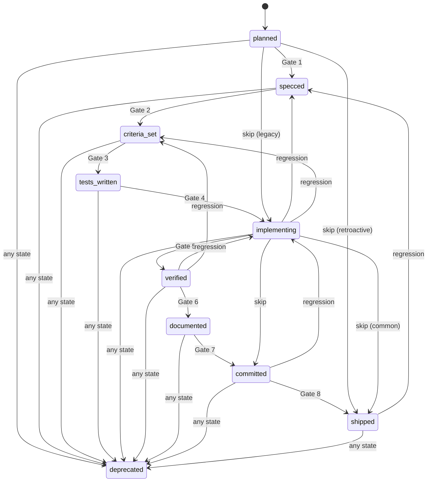
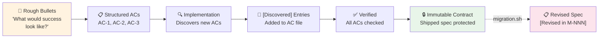
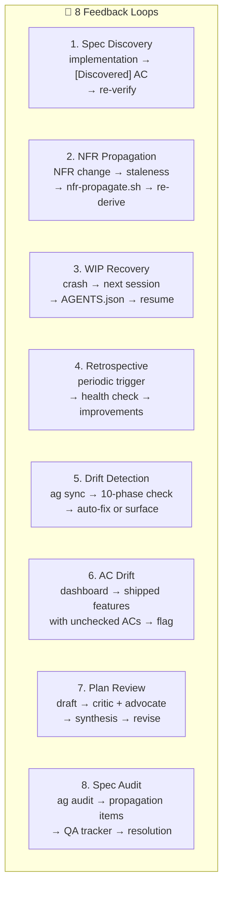
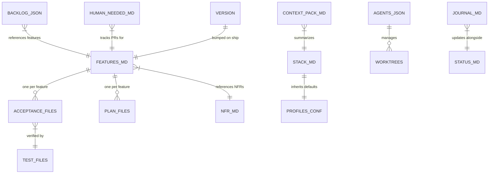
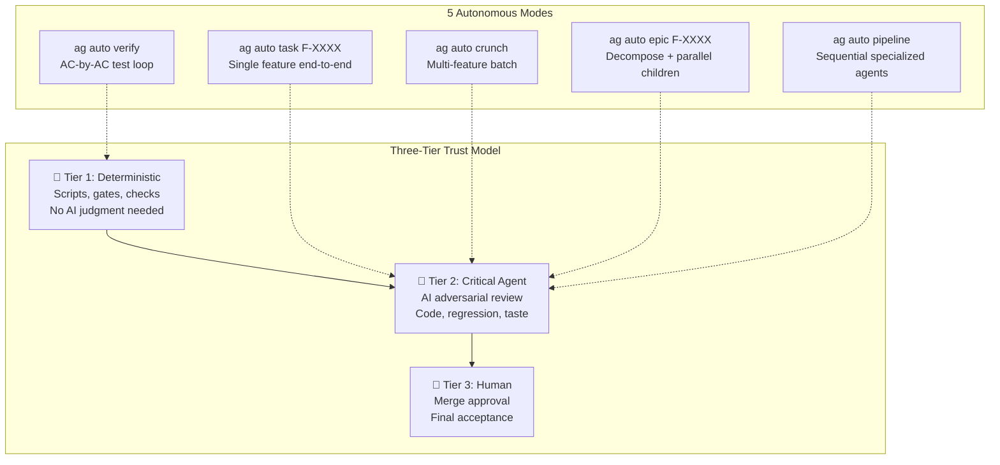

# Framework System Map

> **Version**: 0.61.0 · **Date**: 2026-03-16 · **Features**: 157 shipped, 2 implementing, 10 planned

The complete reference for understanding, using, and maintaining the Agentic Framework — from 30-second overview to deep reference.

---

## Table of Contents

- [Part I: The System at Three Zoom Levels](#part-i-the-system-at-three-zoom-levels)
  - [Section 1: 30-Second Overview](#section-1-30-second-overview)
  - [Section 2: 5-Minute Walkthrough](#section-2-5-minute-walkthrough)
  - [Section 3: Deep Reference — The 9 Phases](#section-3-deep-reference--the-9-phases)
- [Part II: Structural Diagrams](#part-ii-structural-diagrams)
  - [Section 4: Feature State Machine](#section-4-feature-state-machine)
  - [Section 5: Three Profiles — Parallel Paths](#section-5-three-profiles--parallel-paths)
  - [Section 6: Spec Evolution Lifecycle](#section-6-spec-evolution-lifecycle)
  - [Section 7: Feedback Loops](#section-7-feedback-loops)
  - [Section 8: Artifact Relationship Map](#section-8-artifact-relationship-map)
- [Part III: Advanced Workflows](#part-iii-advanced-workflows)
  - [Section 9: Autonomous Execution Modes](#section-9-autonomous-execution-modes)
  - [Section 10: Verification Pyramid](#section-10-verification-pyramid)
  - [Section 11: Quality Gates Complete Reference](#section-11-quality-gates-complete-reference)
- [Part IV: The Bigger Picture](#part-iv-the-bigger-picture)
  - [Section 12: Current Inventory (v0.61.0)](#section-12-current-inventory-v0610)
  - [Section 13: What's In Flight](#section-13-whats-in-flight)
  - [Section 14: Opportunity Map](#section-14-opportunity-map)
- [Part V: Quick References](#part-v-quick-references)
  - [Section 15: Command Quick Reference](#section-15-command-quick-reference)
  - [Section 16: Recovery Playbook](#section-16-recovery-playbook)

---

# Part I: The System at Three Zoom Levels

## Section 1: 30-Second Overview

The framework turns ideas into shipped features through a gated lifecycle. Every phase produces artifacts, every transition is guarded, and three profiles (Discovery, Formal, Autonomous Formal) control how much rigor is applied.

```mermaid
flowchart LR
    A["💡 Idea"] -->|"ag kickoff / ag plan"| B["📋 Plan"]
    B -->|"ag implement"| C["📝 Spec + ACs"]
    C -->|TDD / code| D["⚙️ Implement"]
    D -->|tests pass| E["✅ Verify"]
    E -->|journal + docs| F["📄 Document"]
    F -->|pre-commit gates| G["💾 Commit"]
    G -->|PR + review| H["🚀 Ship"]

    style A fill:#e1f5fe
    style H fill:#c8e6c9
```



**One sentence**: Ideas become plans, plans become specs, specs become tested code, tested code gets documented, documented code passes gates, gated code ships through PRs.

**Key principle**: Spec + Code + Tests + Docs = Done. All four artifacts ship together, not sequentially.

---

## Section 2: 5-Minute Walkthrough

### The 9 Lifecycle Phases

| # | Phase | What Happens | Key Command | Key Artifact |
|---|-------|-------------|-------------|-------------|
| 1 | **Session Start** | Dashboard loads, WIP recovery, orphan plan scan, context hydration | `ag start` / `ag sync` | STATUS.md, AGENTS.json |
| 2 | **Intent & Routing** | Trigger words route to workflows: "build" → spec-first, "fix" → test-first, "done" → completion | Trigger words / skills | Skill activation |
| 3 | **Planning** | `ag plan` drafts approach, dialectical review (Critic + Advocate) validates, plan saved durably | `ag plan F-XXXX` | `.agentic/journal/plans/F-XXXX-plan.md` |
| 4 | **Specification** | Acceptance criteria written, NFRs integrated, clarity gate validates testability | `ag spec` | `spec/acceptance/F-XXXX.md`, `spec/FEATURES.md` |
| 5 | **Implementation** | TDD (test-first) or standard flow. WIP tracked. Checkpoints at scope boundaries | `ag implement F-XXXX` | Source code, WIP entry in AGENTS.json |
| 6 | **Verification** | Tests run, NFR coverage checked, AC completion verified, smoke test | `ag auto verify` | Test results, verification record |
| 7 | **Documentation** | Journal entry, status update, doc drift detection, registry maintenance | `journal.sh`, `status.sh` | JOURNAL.md, STATUS.md |
| 8 | **Commit** | 17+ pre-commit checks run. Scope validated, specs protected, complexity limited | `ag commit` | Git commit |
| 9 | **Completion** | Feature marked shipped, VERSION bumped, backlog advanced, retro trigger | `ag done F-XXXX` | VERSION, FEATURES.md, BACKLOG.json |

### Profile Differences at a Glance

| Dimension | Discovery | Formal | Autonomous Formal |
|-----------|-----------|--------|-------------------|
| **Spirit** | Move fast, learn | Spec-driven rigor | Formal rigor, AI-driven reviews |
| **AC required?** | Recommended | Blocking | Blocking |
| **Plan review?** | No | Yes (dialectical) | Yes (dialectical) |
| **Code review** | Critical agent | Human | Critical agent |
| **Merge review** | Human | Human | Human |
| **Pre-commit** | Fast (subset) | Full (all checks) | Full (all checks) |
| **Max files/commit** | 15 | 10 | 10 |

---

## Section 3: Deep Reference — The 9 Phases

### Phase 1: Session Start

**What happens**: The dashboard renders project health, detects interrupted work, scans for orphaned plans, and loads context.

**Commands & tools**:
- `bash .agentic/lib/tools/dashboard.sh` — renders health dashboard
- `ag sync` — 10-phase sync check (git, state files, drift, agent status)
- `ag start` — alias for sync + dashboard

**Gates**: None blocking. Dashboard is informational.

**Artifacts**:
- Read: STATUS.md, AGENTS.json, BACKLOG.json, HUMAN_NEEDED.md, VERSION
- Updated: STATUS.md (focus), AGENTS.json (agent registration)

**Profile variations**:
- All profiles: orphaned plan scan runs (`periodic_orphaned_plans: every_session`)
- Formal/Autonomous: retro check runs periodically (`periodic_retro_check: every_5_sessions`)

**Feedback loops**: WIP Recovery — if AGENTS.json shows interrupted work, dashboard surfaces it as first action. Orphaned plans from `~/.claude/plans/` are detected and must be saved before any implementation.

**Testing target**: `tests/llm/001_session_start.sh` — verifies dashboard output.

---

### Phase 2: Intent & Routing

**What happens**: User input is matched to trigger words, which route to specific workflows and skills.

**Trigger word table**:

| Trigger | Route | First Action |
|---------|-------|-------------|
| build / implement / add / create | Spec-first workflow | STOP. Write spec, then plan, then implement |
| fix / debug / repair | Test-first workflow | STOP. Write failing test FIRST |
| commit / push / ship | Completion workflow | STOP. Check AGENTS.json for active WIP |
| done / complete / finished | `ag done` | STOP. Run `ag done F-XXXX` |
| idea / remember / todo | Quick capture | `ag todo "description"` |
| decompose / break down | Decomposition | `ag decompose F-XXXX` |
| entire / full system (>10 files) | Rejection | TOO BIG. Break into 3-5 tasks |
| kickoff / vision | Vision pipeline | `ag kickoff "vision"` |
| review / approve | Review resolution | `ag review` |

**Skills**: 13 skills in `.claude/skills/` provide just-in-time guidance. Key skills: `implementing-features`, `committing-changes`, `writing-specs`, `planning-features`, `session-start`.

**Profile variations**: Routing is profile-independent. The routed workflow applies profile-specific gates.

---

### Phase 3: Planning

**What happens**: Agent explores codebase, drafts implementation plan, saves as DRAFT. If `plan_review_enabled: yes`, dialectical review runs (Critic + Advocate agents in fresh context). Plan iterated until approved.

**Commands & tools**:
- `ag plan F-XXXX` — enters plan mode, saves draft on exit
- `ag implement F-XXXX` — checks for approved plan (Gate 0), blocks if missing/draft

**Gates**:
- Plan must exist at `.agentic/journal/plans/F-XXXX-plan.md` before implementation
- Plan status must be APPROVED (not DRAFT) — enforced by `ag implement` Gate 0

**Artifacts**:
- Created: `.agentic/journal/plans/F-XXXX-plan.md` (status: DRAFT → APPROVED)
- Read: CONTEXT_PACK.md, STACK.md, FEATURES.md, existing code

**Profile variations**:
| Setting | Discovery | Formal | Autonomous |
|---------|-----------|--------|------------|
| `plan_review_enabled` | no | yes | yes |
| `review_plan` | skip | critical_agent | critical_agent |

**Feedback loops**: Plan Review Loop — draft → critic agent → advocate agent → synthesis → revision → re-review. Continues until both agents agree or user decides.

**Testing target**: `tests/llm/016_plan_review_dialectical.sh`

---

### Phase 4: Specification

**What happens**: Feature entry created in FEATURES.md, acceptance criteria file written in `spec/acceptance/F-XXXX.md`. NFRs integrated into ACs where applicable. Clarity gate checks ACs are testable.

**Commands & tools**:
- `bash .agentic/lib/tools/feature.sh F-XXXX status planned` — create FEATURES.md entry
- `ag spec` / `ag specs` — spec management
- Clarity gate: checks AC lines for testability (part of `ag implement` gates)

**Gates**:
- `gate_planned_to_specced`: Feature must have Description in FEATURES.md
- `gate_specced_to_criteria_set`: Acceptance criteria file must exist with `AC-` lines
- Pre-commit Check 3c: FEATURES.md must be updated when spec files change (Formal only, BLOCKING)

**Artifacts**:
- Created: `spec/acceptance/F-XXXX.md`, FEATURES.md entry
- Format: `- [ ] **AC-1**: <testable criterion>` with `[Discovered]`, `[Revised in M-NNN]`, `[Future]` markers

**Profile variations**:
| Setting | Discovery | Formal | Autonomous |
|---------|-----------|--------|------------|
| `acceptance_criteria` | recommended | blocking | blocking |
| `spec_directory` | no | yes | yes |
| `review_spec` | skip | critical_agent | critical_agent |
| `review_criteria` | skip | critical_agent | critical_agent |

**Testing target**: `tests/test_gates.py` (gate_specced_to_criteria_set), structural tests S07/S08.

---

### Phase 5: Implementation

**What happens**: Agent implements feature following the approved plan. TDD cycle: write failing tests → implement → green tests → refactor. WIP entry created in AGENTS.json. Worktree isolation available.

**Commands & tools**:
- `ag implement F-XXXX` — 10-gate startup sequence, creates AGENTS.json WIP entry
- `bash .agentic/lib/agents/claude/skills/implementing-features/scripts/check-gates.sh` — gate checker

**`ag implement` gates** (from `ag.sh` cmd_implement, line 808):

| Gate | Check | Blocking? |
|------|-------|-----------|
| 0a | One feature at a time (AGENTS.json WIP check) | Yes |
| 0b | Backlog order (feature at position 0, auto-upserts if missing) | Yes |
| 0c | Auto-save plans (migrate from session-scoped to durable) | No |
| 0d | Plan review (plan exists + status APPROVED) | Yes (when `plan_review_enabled: yes`) |
| 1 | Spec-first (FEATURES.md entry + AC file exists) | Yes |
| 2 | AC clarity gate (`spec-analyze.sh --gate`) | Formal: Yes, Discovery: Advisory |
| 2b | NFR staleness detection | Advisory |
| 3 | Planning phase (`doctor.sh --phase planning`) | Yes |

**Artifacts**:
- Read: Plan, spec, ACs, STACK.md
- Created/Updated: AGENTS.json (WIP entry), source code, test files
- Worktree: `git worktree` branch created if `worktree_mode: on`

**Profile variations**:
| Setting | Discovery | Formal | Autonomous |
|---------|-----------|--------|------------|
| `worktree_mode` | off | off | off |
| `max_files_per_commit` | 15 | 10 | 10 |
| `max_code_file_length` | 1000 | 500 | 500 |

---

### Phase 6: Verification

**What happens**: Tests run and must pass. AC completion checked. NFR coverage verified. Smoke test performed. Spec audit available.

**Commands & tools**:
- `ag auto verify` — AC-by-AC verification loop
- `ag auto verify --visual` — with visual/screenshot verification
- `ag audit` — spec→AC→test chain verification
- `ag nfr check` — NFR compliance check

**Gates**:
- `gate_implementing_to_verified`: AC file + test files must exist, tests must reference feature ID
- Pre-commit Check 6: Test execution (BLOCKING)
- Pre-commit Check 20: TDD phase ordering (BLOCKING when `development_mode: tdd`)

**Artifacts**:
- Read: AC file, test files, NFR.md
- Created: Verification record, test results

**Profile variations**: All profiles require tests. Formal/Autonomous add NFR coverage check.

**Testing target**: `tests/test_gates.py` (gate_implementing_to_verified), `tests/test_nfr_validation.py`

---

### Phase 7: Documentation

**What happens**: Journal entry records outcomes (not file lists). Status updated. Doc drift detection runs. Registry maintained. CONTRIBUTIONS.md updated for framework PRs.

**Commands & tools**:
- `bash .agentic/lib/tools/journal.sh "Topic" "Outcomes" "Next" "Blockers" --why "Problem"`
- `bash .agentic/lib/tools/status.sh focus "Current task"`
- `bash .agentic/lib/tools/drift.sh --docs` — detect stale documentation
- `bash .agentic/lib/tools/docs.sh --list` — show doc registry

**Gates**:
- `gate_verified_to_documented`: Runs `drift.sh --docs --check` based on `docs_gate` setting
- Pre-commit Check 3: JOURNAL.md updated since last commit (BLOCKING)
- Pre-commit Check 3b: STATUS.md updated since last commit (BLOCKING)
- Pre-commit Check 19: Doc registry health (advisory)

**Artifacts**:
- Updated: JOURNAL.md, STATUS.md, CONTRIBUTIONS.md
- Checked: Doc registry in STACK.md `## Docs` section

**Profile variations**:
| Setting | Discovery | Formal | Autonomous |
|---------|-----------|--------|------------|
| `docs_gate` | off | blocking | blocking |
| `docs_mode` | inline | inline | inline |
| `docs_stale_days` | 30 | 30 | 30 |

---

### Phase 8: Commit

**What happens**: 17+ pre-commit checks validate the commit. Scope, specs, tests, complexity, branch policy, and spec immutability all verified. Diff shown to human for review (interactive sessions).

**Commands & tools**:
- `ag commit` — runs pre-commit checks, shows diff, creates commit
- `bash .agentic/lib/hooks/pre-commit-check.sh [--mode fast|full]`

**Gates**: See [Section 11: Quality Gates Complete Reference](#section-11-quality-gates-complete-reference) for all 17+ checks.

**Artifacts**:
- Read: All state files for validation
- Created: Git commit

**Profile variations**:
| Setting | Discovery | Formal | Autonomous |
|---------|-----------|--------|------------|
| `pre_commit_checks` | fast | full | full |
| `review_code` | critical_agent | human | critical_agent |
| `review_commit` | human | human | critical_agent |
| `git_workflow` | direct | pull_request | pull_request |

**Escape hatches** (feature branches only, blocked on main/master):
- `SKIP_TESTS=1` — skip test execution
- `SKIP_COMPLEXITY=1` — skip complexity limits
- `SKIP_STALENESS=1` — skip JOURNAL/STATUS/FEATURES staleness checks
- `SKIP_TDD=1` — skip TDD phase ordering check

---

### Phase 9: Completion

**What happens**: Feature marked shipped in FEATURES.md. VERSION bumped (patch). Backlog advanced to next item. Worktree cleaned up. Retro trigger checked. HUMAN_NEEDED.md entry added for PR review.

**Commands & tools**:
- `ag done F-XXXX` — full completion workflow
- `bash .agentic/lib/tools/feature.sh F-XXXX status shipped`
- `ag backlog done` — advance to next backlog item
- `ag flush` — commit state file updates on main

**Gates** (`ag done` from `ag.sh` cmd_done, line 1390):
- Doctor validation (state file health)
- AC completion check (all ACs checked off)
- Drift check (`ag sync` runs)
- WIP cleanup (AGENTS.json entry removed)
- Worktree cleanup (if applicable)

**Artifacts**:
- Updated: FEATURES.md (status → shipped), VERSION (patch bump), BACKLOG.json (advance), AGENTS.json (WIP removed)
- Created: HUMAN_NEEDED.md entry (PR review tracking)

**Profile variations**: All profiles follow the same completion sequence. `review_merge` determines who approves the final PR.

**Post-completion**: If `docs_mode: deferred`, `ag done` logs deferred items to `.agentic/deferred-docs.json`. Run `ag docs generate` later. If `retrospective_enabled: yes`, retro trigger fires at configured intervals.

---

# Part II: Structural Diagrams

## Section 4: Feature State Machine

### State Diagram



### Transition Table

| # | From → To | Gate Function | What It Checks | Blocking? | Source |
|---|-----------|--------------|----------------|-----------|--------|
| 1 | planned → specced | `gate_planned_to_specced` | Feature exists in FEATURES.md with non-empty Description | Yes | `gates.py:105` |
| 2 | specced → criteria_set | `gate_specced_to_criteria_set` | AC file exists with at least one `AC-` line | Yes | `gates.py:133` |
| 3 | criteria_set → tests_written | `gate_criteria_set_to_tests_written` | At least one test file references feature ID | Yes | `gates.py:167` |
| 4 | tests_written → implementing | `gate_tests_written_to_implementing` | TDD readiness (advisory only) | Advisory | `gates.py:217` |
| 5 | implementing → verified | `gate_implementing_to_verified` | AC file + test files exist, tests reference feature | Yes | `gates.py:241` |
| 6 | verified → documented | `gate_verified_to_documented` | Doc drift check (respects `docs_gate` setting) | Configurable | `gates.py:314` |
| 7 | documented → committed | `gate_documented_to_committed` | Pre-commit checks advisory | Advisory | `gates.py:390` |
| 8 | committed → shipped | `gate_committed_to_shipped` | Branch pushed, PR exists, VERSION bumped (all advisory) | Advisory | `gates.py:413` |

### Review Checkpoint Overlay

Reviews fire **after gates pass, before transition writes** (from `review.py`):

| Transition | Setting Key | Discovery | Formal | Autonomous |
|-----------|-------------|-----------|--------|------------|
| planned → specced | `review_spec` | skip | critical_agent | critical_agent |
| specced → criteria_set | `review_criteria` | skip | critical_agent | critical_agent |
| tests_written → implementing | `review_plan` | skip | critical_agent | critical_agent |
| documented → committed | `review_code` | critical_agent | human | critical_agent |
| committed → shipped | `review_merge` | human | human | human |
| Any regression | `review_regression` | critical_agent | human | critical_agent |

Unmapped forward transitions (criteria_set → tests_written, implementing → verified, verified → documented) default to **skip** — structural gates are sufficient.

### Regression Cascade Rules

When a feature regresses from state A to state B, all intermediate states are **invalidated** and must be re-achieved:

| Regression | Invalidated States |
|-----------|-------------------|
| implementing → specced | criteria_set, tests_written |
| implementing → criteria_set | tests_written |
| verified → implementing | (none — adjacent) |
| verified → criteria_set | tests_written, implementing |
| committed → implementing | verified, documented |
| shipped → specced | criteria_set, tests_written, implementing, verified, documented, committed |

**Mode**: Currently **advisory** (`state_enforcement: advisory` for Formal/Autonomous, `off` for Discovery). Invalid transitions log warnings but don't block. Set `enforce=True` on `FeatureStateMachine` for blocking mode.

---

## Section 5: Three Profiles — Parallel Paths

### Swim Lane Diagram

```mermaid
flowchart TB
    subgraph Discovery["🔍 Discovery — Move fast, learn"]
        D1[Idea] --> D2[Rough spec optional]
        D2 --> D3[Implement]
        D3 --> D4[Fast pre-commit]
        D4 --> D5[Direct to main]
    end

    subgraph Formal["📐 Formal — Spec-driven rigor"]
        F1[Idea] --> F2[Plan + dialectical review]
        F2 --> F3[Spec + ACs blocking]
        F3 --> F4[TDD implement]
        F4 --> F5[Full pre-commit + human review]
        F5 --> F6[PR workflow]
    end

    subgraph Autonomous["🤖 Autonomous Formal — AI-driven reviews"]
        A1[Idea] --> A2[Plan + dialectical review]
        A2 --> A3[Spec + ACs blocking]
        A3 --> A4[TDD implement]
        A4 --> A5[Full pre-commit + critical agent]
        A5 --> A6[PR workflow, human merge only]
    end
```



### Comprehensive Comparison Table

| Setting | Discovery | Formal | Autonomous Formal |
|---------|-----------|--------|-------------------|
| **Feature & Spec** | | | |
| `feature_tracking` | no | yes | yes |
| `acceptance_criteria` | recommended | blocking | blocking |
| `spec_directory` | no | yes | yes |
| `spec_analysis` | off | on | on |
| `state_enforcement` | off | advisory | advisory |
| **Planning & Review** | | | |
| `plan_review_enabled` | no | yes | yes |
| `review_spec` | skip | critical_agent | critical_agent |
| `review_criteria` | skip | critical_agent | critical_agent |
| `review_plan` | skip | critical_agent | critical_agent |
| `review_code` | critical_agent | human | critical_agent |
| `review_merge` | human | human | human |
| `review_commit` | human | human | critical_agent |
| `review_decomposition` | skip | critical_agent | critical_agent |
| `review_regression` | critical_agent | human | critical_agent |
| `review_taste` | skip | critical_agent | critical_agent |
| `review_integration` | skip | critical_agent | critical_agent |
| **Commit & Quality** | | | |
| `pre_commit_checks` | fast | full | full |
| `pre_commit_hook` | fast | fast | fast |
| `wip_before_commit` | warning | blocking | blocking |
| `git_workflow` | direct | pull_request | pull_request |
| `max_files_per_commit` | 15 | 10 | 10 |
| `max_added_lines` | 1000 | 500 | 500 |
| `max_code_file_length` | 1000 | 500 | 500 |
| **Documentation** | | | |
| `docs_gate` | off | blocking | blocking |
| `docs_mode` | inline | inline | inline |
| `docs_stale_days` | 30 | 30 | 30 |
| **Periodic Checks** | | | |
| `periodic_orphaned_plans` | every_session | every_session | every_session |
| `periodic_retro_check` | off | every_5_sessions | every_5_sessions |
| `periodic_agent_refresh` | off | every_20_sessions | every_20_sessions |
| `retrospective_enabled` | no | yes | yes |
| **Quality & NFR** | | | |
| `qa_propagation_warn_days` | 3 | 3 | 3 |
| `qa_propagation_escalate_days` | 7 | 7 | 7 |
| `qa_audit_freshness_days` | 30 | 30 | 30 |
| **Autonomous** | | | |
| `kickoff_confirm` | skip | ask | skip |
| `feedback_mode` | pr_review | pr_review | working_software |
| `max_parallel_agents` | 3 | 3 | 3 |
| `worktree_mode` | off | off | off |

### When to Use Which

- **Discovery**: Prototypes, solo work, learning projects, hackathons. You want speed over ceremony. Specs are optional, reviews are minimal.
- **Formal**: Team projects, production code, regulated environments. Every feature has specs and tests. Humans review code and merges.
- **Autonomous Formal**: High-throughput delivery where AI handles routine reviews. Same rigor as Formal, but only merge requires human approval. Ideal for `ag auto epic` workflows.

### ADR-002 Mode Mapping

| ADR-002 Mode | Profile | Key Override |
|-------------|---------|-------------|
| Tech Lead (low autonomy) | formal | `review_code: human`, `review_merge: human` |
| Product Visionary (medium) | autonomous_formal | `review_taste: human`, `feedback_mode: working_software` |
| Fully Autonomous (high) | autonomous_formal | `review_merge: critical_agent` (override default) |

---

## Section 6: Spec Evolution Lifecycle

### Spec Journey Diagram



### Protection Levels

| Stage | Protection | What's Allowed |
|-------|-----------|---------------|
| **New** (planned) | None | Free editing, restructuring |
| **In Progress** (implementing) | Low | Add `[Discovered]` entries, fix typos |
| **Shipped** | **HIGH** | No changes without migration (`migration.sh create`) |

### Pre-Commit Enforcement (Checks 14-16)

| Check | Name | What It Does | Blocking? |
|-------|------|-------------|-----------|
| 14 | Shipped spec changes require migration | Detects modifications to `spec/acceptance/F-XXXX.md` for shipped features. Requires `migration.sh create` | BLOCKING |
| 15 | Test file deletion protection | Blocks deletion of test files referenced by shipped features | BLOCKING |
| 16 | Status downgrade protection | Blocks status changes from shipped to non-shipped (except deprecated) | BLOCKING |

### Spec Markers

| Marker | Meaning | When Used |
|--------|---------|----------|
| `[Discovered]` | AC found during implementation, not in original spec | Implementation phase |
| `[Revised in M-NNN]` | AC modified via formal migration | Post-ship amendment |
| `[Future]` | Enhancement idea captured but not committed to | Any phase |

---

## Section 7: Feedback Loops

### Feedback Loop Diagram



### Loop Details

**1. Spec Discovery Loop**
- **Trigger**: Implementation reveals new requirements
- **Flow**: Implement → discover edge case → add `[Discovered]` AC → write test → verify
- **Artifact**: `spec/acceptance/F-XXXX.md` updated with `[Discovered]` entries
- **Phase connection**: Implementation → Specification (backward) → Verification (forward)

**2. NFR Propagation Loop**
- **Trigger**: NFR definition changes or new NFR created
- **Flow**: NFR change → `nfr-propagate.sh` detects staleness → re-derive affected ACs → update features
- **Tools**: `nfr-propagate.sh`, `nfr-coverage.sh`, `nfr-test-check.sh`
- **Phase connection**: Specification → Verification (re-check NFR compliance)

**3. WIP Recovery Loop**
- **Trigger**: Session crash, context loss, or agent timeout
- **Flow**: Next session → dashboard reads AGENTS.json → shows interrupted WIP → agent resumes or rolls back
- **Tools**: `wip.sh check`, `agents_helpers.py list`, dashboard.sh
- **Phase connection**: Session Start → Implementation (resume)

**4. Retrospective Loop**
- **Trigger**: Periodic (`every_5_sessions` for Formal/Autonomous)
- **Flow**: Session count threshold → retro prompt → health check → process improvement notes
- **Setting**: `retrospective_enabled`, `periodic_retro_check`
- **Phase connection**: Completion → Session Start (next cycle)

**5. Drift Detection Loop**
- **Trigger**: `ag sync` (manual or session start)
- **Flow**: 10-phase sync check → detect mismatches → auto-fix trivial issues → surface blockers
- **Checks**: Git sync, state file validity, agent status, spec consistency, doc freshness, NFR compliance
- **Phase connection**: Session Start → any phase needing remediation

**6. AC Drift Loop**
- **Trigger**: Dashboard at session start
- **Flow**: Scan shipped features → check AC completion percentage → flag features below 50%
- **Display**: `⚠️ AC Drift: N shipped feature(s) with <50% ACs checked`
- **Phase connection**: Session Start → Verification (remediation)

**7. Plan Review Loop (Dialectical)**
- **Trigger**: Exiting plan mode when `plan_review_enabled: yes`
- **Flow**: Draft plan → spawn Critic agent → spawn Advocate agent → synthesize perspectives → revision guidance → user decides (proceed/revise/reject)
- **Iterations**: Continues until both agents agree or user overrides
- **Phase connection**: Planning (internal loop)

**8. Spec Audit Loop**
- **Trigger**: `ag audit` command
- **Flow**: Verify spec→AC→test chain integrity → detect propagation items → populate QA tracker → track resolution
- **Tools**: `ag audit`, `ag nfr check`
- **Phase connection**: Verification → Specification (fix gaps)

---

## Section 8: Artifact Relationship Map

### Entity-Relationship Diagram



### Artifact Reference Table

| Artifact | Path | Git-tracked? | Phase Created | Who Reads | Who Updates | Script |
|----------|------|-------------|--------------|-----------|-------------|--------|
| FEATURES.md | `.agentic/spec/FEATURES.md` | Yes | Specification | All phases | `feature.sh` | `feature.sh` |
| Acceptance files | `.agentic/spec/acceptance/F-XXXX.md` | Yes | Specification | Implementation, Verification | Manual / `ag spec` | — |
| NFR.md | `.agentic/spec/NFR.md` | Yes | Specification | Verification, Implementation | Manual | — |
| Plan files | `.agentic/journal/plans/F-XXXX-plan.md` | Yes | Planning | Implementation | `ag plan` | — |
| JOURNAL.md | `.agentic/journal/JOURNAL.md` | Yes | Documentation | Session Start | `journal.sh` | `journal.sh` |
| STATUS.md | `.agentic/STATUS.md` | Yes | Session Start | Dashboard | `status.sh` | `status.sh` |
| STACK.md | `STACK.md` (project root) | Yes | Init | All phases | Manual / `ag set` | `ag set` |
| CONTEXT_PACK.md | `CONTEXT_PACK.md` (project root) | Yes | Init | Session Start, Planning | `ag sync` | — |
| BACKLOG.json | `.agentic/BACKLOG.json` | Yes | Planning | Implementation, Completion | `ag backlog` | `backlog.sh` |
| HUMAN_NEEDED.md | `.agentic/HUMAN_NEEDED.md` | Yes | Commit | Session Start | `blocker.sh` | `blocker.sh` |
| VERSION | `VERSION` (project root) | Yes | Init | Completion | `ag done` | — |
| AGENTS.json | `.agentic/session/AGENTS.json` | No (gitignored) | Implementation | Session Start | `ag implement`, `ag done` | `agents_helpers.py` |
| TODO.md | `.agentic/TODO.md` | Yes | Any | Session Start | `todo.sh` | `todo.sh` |
| CONTRIBUTIONS.md | `.agentic/CONTRIBUTIONS.md` | Yes | Implementation | — | Manual | — |

---

# Part III: Advanced Workflows

## Section 9: Autonomous Execution Modes

### Autonomous Modes Diagram



### Mode Details

| Mode | Command | What It Does | Trust Tier | Key Module |
|------|---------|-------------|-----------|------------|
| **Verify** | `ag auto verify` | Loops through each AC, runs targeted tests, collects evidence | Tier 1 (deterministic) | `auto/verify.py` |
| **Task** | `ag auto task F-XXXX` | Full lifecycle for single feature: plan → spec → implement → verify → commit | Tier 2 (critical agent reviews) | `auto/task.py` |
| **Crunch** | `ag auto crunch` | Processes multiple features from backlog sequentially | Tier 2 | `auto/crunch.py` |
| **Epic** | `ag auto epic F-XXXX` | Decomposes epic into children, executes children (optionally in parallel) | Tier 2 | `auto/epic.py`, `auto/parallel.py` |
| **Pipeline** | `ag auto pipeline` | Sequential specialized agents (planner → implementer → reviewer) | Tier 2 | `auto/pipeline.py` |

### How Autonomous Maps to Standard Phases

| Standard Phase | Autonomous Equivalent | Trust |
|---------------|----------------------|-------|
| Planning | Auto-generates plan, skips dialectical review | Deterministic |
| Specification | Auto-creates ACs from plan | Deterministic |
| Implementation | Agent codes against ACs | Deterministic |
| Verification | `verify.py` AC-by-AC loop | Deterministic |
| Code Review | `critical_agent.py` adversarial review | Critical Agent |
| Commit | Auto-commit (when `review_commit: critical_agent`) | Critical Agent |
| Merge | Human approval (unless overridden) | Human |

### Autonomous Engine Modules (24 modules in `.agentic/lib/auto/`)

| Module | Purpose |
|--------|---------|
| `task.py` | Single-feature autonomous execution |
| `engine.py` | Core execution loop shared by all modes |
| `verify.py` | AC-by-AC verification with evidence |
| `parallel.py` | Parallel epic child execution |
| `epic.py` | Epic decomposition and child management |
| `crunch.py` | Multi-feature batch processing |
| `pipeline.py` | Sequential specialized agent pipeline |
| `critical_agent.py` | Adversarial AI reviewer |
| `state_machine.py` | 9-state feature lifecycle |
| `gates.py` | Transition gate functions |
| `review.py` | Configurable review checkpoints |
| `components.py` | Component registry and scoped testing |
| `scheduler.py` | Work scheduling and ordering |
| `coord_server.py` | HTTP JSON-RPC coordination server |
| `coord_tools.py` | Coordination primitives |
| `control.py` | Agent lifecycle control |
| `intents.py` | Intent tracking for crash recovery |
| `kickoff.py` | Vision-to-backlog pipeline |
| `framework_verify.py` | Framework self-verification |
| `integration_verify.py` | Cross-component integration tests |
| `self_heal.py` | Auto-recovery from failures |
| `settings-template.json` | Default autonomous settings |
| `visual.py` | Visual/screenshot verification |
| `umbrella.py` | Multi-repo coordination (future) |

---

## Section 10: Verification Pyramid

Six levels of verification, from narrowest to broadest:

| Level | Scope | Tools | When Run |
|-------|-------|-------|----------|
| **1. Unit** | Individual test cases, per-AC coverage | `pytest`, `bash` test scripts | During implementation |
| **2. Feature** | Single feature: all ACs, smoke test | `ag auto verify`, `ag audit` | After implementation |
| **3. Integration** | Cross-component: epic children interact correctly | `ag auto verify-epic F-XXXX` | After epic completion |
| **4. Framework** | Framework self-consistency: 675+ structural checks | `bash tests/validate_framework.sh` | Before commit (framework dev) |
| **5. Behavioral** | AI agent behavior: do agents follow rules? | `ag test llm` (67 LLM tests) | Before commit (framework dev) |
| **6. Drift** | Project state consistency: 10-phase sync check | `ag sync`, `drift.sh`, `drift-check.sh` | Session start, before commit |

### Test Inventory

| Category | Count | Location |
|----------|-------|----------|
| LLM behavioral tests | 67 | `tests/llm/` |
| Python unit/integration | 34 | `tests/test_*.py` |
| Shell tests | 17 | `tests/test_*.sh` |
| Structural checks | 13 | `tests/infrastructure/structural/` |
| **Total** | **152** | `tests/` |

---

## Section 11: Quality Gates Complete Reference

### Pre-Commit Checks (`pre-commit-check.sh`)

| # | Name | Mode | Blocking? | What It Validates | Escape Hatch |
|---|------|------|-----------|-------------------|-------------|
| 1 | WIP check | all | BLOCKING | `.agentic/session/WIP.md` must not exist (work must be complete) | — |
| 2 | Shipped AC check | all | BLOCKING | Shipped features must have acceptance criteria files | — |
| 3 | Journal freshness | all | BLOCKING | JOURNAL.md updated since last commit | `SKIP_STALENESS` |
| 3b | Status freshness | all | BLOCKING | STATUS.md updated since last commit | `SKIP_STALENESS` |
| 3c | Features freshness | full | BLOCKING | FEATURES.md updated when feature spec files staged (Formal only) | `SKIP_STALENESS` |
| 3d | NFR freshness | full | BLOCKING | NFR.md updated when NFR spec files staged (Formal only) | `SKIP_STALENESS` |
| 4 | Stack version | full | Advisory | STACK.md version matches reality | — |
| 5 | Batch size | full | Advisory | Warns on >10 files (>max_files_per_commit) | — |
| 6 | Test execution | all | BLOCKING | Tests must pass | `SKIP_TESTS` |
| 7 | Complexity limits | all | BLOCKING | Max files, lines, file length per commit | `SKIP_COMPLEXITY` |
| 8 | Untracked files | full | Advisory | Warns about new files not git-added | — |
| 9 | LLM test status | full | Advisory | LLM behavioral test pass rate (framework dev only) | — |
| 10 | Instruction file size | full | Advisory | Agent instruction files under size limits (NFR-0001) | — |
| 11 | Branch policy | all | BLOCKING | Blocks commit to main if `git_workflow: pull_request` | — |
| 12 | Workflow compliance | full | Advisory | New impl files tracked via WIP with feature ID (Formal only) | — |
| 13 | Test co-presence | full | Advisory | Warns when source files lack corresponding tests | — |
| 14 | Shipped spec protection | all | BLOCKING | Shipped spec changes require migration (`migration.sh`) | — |
| 15 | Test deletion protection | all | BLOCKING | Cannot delete test files referenced by shipped features | — |
| 16 | Status downgrade protection | all | BLOCKING | Cannot downgrade shipped features (except → deprecated) | — |
| 17 | Custom quality gates | full | BLOCKING | Extension gates from `.agentic/local/extensions/gates/*.sh` | — |
| 18 | Instruction file sync | full | Advisory | ag.sh changes accompanied by instruction file updates (framework dev) | — |
| 19 | Doc registry health | full | Advisory | Doc registry entries are valid (respects `docs_gate` setting) | — |
| 20 | TDD phase ordering | all | BLOCKING | Tests must exist before implementation (when `development_mode: tdd`) | `SKIP_TDD` |

**Escape hatch rules**: All `SKIP_*` variables are **blocked on main/master branches**. They only work on feature branches for WIP commits.

### `ag implement` Gates

| Gate | What It Checks | Blocking? |
|------|---------------|-----------|
| 0a | One feature at a time — no other WIP in AGENTS.json | Yes |
| 0b | Backlog order — feature at position 0 (auto-upserts if missing) | Yes |
| 0c | Auto-save plans — migrates from `~/.claude/plans/` to durable location | No |
| 0d | Plan review — plan exists and status is APPROVED (triggers review if DRAFT) | Yes (when `plan_review_enabled: yes`) |
| 1 | Spec-first — feature registered in FEATURES.md + AC file exists | Yes |
| 2 | AC clarity — `spec-analyze.sh --gate` checks ACs are testable | Formal: Yes, Discovery: Advisory |
| 2b | NFR staleness — warns if NFR.md newer than AC file | Advisory |
| 3 | Planning phase — `doctor.sh --phase planning` validates state | Yes |

### `ag done` Gates

| Check | What It Does |
|-------|-------------|
| Doctor validation | State file health check (all required files exist, valid format) |
| AC completion | All acceptance criteria checked off (`- [x]`) |
| Drift check | Runs `ag sync` equivalent |
| WIP cleanup | Removes AGENTS.json entry for the feature |
| Worktree cleanup | Removes worktree if applicable |
| VERSION bump | Increments patch version |
| Backlog advance | Moves to next backlog item |
| State transition | Updates FEATURES.md status to `shipped` |

---

# Part IV: The Bigger Picture

## Section 12: Current Inventory (v0.61.0)

### Metrics Snapshot

| Metric | Count |
|--------|-------|
| Features (total) | 183 |
| — Shipped | 157 |
| — Implementing | 2 |
| — Planned | 10 |
| — Deprecated | 4 |
| Shell tools (`.agentic/lib/tools/*.sh`) | 86 |
| Autonomous engine modules (`.agentic/lib/auto/*.py`) | 24 |
| Workflows (`.agentic/lib/workflows/*.md`) | 35 |
| Checklists (`.agentic/lib/checklists/*.md`) | 10 |
| Skills (`.claude/skills/`) | 13 |
| Tests (total) | 152 |
| — LLM behavioral | 67 |
| — Python unit/integration | 34 |
| — Shell | 17 |
| — Structural | 13 |
| NFRs defined | 4 (all met) |
| ADRs | 2 |
| CLI gateway (ag.sh) | 4,008 lines |
| Versions released | 92 (v0.61.0) |

### Architecture Components

| Layer | Components | Purpose |
|-------|-----------|---------|
| **Constitution** | CLAUDE.md, .cursorrules, copilot-instructions.md, codex-instructions.md | <100-line instruction files loaded at session start |
| **Playbooks** | 13 skills, 35 workflows, 10 checklists | Just-in-time guidance loaded by `ag` commands |
| **State** | STACK.md, STATUS.md, FEATURES.md, JOURNAL.md, BACKLOG.json, AGENTS.json | Durable artifacts tracking project state |
| **Engine** | 24 auto modules, 86 shell tools, ag.sh gateway | Execution infrastructure |
| **Verification** | 152 tests, validate_framework.sh, drift checks | Quality assurance |

---

## Section 13: What's In Flight

### Features Currently Implementing

| Feature | Description |
|---------|-------------|
| F-0192 | Review delegation |
| F-0214 | Parallel epic execution |

### Features Planned (10)

These have FEATURES.md entries with `Status: planned` but no active implementation.

### Pending PRs

Track in HUMAN_NEEDED.md — PRs awaiting human review.

### ADRs

| ADR | Title | Status |
|-----|-------|--------|
| ADR-001 | Multi-Component Architecture & Workflow Engine | Proposed |
| ADR-002 | User Involvement Modes | Proposed |

---

## Section 14: Opportunity Map

Organized by impact and effort:

### High Impact, Moderate Effort

1. **Unified Work Queue (F-0213)** — FEATURES.md has 183 entries mixing shipped contracts with planning noise. BACKLOG.json can't hold heterogeneous items. No dependency tracking. Redesign: shipped features as contracts, active work in unified queue with types/deps/priorities.

2. **Configurable DoD per Task Type (F-0210)** — Spikes shouldn't require "tests passing"; docs tasks shouldn't require "code quality check". Task-type-aware completion checklists would reduce friction for non-standard work items.

3. **Customization Layer (F-0211/F-0212)** — `.agentic/project/` for user-editable config that survives framework upgrades. Custom DoD, coding conventions, workflow overrides.

### High Impact, High Effort

4. **Protected Main Branch Support (T-0066)** — Framework assumes direct-to-main for state files (`ag done`, `ag flush`). With branch protection rules, these break. Needs architectural solution.

5. **Collision-Proof Feature IDs (F-0193)** — Sequential F-XXXX collides in multi-agent/multi-branch. Options: slugs, atomic allocation, UUIDs.

6. **ag.sh Decomposition** — 4,008 lines in one file. Extract commands into individual files for maintainability.

### Medium Impact, Low Effort (Quick Wins)

7. **State Machine Enforcement = Blocking** — Currently advisory-only for Formal profile. Making it blocking would close the gap between "gates exist" and "gates are enforced."

8. **Later State Machine Gates** — `gates.py` has gates for all 8 forward transitions. Gates 6-8 (verified→documented, documented→committed, committed→shipped) are primarily advisory. Strengthening these would complete the enforcement chain.

9. **Smoke Test Evidence** — Currently behavioral ("please run the app"). Add structural check: require a smoke test log/screenshot artifact before `ag done`.

10. **Spec Evolution Metrics** — Track `[Discovered]` count per feature, spec churn rate. Surface in retrospective for process learning.

11. **Post-Merge Dogfooding (T-0044)** — Verify `ag` commands work after merge, root files sync with templates, state files valid.

### Visionary (Future Architecture)

12. **MCP Coordination Server** (ADR-001) — Real-time agent coordination for multi-component projects.

13. **Multi-Repo Umbrella** (ADR-001) — Coordinate across repos with shared contracts.

14. **Full Autonomous Scheduling** (ADR-001) — Scheduler finds unblocked transitions, spawns workers, critical agents review.

15. **Design Phase Formalization** — Add explicit "design" phase between planning and specification. Currently implicit — the plan IS the design. For complex features, separate design review (architecture, data model, API surface) before writing ACs.

### What's Missing That Should Exist

16. **End-to-End Workflow Integration Test** — No single test exercises the full 9-phase lifecycle. Would catch gate ordering bugs, artifact sync issues.

17. **Workflow Definition File** — The workflow is spread across 10 checklists, 35 workflow docs, 14 skills, and ag.sh. A single declarative workflow definition (phases, gates, artifacts, profile variations) would be the authoritative source.

18. **Code Annotation Enforcement** — `@feature`, `@acceptance` annotations are in checklists but never enforced. Adding structural check would enable code→spec traceability.

---

# Part V: Quick References

## Section 15: Command Quick Reference

### By Phase

| Phase | Primary Command | What It Does |
|-------|----------------|-------------|
| Session Start | `ag start` / `ag sync` | Dashboard + sync check |
| Planning | `ag plan F-XXXX` | Enter plan mode for feature |
| Specification | `ag spec` | Manage specs and ACs |
| Implementation | `ag implement F-XXXX` | Start implementation (gate-checked) |
| Verification | `ag auto verify` | AC-by-AC verification |
| Documentation | `ag commit` (triggers journal check) | Pre-commit handles doc gates |
| Commit | `ag commit` | Pre-commit checks + commit |
| Completion | `ag done F-XXXX` | Ship feature, bump version |

### Daily Commands

| Command | Purpose |
|---------|---------|
| `ag start` | Begin session, see dashboard |
| `ag sync` | 10-phase state sync |
| `ag backlog list` | View work queue |
| `ag implement F-XXXX` | Start working on feature |
| `ag commit` | Commit with quality gates |
| `ag done F-XXXX` | Complete feature |
| `ag todo "idea"` | Capture an idea |
| `ag test llm` | Run behavioral tests |

### Autonomous Commands

| Command | Purpose |
|---------|---------|
| `ag auto verify` | AC-by-AC verification loop |
| `ag auto verify --visual` | With visual verification |
| `ag auto task F-XXXX` | Single feature autonomously |
| `ag auto crunch` | Multi-feature batch |
| `ag auto epic F-XXXX` | Decompose + execute epic |
| `ag auto epic F-XXXX --parallel` | Parallel epic children |
| `ag auto pipeline` | Sequential agent pipeline |
| `ag auto verify-framework` | Framework self-check |

### Management Commands

| Command | Purpose |
|---------|---------|
| `ag backlog add F-XXXX` | Add to work queue |
| `ag backlog done` | Advance to next item |
| `ag backlog move F-XXXX 0` | Reprioritize |
| `ag review` | List pending reviews |
| `ag review F-XXXX <state>` | Resolve review |
| `ag decompose F-XXXX` | Break feature into children |
| `ag nfr check` | Check NFR compliance |
| `ag audit` | Spec→AC→test chain audit |
| `ag kickoff "vision"` | Generate features from vision |
| `ag coord start` | Start coordination server |

### Token-Efficient State Scripts

| Script | Manages | Example |
|--------|---------|---------|
| `status.sh` | STATUS.md | `bash .agentic/lib/tools/status.sh focus "Task"` |
| `journal.sh` | JOURNAL.md | `bash .agentic/lib/tools/journal.sh "Topic" "Done" "Next" "Blockers" --why "Why"` |
| `blocker.sh` | HUMAN_NEEDED.md | `bash .agentic/lib/tools/blocker.sh add "Title" "type" "Details"` |
| `feature.sh` | FEATURES.md | `bash .agentic/lib/tools/feature.sh F-XXXX status shipped` |
| `todo.sh` | TODO.md | `bash .agentic/lib/tools/todo.sh add "Idea"` |
| `backlog.sh` | BACKLOG.json | `bash .agentic/lib/tools/backlog.sh add F-XXXX` |

### "Where Do I Find X?" Lookup

| Looking For | Location |
|-------------|----------|
| Feature list & status | `.agentic/spec/FEATURES.md` |
| Acceptance criteria | `.agentic/spec/acceptance/F-XXXX.md` |
| NFRs | `.agentic/spec/NFR.md` |
| Current work item | `ag backlog list` (position 0) |
| Work history | `.agentic/journal/JOURNAL.md` |
| Implementation plans | `.agentic/journal/plans/` |
| Project config | `STACK.md` (project root) |
| Project overview | `CONTEXT_PACK.md` (project root) |
| Active agents | `.agentic/session/AGENTS.json` |
| Items needing human | `.agentic/HUMAN_NEEDED.md` |
| Profile defaults | `.agentic/lib/presets/profiles.conf` |
| Quick ideas | `.agentic/TODO.md` |
| Design decisions | `.agentic/spec/adr/` |
| Framework version | `VERSION` (project root) |

---

## Section 16: Recovery Playbook

### Common Recovery Scenarios

**WIP stuck (agent crashed mid-implementation)**
```bash
# Check what's stuck
ag sync
# See AGENTS.json state
python3 .agentic/lib/auto/intents.py list
# Resume or clean up
ag implement F-XXXX   # resumes if WIP exists
# Or manually clean AGENTS.json entry
```

**Plan orphaned (plan in session-scoped location)**
```bash
# Scan for orphaned plans
bash .agentic/lib/tools/plan-scan.sh
# Save to durable location
cp ~/.claude/plans/<plan-file> .agentic/journal/plans/F-XXXX-plan.md
```

**Merge conflict on state files**
```bash
# State files (FEATURES.md, JOURNAL.md) — take both changes
git checkout --theirs .agentic/spec/FEATURES.md  # if their status is newer
# Re-run state scripts to normalize format
bash .agentic/lib/tools/feature.sh F-XXXX status shipped
```

**State drift detected**
```bash
# Run full sync
ag sync
# Check specific drift
bash .agentic/lib/tools/drift.sh --docs --check
bash .agentic/lib/tools/drift-check.sh
```

**Agent collision (multiple agents on same branch)**
```bash
# Check for other agents
python3 .agentic/lib/tools/agents_helpers.py --project-root . count-others "$(pwd)" --pid $$
# If >0, use worktree
git worktree add ../my-feature feature/F-XXXX
```

**Pre-commit check failing**
```bash
# Run checks manually to see which fails
bash .agentic/lib/hooks/pre-commit-check.sh --mode full
# On feature branch, escape hatches available:
SKIP_TESTS=1 git commit -m "WIP: work in progress"
# NEVER on main/master — escape hatches are blocked
```

**Backlog out of sync**
```bash
# View current state
ag backlog list
# Force-remove stuck item
bash .agentic/lib/tools/backlog.sh remove F-XXXX
# Re-add in correct position
ag backlog add F-XXXX
ag backlog move F-XXXX 0
```

**Feature status wrong in FEATURES.md**
```bash
# Check state machine view
python3 -m auto.state_machine F-XXXX --status
# Fix via feature.sh (not manual edit)
bash .agentic/lib/tools/feature.sh F-XXXX status <correct-status>
```

---

*Generated from framework v0.61.0 source. File paths, gate names, settings, and metrics verified against live codebase.*
