# Framework System Map

> **Version**: 0.64.0 · **Date**: 2026-03-19 · **Features**: 179 shipped, 23 implementing, 26 planned

The complete reference for understanding, using, and maintaining the Agentic Framework — from 30-second overview to deep reference.

---

## Table of Contents

- [Part I: The System at Three Zoom Levels](#part-i-the-system-at-three-zoom-levels)
  - [Section 1: 30-Second Overview](#section-1-30-second-overview)
  - [Section 1b: How an Idea Becomes a Shipped Feature](#section-1b-how-an-idea-becomes-a-shipped-feature)
  - [Section 2: 5-Minute Walkthrough](#section-2-5-minute-walkthrough)
  - [Section 3: Deep Reference — The 9 Phases](#section-3-deep-reference--the-9-phases)
- [Part II: Structural Diagrams](#part-ii-structural-diagrams)
  - [Section 4: Feature State Machine](#section-4-feature-state-machine)
  - [Section 5: Three Profiles — Parallel Paths](#section-5-three-profiles--parallel-paths)
  - [Section 6: Spec Evolution Lifecycle](#section-6-spec-evolution-lifecycle)
  - [Section 7: Feedback Loops](#section-7-feedback-loops)
  - [Section 8: Artifact Relationship Map](#section-8-artifact-relationship-map)
- [Part III: Advanced Workflows](#part-iii-advanced-workflows)
  - [Section 9: Autonomous Execution Modes](#section-9-autonomous-execution-modes)
  - [Section 10: Verification Pyramid](#section-10-verification-pyramid)
  - [Section 11: Quality Gates Complete Reference](#section-11-quality-gates-complete-reference)
- [Part III-B: Deep Pipeline Sections](#part-iii-b-deep-pipeline-sections)
  - [The Testing Pipeline — End to End](#the-testing-pipeline--end-to-end)
  - [Section 12: The Spec Derivation Pipeline — From NFRs + Features to Testable ACs](#section-12-the-spec-derivation-pipeline--from-nfrs--features-to-testable-acs)
  - [Section 13: From ACs to Tests — How Test Types Are Decided](#section-13-from-acs-to-tests--how-test-types-are-decided)
  - [Section 14: The Verification Loop — From "Tests Fail" to "Commit"](#section-14-the-verification-loop--from-tests-fail-to-commit)
  - [Section 15: Research Phase and Project-Aware Context Assembly](#section-15-research-phase-and-project-aware-context-assembly)
- [Part IV: The Bigger Picture](#part-iv-the-bigger-picture)
  - [Section 16: Current Inventory (v0.64.0)](#section-16-current-inventory-v0610)
  - [Section 17: What's In Flight](#section-17-whats-in-flight)
  - [Section 18: Opportunity Map](#section-18-opportunity-map)
- [Part V: Quick References](#part-v-quick-references)
  - [Section 19: Command Quick Reference](#section-19-command-quick-reference)
  - [Section 20: Recovery Playbook](#section-20-recovery-playbook)

---

# Part I: The System at Three Zoom Levels

## Section 1: 30-Second Overview

The framework turns ideas into shipped features through a gated lifecycle. Every phase produces artifacts, every transition is guarded, and three profiles (Discovery, Formal, Autonomous Formal) control how much rigor is applied.

```mermaid
flowchart LR
    A["💡 Idea"] -->|"ag kickoff / ag plan"| B["📋 Plan"]
    B -->|"ag implement"| C["📝 Spec + ACs"]
    C -->|TDD / code| D["⚙️ Implement"]
    D -->|tests pass| E["✅ Verify"]
    E -->|journal + docs| F["📄 Document"]
    F -->|pre-commit gates| G["💾 Commit"]
    G -->|PR + review| H["🚀 Ship"]

    style A fill:#e1f5fe
    style H fill:#c8e6c9
```

**One sentence**: Ideas become plans, plans become specs, specs become tested code, tested code gets documented, documented code passes gates, gated code ships through PRs.

**Key principles**:
- Spec + Code + Tests + Docs = Done. All four artifacts ship together, not sequentially.
- Shipped specs are immutable contracts — changes require formal migration (see [Section 6](#section-6-spec-evolution-lifecycle)).

---

## Section 1b: How an Idea Becomes a Shipped Feature

The golden path above hides the most important transformation: how a vague idea becomes concrete, testable acceptance criteria. This section zooms into that front half.

### The Idea-to-Implementation Pipeline

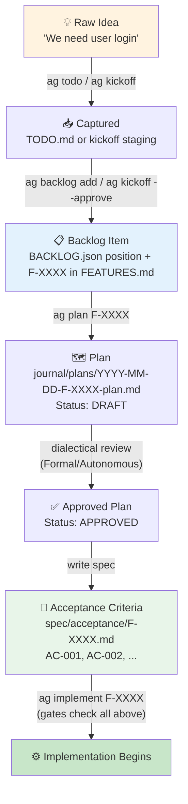

### What the Artifact Looks Like at Each Stage

**Stage 1 — Raw idea** (a sentence, a chat message, a TODO):
```
"We need user login with email and password"
```
Captured via `ag todo "user login with email/password"` → lands in TODO.md.

**Stage 2 — Backlog item** (ordered, with an F-ID):
```
ag backlog add --task "User login with email/password"
```
This creates an F-XXXX entry in FEATURES.md with `Status: planned` and adds it to BACKLOG.json at the end of the queue. Or if starting from a vision, `ag kickoff "build an auth system"` generates multiple features at once into a staging area, then `ag kickoff --approve` promotes them.

**Stage 3 — Plan** (how you'll build it):
```
ag plan F-0042
```
Agent explores the codebase, drafts an implementation approach, saves to `.agentic/journal/plans/YYYY-MM-DD-F-0042-plan.md` with `Status: DRAFT`. In Formal profile, dialectical review runs: a Critic agent attacks the plan, an Advocate defends it, they iterate until agreeing or the user decides.

**Stage 4 — Acceptance criteria** (the contract):
```markdown
# F-0042: User Login - Acceptance Criteria

**Feature**: Users can authenticate with email and password

## Acceptance Criteria

### Core Login (P1 — MVP)
- [ ] **AC-001**: User can enter email and password on login form
- [ ] **AC-002**: Invalid credentials show error message (no credential detail leak)
- [ ] **AC-003**: Valid credentials redirect to dashboard with session cookie

### Security (P1 — MVP)
- [ ] **AC-004**: Passwords hashed with bcrypt (cost ≥ 12)
- [ ] **AC-005**: Rate limit: max 5 failed attempts per 10 minutes per IP

### NFR Constraints (P1 — required)
- [ ] **AC-010**: Login response under 500ms (NFR-0007)

## Verification
### Unit Tests
- [ ] `tests/test_auth.py` — password hashing, session creation
### Integration Tests
- [ ] `tests/test_login_flow.py` — full login/redirect cycle

## Out of Scope
- OAuth / social login (F-0043)
- Two-factor authentication (F-0044)
```

This file lives at `spec/acceptance/F-0042.md`. Each AC is specific, testable, and unambiguous. NFRs from `spec/NFR.md` are integrated as testable ACs (not a separate section agents might ignore). Priority groups (P1/P2) indicate what's required vs. nice-to-have.

**Stage 5 — Implementation begins** (`ag implement F-0042`):

The `ag implement` command checks all prior stages are complete:
- F-0042 is at backlog position 0? ✓
- Plan exists and is APPROVED? ✓
- FEATURES.md entry exists? ✓
- Acceptance criteria file exists with AC lines? ✓
- AC clarity gate passes (ACs are testable)? ✓

Only then does implementation start. During implementation, new requirements discovered get added as `[Discovered]` entries — the spec grows organically with the code.

### Entry Points — Multiple Roads to the Backlog

Not every idea follows the same path in:

| Entry Point | Command | What Happens | Ends Up As |
|-------------|---------|-------------|-----------|
| **Quick idea** | `ag todo "..."` | Saved to TODO.md inbox | Unordered idea — triage later |
| **Triaged idea** | `ag backlog add --task "..."` | Creates F-XXXX + adds to queue | Ordered backlog item |
| **Vision / epic** | `ag kickoff "build auth system"` | Generates multiple features + ACs to staging | Staged features (review before promoting) |
| **Decomposed epic** | `ag decompose F-XXXX` | Breaks parent into component-scoped children | Child features linked to parent |
| **Promoted TODO** | `ag formalize T-XXXX` | Converts TODO into formal F-XXXX with AC stubs | Feature with skeleton spec |
| **Direct feature** | `feature.sh F-XXXX status planned` | Manual FEATURES.md entry | Planned feature (needs spec) |

### Discovery vs. Formal — How the Pipeline Differs

| Stage | Discovery | Formal / Autonomous Formal |
|-------|-----------|---------------------------|
| **Idea capture** | `ag todo` or just start coding | `ag todo` → `ag backlog add` |
| **Planning** | Optional — jump to implementation | Required — `ag plan` + dialectical review |
| **Spec format** | Rough bullets in WIP.md or inline | Structured AC file in `spec/acceptance/` |
| **AC quality** | "What would success look like?" (2-3 bullets) | Priority-grouped, NFR-integrated, clarity-gated |
| **Gate enforcement** | Advisory (warns but doesn't block) | Blocking (`ag implement` won't start without spec) |
| **Spec evolution** | Informal — update as you go | Formal markers: `[Discovered]`, `[Future]`, `[Revised in M-NNN]` |

---

## Section 2: 5-Minute Walkthrough

### The 9 Lifecycle Phases

| # | Phase | What Happens | Key Command | Key Artifact |
|---|-------|-------------|-------------|-------------|
| 1 | **Session Start** | Dashboard loads, WIP recovery, orphan plan scan, context hydration | `ag start` / `ag sync` | STATUS.md, AGENTS.json |
| 2 | **Intent & Routing** | Trigger words route to workflows: "build" → spec-first, "fix" → test-first, "done" → completion | Trigger words / skills | Skill activation |
| 3 | **Planning** | `ag intel architecture` gathers ADRs/NFRs, `ag plan` drafts approach, dialectical review validates, plan saved | `ag plan F-XXXX` | `.agentic/journal/plans/YYYY-MM-DD-F-XXXX-plan.md` |
| 4 | **Specification** | `ag intel spec F-XXXX` checks feature overlap, ACs written, NFRs integrated, clarity gate validates | `ag spec` | `spec/contracts/F-XXXX.yaml`, `spec/FEATURES.md` |
| 5 | **Implementation** | `ag intel implement F-XXXX` surfaces conventions/patterns, TDD or standard flow, WIP tracked | `ag implement F-XXXX` | Source code, WIP entry in AGENTS.json |
| 6 | **Verification** | `ag intel test F-XXXX` surfaces test strategy, tests run, NFR coverage checked, AC verified | `ag auto verify` | Test results, verification record |
| 7 | **Documentation** | Journal entry, status update, doc drift detection, registry maintenance | `journal.sh`, `status.sh` | JOURNAL.md, STATUS.md |
| 8 | **Commit** | 17+ pre-commit checks run. Scope validated, specs protected, complexity limited | `ag commit` | Git commit |
| 9 | **Completion** | Feature marked shipped, VERSION bumped, backlog advanced, retro trigger | `ag done F-XXXX` | VERSION, FEATURES.md, BACKLOG.json |

### Profile Differences at a Glance

| Dimension | Discovery | Formal | Autonomous Formal |
|-----------|-----------|--------|-------------------|
| **Spirit** | Move fast, learn | Spec-driven rigor | Formal rigor, AI-driven reviews |
| **AC required?** | Recommended | Blocking | Blocking |
| **Plan review?** | No | Yes (dialectical) | Yes (dialectical) |
| **Code review** | Critical agent | Human | Critical agent |
| **Merge review** | Human | Human | Human |
| **Pre-commit** | Fast (subset) | Full (all checks) | Full (all checks) |
| **Max files/commit** | 15 | 10 | 10 |

---

## Section 3: Deep Reference — The 9 Phases

### Phase 1: Session Start

**What happens**: The dashboard renders project health, detects interrupted work, scans for orphaned plans, and loads context.

**Commands & tools**:
- `bash .agentic/lib/tools/dashboard.sh` — renders health dashboard
- `ag sync` — 10-phase sync check (git, state files, drift, agent status)
- `ag start` — alias for sync + dashboard

**Gates**: None blocking. Dashboard is informational.

**Artifacts**:
- Read: STATUS.md, AGENTS.json, BACKLOG.json, HUMAN_NEEDED.md, VERSION
- Updated: STATUS.md (focus), AGENTS.json (agent registration)

**Profile variations**:
- All profiles: orphaned plan scan runs (`periodic_orphaned_plans: every_session`)
- Formal/Autonomous: retro check runs periodically (`periodic_retro_check: every_5_sessions`)

**Feedback loops**: WIP Recovery — if AGENTS.json shows interrupted work, dashboard surfaces it as first action. Orphaned plans from `~/.claude/plans/` are detected and must be saved before any implementation.

**Testing target**: `tests/llm/001_session_start.sh` — verifies dashboard output.

---

### Phase 2: Intent & Routing

**What happens**: User input is matched to trigger words, which route to specific workflows and skills.

**Trigger word table**:

| Trigger | Route | First Action |
|---------|-------|-------------|
| build / implement / add / create | Spec-first workflow | STOP. Write spec, then plan, then implement |
| fix / debug / repair | Test-first workflow | STOP. Write failing test FIRST |
| commit / push / ship | Completion workflow | STOP. Check AGENTS.json for active WIP |
| done / complete / finished | `ag done` | STOP. Run `ag done F-XXXX` |
| idea / remember / todo | Quick capture | `ag todo "description"` |
| decompose / break down | Decomposition | `ag decompose F-XXXX` |
| entire / full system (>10 files) | Rejection | TOO BIG. Break into 3-5 tasks |
| kickoff / vision | Vision pipeline | `ag kickoff "vision"` |
| review / approve | Review resolution | `ag review` |

**Skills**: 13 skills in `.claude/skills/` provide just-in-time guidance. Key skills: `implementing-features`, `committing-changes`, `writing-specs`, `planning-features`, `session-start`.

**Profile variations**: Routing is profile-independent. The routed workflow applies profile-specific gates.

---

### Phase 3: Planning

**What happens**: Agent explores codebase, drafts implementation plan, saves as DRAFT. If `plan_review_enabled: yes`, dialectical review runs (Critic + Advocate agents in fresh context). Plan iterated until approved.

**Commands & tools**:
- `ag plan F-XXXX` — enters plan mode, saves draft on exit
- `ag implement F-XXXX` — checks for approved plan (Gate 0), blocks if missing/draft

**Gates**:
- Plan must exist at `.agentic/journal/plans/*F-XXXX-plan.md` (dated plan file) before implementation
- Plan status must be APPROVED (not DRAFT) — enforced by `ag implement` Gate 0

**Artifacts**:
- Created: `.agentic/journal/plans/YYYY-MM-DD-F-XXXX-plan.md` (status: DRAFT → APPROVED)
- Read: CONTEXT_PACK.md, STACK.md, FEATURES.md, existing code

**Profile variations**:
| Setting | Discovery | Formal | Autonomous |
|---------|-----------|--------|------------|
| `plan_review_enabled` | no | yes | yes |
| `review_plan` | skip | critical_agent | critical_agent |

**Feedback loops**: Plan Review Loop — draft → critic agent → advocate agent → synthesis → revision → re-review. Continues until both agents agree or user decides.

**Testing target**: `tests/llm/016_plan_review_dialectical.sh`

---

### Phase 4: Specification

**What happens**: Feature entry created in FEATURES.md, acceptance criteria file written in `spec/acceptance/F-XXXX.md`. NFRs integrated into ACs where applicable. Clarity gate checks ACs are testable.

**Commands & tools**:
- `bash .agentic/lib/tools/feature.sh F-XXXX status planned` — create FEATURES.md entry
- `ag spec` / `ag specs` — spec management
- Clarity gate: checks AC lines for testability (part of `ag implement` gates)

**Gates**:
- `gate_planned_to_specced`: Feature must have Description in FEATURES.md
- `gate_specced_to_criteria_set`: Acceptance criteria file must exist with `AC-` lines
- Pre-commit Check 3c: FEATURES.md must be updated when spec files change (Formal only, BLOCKING)

**Artifacts**:
- Created: `spec/acceptance/F-XXXX.md`, FEATURES.md entry
- Format: `- [ ] **AC-1**: <testable criterion>` with `[Discovered]`, `[Revised in M-NNN]`, `[Future]` markers

**Profile variations**:
| Setting | Discovery | Formal | Autonomous |
|---------|-----------|--------|------------|
| `acceptance_criteria` | recommended | blocking | blocking |
| `spec_directory` | no | yes | yes |
| `review_spec` | skip | critical_agent | critical_agent |
| `review_criteria` | skip | critical_agent | critical_agent |

**Testing target**: `tests/test_gates.py` (gate_specced_to_criteria_set), structural tests S07/S08.

---

### Phase 5: Implementation

**What happens**: Agent implements feature following the approved plan. TDD cycle: write failing tests → implement → green tests → refactor. WIP entry created in AGENTS.json. Worktree isolation available.

**Commands & tools**:
- `ag implement F-XXXX` — 10-gate startup sequence, creates AGENTS.json WIP entry
- `bash .agentic/lib/agents/claude/skills/implementing-features/scripts/check-gates.sh` — gate checker

**`ag implement` gates** (from `ag.sh` cmd_implement, line 808):

| Gate | Check | Blocking? |
|------|-------|-----------|
| 0a | One feature at a time (AGENTS.json WIP check) | Yes |
| 0b | Backlog order (feature at position 0, auto-upserts if missing) | Yes |
| 0c | Auto-save plans (migrate from session-scoped to durable) | No |
| 0d | Plan review (plan exists + status APPROVED) | Yes (when `plan_review_enabled: yes`) |
| 1 | Spec-first (FEATURES.md entry + AC file exists) | Yes |
| 2 | AC clarity gate (`spec-analyze.sh --gate`) | Formal: Yes, Discovery: Advisory |
| 2b | NFR staleness detection | Advisory |
| 3 | Planning phase (`doctor.sh --phase planning`) | Yes |

**Artifacts**:
- Read: Plan, spec, ACs, STACK.md
- Created/Updated: AGENTS.json (WIP entry), source code, test files
- Worktree: `git worktree` branch created if `worktree_mode: on`

**Profile variations**:
| Setting | Discovery | Formal | Autonomous |
|---------|-----------|--------|------------|
| `worktree_mode` | off | off | off |
| `max_files_per_commit` | 15 | 10 | 10 |
| `max_code_file_length` | 1000 | 500 | 500 |

---

### Phase 6: Verification

**What happens**: Tests run and must pass. AC completion checked. NFR coverage verified. Smoke test performed. Spec audit available.

**Commands & tools**:
- `ag auto verify` — AC-by-AC verification loop
- `ag auto verify --visual` — with visual/screenshot verification
- `ag audit` — spec→AC→test chain verification
- `ag qa` — QA Registry: feature-to-test matrix across 9 categories, gap analysis
- `ag nfr check` — NFR compliance check

**Gates**:
- `gate_implementing_to_verified`: AC file + test files must exist, tests must reference feature ID
- Pre-commit Check 6: Test execution (BLOCKING)
- Pre-commit Check 20: TDD phase ordering (BLOCKING when `development_mode: tdd`)

**Artifacts**:
- Read: AC file, test files, NFR.md
- Created: Verification record, test results

**Profile variations**: All profiles require tests. Formal/Autonomous add NFR coverage check.

**Testing target**: `tests/test_gates.py` (gate_implementing_to_verified), `tests/test_nfr_validation.py`

---

### Phase 7: Documentation

**What happens**: Journal entry records outcomes (not file lists). Status updated. Doc drift detection runs. Registry maintained. CONTRIBUTIONS.md updated for framework PRs.

**Commands & tools**:
- `bash .agentic/lib/tools/journal.sh "Topic" "Outcomes" "Next" "Blockers" --why "Problem"`
- `bash .agentic/lib/tools/status.sh focus "Current task"`
- `bash .agentic/lib/tools/drift.sh --docs` — detect stale documentation
- `bash .agentic/lib/tools/docs.sh --list` — show doc registry

**Gates**:
- `gate_verified_to_documented`: Runs `drift.sh --docs --check` based on `docs_gate` setting
- Pre-commit Check 3: JOURNAL.md updated since last commit (BLOCKING)
- Pre-commit Check 3b: STATUS.md updated since last commit (BLOCKING)
- Pre-commit Check 19: Doc registry health (advisory)

**Artifacts**:
- Updated: JOURNAL.md, STATUS.md, CONTRIBUTIONS.md
- Checked: Doc registry in STACK.md `## Docs` section

**Profile variations**:
| Setting | Discovery | Formal | Autonomous |
|---------|-----------|--------|------------|
| `docs_gate` | off | blocking | blocking |
| `docs_mode` | inline | inline | inline |
| `docs_stale_days` | 30 | 30 | 30 |

---

### Phase 8: Commit

**What happens**: 17+ pre-commit checks validate the commit. Scope, specs, tests, complexity, branch policy, and spec immutability all verified. Diff shown to human for review (interactive sessions).

**Commands & tools**:
- `ag commit` — runs pre-commit checks, shows diff, creates commit
- `bash .agentic/lib/hooks/pre-commit-check.sh [--mode fast|full]`

**Gates**: See [Section 11: Quality Gates Complete Reference](#section-11-quality-gates-complete-reference) for all 17+ checks.

**Artifacts**:
- Read: All state files for validation
- Created: Git commit

**Profile variations**:
| Setting | Discovery | Formal | Autonomous |
|---------|-----------|--------|------------|
| `pre_commit_checks` | fast | full | full |
| `review_code` | critical_agent | human | critical_agent |
| `review_commit` | human | human | critical_agent |
| `git_workflow` | direct | pull_request | pull_request |

**Escape hatches** (feature branches only, blocked on main/master):
- `SKIP_TESTS=1` — skip test execution
- `SKIP_COMPLEXITY=1` — skip complexity limits
- `SKIP_STALENESS=1` — skip JOURNAL/STATUS/FEATURES staleness checks
- `SKIP_TDD=1` — skip TDD phase ordering check

---

### Phase 9: Completion

**What happens**: Feature marked shipped in FEATURES.md. VERSION bumped (patch). Backlog advanced to next item. Worktree cleaned up. Retro trigger checked. HUMAN_NEEDED.md entry added for PR review.

**Commands & tools**:
- `ag done F-XXXX` — full completion workflow
- `bash .agentic/lib/tools/feature.sh F-XXXX status shipped`
- `ag backlog done` — advance to next backlog item
- `ag flush` — commit state file updates on main

**Gates** (`ag done` from `ag.sh` cmd_done, line 1390):
- Doctor validation (state file health)
- AC completion check (all ACs checked off)
- Drift check (`ag sync` runs)
- WIP cleanup (AGENTS.json entry removed)
- Worktree cleanup (if applicable)

**Artifacts**:
- Updated: FEATURES.md (status → shipped), VERSION (patch bump), BACKLOG.json (advance), AGENTS.json (WIP removed)
- Created: HUMAN_NEEDED.md entry (PR review tracking)

**Profile variations**: All profiles follow the same completion sequence. `review_merge` determines who approves the final PR.

**Post-completion**: If `docs_mode: deferred`, `ag done` logs deferred items to `.agentic/deferred-docs.json`. Run `ag docs generate` later. If `retrospective_enabled: yes`, retro trigger fires at configured intervals.

---

# Part II: Structural Diagrams

## Section 4: Feature State Machine

### State Diagram

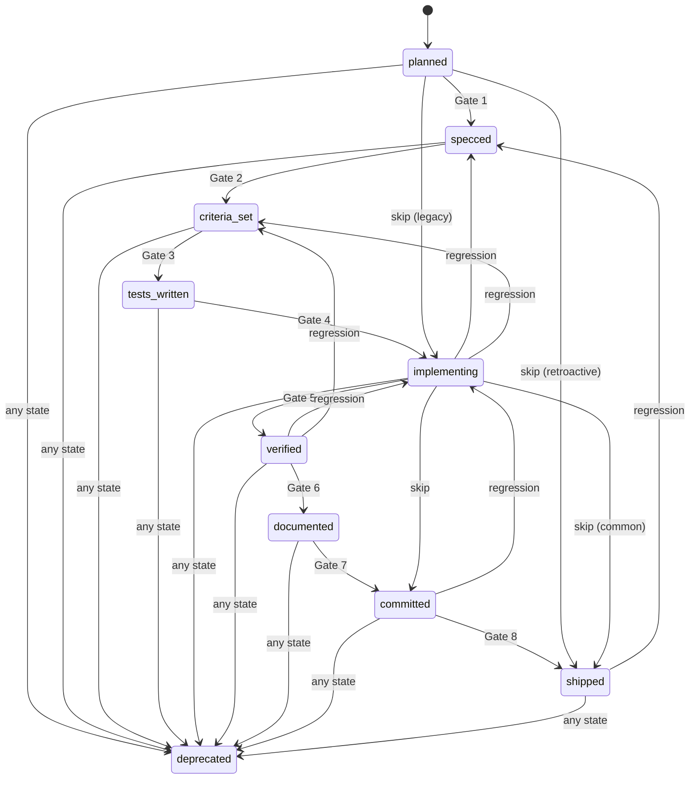

### Transition Table

| # | From → To | Gate Function | What It Checks | Blocking? | Source |
|---|-----------|--------------|----------------|-----------|--------|
| 1 | planned → specced | `gate_planned_to_specced` | Feature exists in FEATURES.md with non-empty Description | Yes | `gates.py:105` |
| 2 | specced → criteria_set | `gate_specced_to_criteria_set` | AC file exists with at least one `AC-` line | Yes | `gates.py:133` |
| 3 | criteria_set → tests_written | `gate_criteria_set_to_tests_written` | At least one test file references feature ID | Yes | `gates.py:167` |
| 4 | tests_written → implementing | `gate_tests_written_to_implementing` | TDD readiness (advisory only) | Advisory | `gates.py:217` |
| 5 | implementing → verified | `gate_implementing_to_verified` | AC file + test files exist, tests reference feature | Yes | `gates.py:241` |
| 6 | verified → documented | `gate_verified_to_documented` | Doc drift check (respects `docs_gate` setting) | Configurable | `gates.py:314` |
| 7 | documented → committed | `gate_documented_to_committed` | Pre-commit checks advisory | Advisory | `gates.py:390` |
| 8 | committed → shipped | `gate_committed_to_shipped` | Branch pushed, PR exists, VERSION bumped (all advisory) | Advisory | `gates.py:413` |

### Review Checkpoint Overlay

Reviews fire **after gates pass, before transition writes** (from `review.py`):

| Transition | Setting Key | Discovery | Formal | Autonomous |
|-----------|-------------|-----------|--------|------------|
| planned → specced | `review_spec` | skip | critical_agent | critical_agent |
| specced → criteria_set | `review_criteria` | skip | critical_agent | critical_agent |
| tests_written → implementing | `review_plan` | skip | critical_agent | critical_agent |
| documented → committed | `review_code` | critical_agent | human | critical_agent |
| committed → shipped | `review_merge` | human | human | human |
| Any regression | `review_regression` | critical_agent | human | critical_agent |

Unmapped forward transitions (criteria_set → tests_written, implementing → verified, verified → documented) default to **skip** — structural gates are sufficient.

### Regression Cascade Rules

When a feature regresses from state A to state B, all intermediate states are **invalidated** and must be re-achieved:

| Regression | Invalidated States |
|-----------|-------------------|
| implementing → specced | criteria_set, tests_written |
| implementing → criteria_set | tests_written |
| verified → implementing | (none — adjacent) |
| verified → criteria_set | tests_written, implementing |
| committed → implementing | verified, documented |
| shipped → specced | criteria_set, tests_written, implementing, verified, documented, committed |

**Mode**: `blocking` for Formal/Autonomous Formal profiles (`state_enforcement: blocking`), `off` for Discovery. In blocking mode, gate failures prevent the transition and `ag implement`/`ag done` exit non-zero. In advisory mode, gate failures warn but allow. To bypass blocking: set `state_enforcement: advisory` in STACK.md.

---

## Section 5: Three Profiles — Parallel Paths

### Swim Lane Diagram

```mermaid
flowchart TB
    subgraph Discovery["🔍 Discovery — Move fast, learn"]
        D1[Idea] --> D2[Rough spec optional]
        D2 --> D3[Implement]
        D3 --> D4[Fast pre-commit]
        D4 --> D5[Direct to main]
    end

    subgraph Formal["📐 Formal — Spec-driven rigor"]
        F1[Idea] --> F2[Plan + dialectical review]
        F2 --> F3[Spec + ACs blocking]
        F3 --> F4[TDD implement]
        F4 --> F5[Full pre-commit + human review]
        F5 --> F6[PR workflow]
    end

    subgraph Autonomous["🤖 Autonomous Formal — AI-driven reviews"]
        A1[Idea] --> A2[Plan + dialectical review]
        A2 --> A3[Spec + ACs blocking]
        A3 --> A4[TDD implement]
        A4 --> A5[Full pre-commit + critical agent]
        A5 --> A6[PR workflow, human merge only]
    end
```

### Comprehensive Comparison Table

| Setting | Discovery | Formal | Autonomous Formal |
|---------|-----------|--------|-------------------|
| **Feature & Spec** | | | |
| `feature_tracking` | no | yes | yes |
| `acceptance_criteria` | recommended | blocking | blocking |
| `spec_directory` | no | yes | yes |
| `spec_analysis` | off | on | on |
| `state_enforcement` | off | blocking | blocking |
| **Planning & Review** | | | |
| `plan_review_enabled` | no | yes | yes |
| `review_spec` | skip | critical_agent | critical_agent |
| `review_criteria` | skip | critical_agent | critical_agent |
| `review_plan` | skip | critical_agent | critical_agent |
| `review_code` | critical_agent | human | critical_agent |
| `review_merge` | human | human | human |
| `review_commit` | human | human | critical_agent |
| `review_decomposition` | skip | critical_agent | critical_agent |
| `review_regression` | critical_agent | human | critical_agent |
| `review_taste` | skip | critical_agent | critical_agent |
| `review_integration` | skip | critical_agent | critical_agent |
| **Commit & Quality** | | | |
| `pre_commit_checks` | fast | full | full |
| `pre_commit_hook` | fast | fast | fast |
| `wip_before_commit` | warning | blocking | blocking |
| `git_workflow` | direct | pull_request | pull_request |
| `max_files_per_commit` | 15 | 10 | 10 |
| `max_added_lines` | 1000 | 500 | 500 |
| `max_code_file_length` | 1000 | 500 | 500 |
| **Documentation** | | | |
| `docs_gate` | off | blocking | blocking |
| `docs_mode` | inline | inline | inline |
| `docs_stale_days` | 30 | 30 | 30 |
| **Periodic Checks** | | | |
| `periodic_orphaned_plans` | every_session | every_session | every_session |
| `periodic_retro_check` | off | every_5_sessions | every_5_sessions |
| `periodic_agent_refresh` | off | every_20_sessions | every_20_sessions |
| `retrospective_enabled` | no | yes | yes |
| **Quality & NFR** | | | |
| `qa_propagation_warn_days` | 3 | 3 | 3 |
| `qa_propagation_escalate_days` | 7 | 7 | 7 |
| `qa_audit_freshness_days` | 30 | 30 | 30 |
| **Autonomous** | | | |
| `kickoff_confirm` | skip | ask | skip |
| `feedback_mode` | pr_review | pr_review | working_software |
| `max_parallel_agents` | 3 | 3 | 3 |
| `worktree_mode` | off | off | off |

### When to Use Which

- **Discovery**: Prototypes, solo work, learning projects, hackathons. You want speed over ceremony. Specs are optional, reviews are minimal.
- **Formal**: Team projects, production code, regulated environments. Every feature has specs and tests. Humans review code and merges.
- **Autonomous Formal**: High-throughput delivery where AI handles routine reviews. Same rigor as Formal, but only merge requires human approval. Ideal for `ag auto epic` workflows.

### ADR-002 Mode Mapping

| ADR-002 Mode | Profile | Key Override |
|-------------|---------|-------------|
| Tech Lead (low autonomy) | formal | `review_code: human`, `review_merge: human` |
| Product Visionary (medium) | autonomous_formal | `review_taste: human`, `feedback_mode: working_software` |
| Fully Autonomous (high) | autonomous_formal | `review_merge: critical_agent` (override default) |

---

## Section 6: Spec Evolution Lifecycle

### Spec Journey Diagram

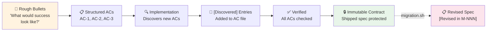

### Protection Levels

| Stage | Protection | What's Allowed |
|-------|-----------|---------------|
| **New** (planned) | None | Free editing, restructuring |
| **In Progress** (implementing) | Low | Add `[Discovered]` entries, fix typos |
| **Shipped** | **HIGH** | No changes without migration (`migration.sh create`) |

### Pre-Commit Enforcement (Checks 14-16)

| Check | Name | What It Does | Blocking? |
|-------|------|-------------|-----------|
| 14 | Shipped spec changes require migration | Detects modifications to `spec/acceptance/F-XXXX.md` for shipped features. Requires `migration.sh create` | BLOCKING |
| 15 | Test file deletion protection | Blocks deletion of test files referenced by shipped features | BLOCKING |
| 16 | Status downgrade protection | Blocks status changes from shipped to non-shipped (except deprecated) | BLOCKING |

### Spec Markers

| Marker | Meaning | When Used |
|--------|---------|----------|
| `[Discovered]` | AC found during implementation, not in original spec | Implementation phase |
| `[Revised in M-NNN]` | AC modified via formal migration | Post-ship amendment |
| `[Future]` | Enhancement idea captured but not committed to | Any phase |

---

## Section 7: Feedback Loops

### Feedback Loop Diagram

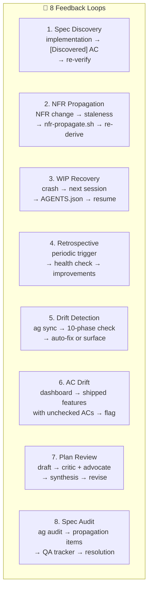

### Loop Details

**1. Spec Discovery Loop**
- **Trigger**: Implementation reveals new requirements
- **Flow**: Implement → discover edge case → add `[Discovered]` AC → write test → verify
- **Artifact**: `spec/acceptance/F-XXXX.md` updated with `[Discovered]` entries
- **Phase connection**: Implementation → Specification (backward) → Verification (forward)

**2. NFR Propagation Loop**
- **Trigger**: NFR definition changes or new NFR created
- **Flow**: NFR change → `nfr-propagate.sh` detects staleness → re-derive affected ACs → update features
- **Tools**: `nfr-propagate.sh`, `nfr-coverage.sh`, `nfr-test-check.sh`
- **Phase connection**: Specification → Verification (re-check NFR compliance)

**3. WIP Recovery Loop**
- **Trigger**: Session crash, context loss, or agent timeout
- **Flow**: Next session → dashboard reads AGENTS.json → shows interrupted WIP → agent resumes or rolls back
- **Tools**: `wip.sh check`, `agents_helpers.py list`, dashboard.sh
- **Phase connection**: Session Start → Implementation (resume)

**4. Retrospective Loop**
- **Trigger**: Periodic (`every_5_sessions` for Formal/Autonomous)
- **Flow**: Session count threshold → retro prompt → health check → process improvement notes
- **Setting**: `retrospective_enabled`, `periodic_retro_check`
- **Phase connection**: Completion → Session Start (next cycle)

**5. Drift Detection Loop**
- **Trigger**: `ag sync` (manual or session start)
- **Flow**: 10-phase sync check → detect mismatches → auto-fix trivial issues → surface blockers
- **Checks**: Git sync, state file validity, agent status, spec consistency, doc freshness, NFR compliance
- **Phase connection**: Session Start → any phase needing remediation

**6. AC Drift Loop**
- **Trigger**: Dashboard at session start
- **Flow**: Scan shipped features → check AC completion percentage → flag features below 50%
- **Display**: `⚠️ AC Drift: N shipped feature(s) with <50% ACs checked`
- **Phase connection**: Session Start → Verification (remediation)

**7. Plan Review Loop (Dialectical)**
- **Trigger**: Exiting plan mode when `plan_review_enabled: yes`
- **Flow**: Draft plan → spawn Critic agent → spawn Advocate agent → synthesize perspectives → revision guidance → user decides (proceed/revise/reject)
- **Iterations**: Continues until both agents agree or user overrides
- **Phase connection**: Planning (internal loop)

**8. Spec Audit Loop**
- **Trigger**: `ag audit` command
- **Flow**: Verify spec→AC→test chain integrity → detect propagation items → populate QA tracker → track resolution
- **Tools**: `ag audit`, `ag nfr check`
- **Phase connection**: Verification → Specification (fix gaps)

---

## Section 8: Artifact Relationship Map

### Entity-Relationship Diagram

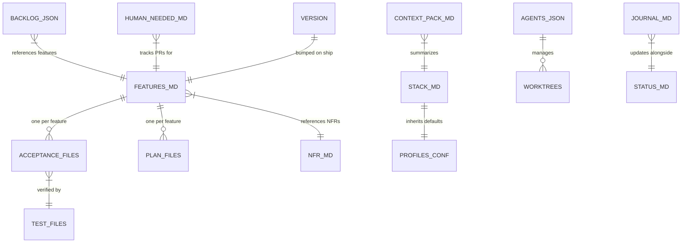

### Artifact Reference Table

| Artifact | Path | Git-tracked? | Phase Created | Who Reads | Who Updates | Script |
|----------|------|-------------|--------------|-----------|-------------|--------|
| FEATURES.md | `.agentic/spec/FEATURES.md` | Yes | Specification | All phases | `feature.sh` | `feature.sh` |
| Acceptance files | `.agentic/spec/acceptance/F-XXXX.md` | Yes | Specification | Implementation, Verification | Manual / `ag spec` | — |
| NFR.md | `.agentic/spec/NFR.md` | Yes | Specification | Verification, Implementation | Manual | — |
| Plan files | `.agentic/journal/plans/YYYY-MM-DD-F-XXXX-plan.md` | Yes | Planning | Implementation | `ag plan` | — |
| JOURNAL.md | `.agentic/journal/JOURNAL.md` | Yes | Documentation | Session Start | `journal.sh` | `journal.sh` |
| STATUS.md | `.agentic/STATUS.md` | Yes | Session Start | Dashboard | `status.sh` | `status.sh` |
| STACK.md | `STACK.md` (project root) | Yes | Init | All phases | Manual / `ag set` | `ag set` |
| CONTEXT_PACK.md | `CONTEXT_PACK.md` (project root) | Yes | Init | Session Start, Planning | `ag sync` | — |
| BACKLOG.json | `.agentic/BACKLOG.json` | Yes | Planning | Implementation, Completion | `ag backlog` | `backlog.sh` |
| HUMAN_NEEDED.md | `.agentic/HUMAN_NEEDED.md` | Yes | Commit | Session Start | `blocker.sh` | `blocker.sh` |
| VERSION | `VERSION` (project root) | Yes | Init | Completion | `ag done` | — |
| AGENTS.json | `.agentic/session/AGENTS.json` | No (gitignored) | Implementation | Session Start | `ag implement`, `ag done` | `agents_helpers.py` |
| TODO.md | `.agentic/TODO.md` | Yes | Any | Session Start | `todo.sh` | `todo.sh` |
| CONTRIBUTIONS.md | `.agentic/CONTRIBUTIONS.md` | Yes | Implementation | — | Manual | — |

---

# Part III: Advanced Workflows

## Section 9: Autonomous Execution Modes

### Autonomous Modes Diagram

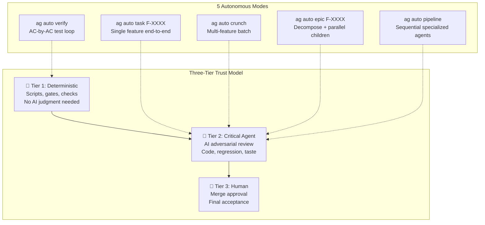

### Mode Details

| Mode | Command | What It Does | Trust Tier | Key Module |
|------|---------|-------------|-----------|------------|
| **Verify** | `ag auto verify` | Loops through each AC, runs targeted tests, collects evidence | Tier 1 (deterministic) | `auto/verify.py` |
| **Task** | `ag auto task F-XXXX` | Full lifecycle for single feature: plan → spec → implement → verify → commit | Tier 2 (critical agent reviews) | `auto/task.py` |
| **Crunch** | `ag auto crunch` | Processes multiple features from backlog sequentially | Tier 2 | `auto/crunch.py` |
| **Epic** | `ag auto epic F-XXXX` | Decomposes epic into children, executes children (optionally in parallel) | Tier 2 | `auto/epic.py`, `auto/parallel.py` |
| **Pipeline** | `ag auto pipeline` | Sequential specialized agents (planner → implementer → reviewer) | Tier 2 | `auto/pipeline.py` |

### How Autonomous Maps to Standard Phases

| Standard Phase | Autonomous Equivalent | Trust |
|---------------|----------------------|-------|
| Planning | Auto-generates plan, skips dialectical review | Deterministic |
| Specification | Auto-creates ACs from plan | Deterministic |
| Implementation | Agent codes against ACs | Deterministic |
| Verification | `verify.py` AC-by-AC loop | Deterministic |
| Code Review | `critical_agent.py` adversarial review | Critical Agent |
| Commit | Auto-commit (when `review_commit: critical_agent`) | Critical Agent |
| Merge | Human approval (unless overridden) | Human |

### Autonomous Engine Modules (24 modules in `.agentic/lib/auto/`)

| Module | Purpose |
|--------|---------|
| `task.py` | Single-feature autonomous execution |
| `engine.py` | Core execution loop shared by all modes |
| `verify.py` | AC-by-AC verification with evidence |
| `parallel.py` | Parallel epic child execution |
| `epic.py` | Epic decomposition and child management |
| `crunch.py` | Multi-feature batch processing |
| `pipeline.py` | Sequential specialized agent pipeline |
| `critical_agent.py` | Adversarial AI reviewer |
| `state_machine.py` | 10-state feature lifecycle |
| `gates.py` | Transition gate functions |
| `review.py` | Configurable review checkpoints |
| `components.py` | Component registry and scoped testing |
| `scheduler.py` | Work scheduling and ordering |
| `coord_server.py` | HTTP JSON-RPC coordination server |
| `coord_tools.py` | Coordination primitives |
| `control.py` | Agent lifecycle control |
| `intents.py` | Intent tracking for crash recovery |
| `kickoff.py` | Vision-to-backlog pipeline |
| `framework_verify.py` | Framework self-verification |
| `integration_verify.py` | Cross-component integration tests |
| `self_heal.py` | Auto-recovery from failures |
| `init.py` | `ag auto init` setup (permissions, tier config) |
| `visual.py` | Visual/screenshot verification |
| `umbrella.py` | Multi-repo coordination (future) |

---

## Section 10: Verification Pyramid

Six levels of verification, from narrowest to broadest:

| Level | Scope | Tools | When Run |
|-------|-------|-------|----------|
| **1. Unit** | Individual test cases, per-AC coverage | `pytest`, `bash` test scripts | During implementation |
| **2. Feature** | Single feature: all ACs, smoke test | `ag auto verify`, `ag audit` | After implementation |
| **3. Integration** | Cross-component: epic children interact correctly | `ag auto verify-epic F-XXXX` | After epic completion |
| **4. Framework** | Framework self-consistency (706 checks at v0.64.0) | `bash tests/validate_framework.sh` | Before commit (framework dev) |
| **5. Behavioral** | AI agent behavior: do agents follow rules? | `ag test llm` (67 LLM tests) | Before commit (framework dev) |
| **6. Drift** | Project state consistency: 10-phase sync check | `ag sync`, `drift.sh`, `drift-check.sh` | Session start, before commit |

### Test Inventory

| Category | Count | Location |
|----------|-------|----------|
| LLM behavioral tests | 67 | `tests/llm/` |
| Python unit/integration | 34 | `tests/test_*.py` |
| Shell tests | 17 | `tests/test_*.sh` |
| Structural checks | 13 | `tests/infrastructure/structural/` |
| **Total** | **152** | `tests/` |

---

## Section 11: Quality Gates Complete Reference

### Pre-Commit Checks (`pre-commit-check.sh`)

| # | Name | Mode | Blocking? | What It Validates | Escape Hatch |
|---|------|------|-----------|-------------------|-------------|
| 1 | WIP check | all | BLOCKING | `.agentic/session/WIP.md` must not exist (work must be complete) | — |
| 2 | Shipped AC check | all | BLOCKING | Shipped features must have acceptance criteria files | — |
| 3 | Journal freshness | all | BLOCKING | JOURNAL.md updated since last commit | `SKIP_STALENESS` |
| 3b | Status freshness | all | BLOCKING | STATUS.md updated since last commit | `SKIP_STALENESS` |
| 3c | Features freshness | full | BLOCKING | FEATURES.md updated when feature spec files staged (Formal only) | `SKIP_STALENESS` |
| 3d | NFR freshness | full | BLOCKING | NFR.md updated when NFR spec files staged (Formal only) | `SKIP_STALENESS` |
| 4 | Stack version | full | Advisory | STACK.md version matches reality | — |
| 5 | Batch size | full | Advisory | Warns on >10 files (>max_files_per_commit) | — |
| 6 | Test execution | all | BLOCKING | Tests must pass | `SKIP_TESTS` |
| 7 | Complexity limits | all | BLOCKING | Max files, lines, file length per commit | `SKIP_COMPLEXITY` |
| 8 | Untracked files | full | Advisory | Warns about new files not git-added | — |
| 9 | LLM test status | full | Advisory | LLM behavioral test pass rate (framework dev only) | — |
| 10 | Instruction file size | full | Advisory | Agent instruction files under size limits (NFR-0001) | — |
| 11 | Branch policy | all | BLOCKING | Blocks commit to main if `git_workflow: pull_request` | — |
| 12 | Workflow compliance | full | Advisory | New impl files tracked via WIP with feature ID (Formal only) | — |
| 13 | Test co-presence | full | Advisory | Warns when source files lack corresponding tests | — |
| 14 | Shipped spec protection | all | BLOCKING | Shipped spec changes require migration (`migration.sh`) | — |
| 15 | Test deletion protection | all | BLOCKING | Cannot delete test files referenced by shipped features | — |
| 16 | Status downgrade protection | all | BLOCKING | Cannot downgrade shipped features (except → deprecated) | — |
| 17 | Custom quality gates | full | BLOCKING | Extension gates from `.agentic/local/extensions/gates/*.sh` | — |
| 18 | Instruction file sync | full | Advisory | ag.sh changes accompanied by instruction file updates (framework dev) | — |
| 19 | Doc registry health | full | Advisory | Doc registry entries are valid (respects `docs_gate` setting) | — |
| 20 | TDD phase ordering | all | BLOCKING | Tests must exist before implementation (when `development_mode: tdd`) | `SKIP_TDD` |
| 21 | Plan approval | all | BLOCKING | Approved plan required when `plan_review_enabled: yes`. Defense-in-depth (F-0221): ExitPlanMode + UserPromptSubmit + PostToolUse(Write\|Edit\|MultiEdit) provide advisory warnings at 3 earlier points. | — |

**Escape hatch rules**: All `SKIP_*` variables are **blocked on main/master branches**. They only work on feature branches for WIP commits.

### `ag implement` Gates

| Gate | What It Checks | Blocking? |
|------|---------------|-----------|
| 0a | One feature at a time — no other WIP in AGENTS.json | Yes |
| 0b | Backlog order — feature at position 0 (auto-upserts if missing) | Yes |
| 0c | Auto-save plans — migrates from `~/.claude/plans/` to durable location | No |
| 0d | Plan review — plan exists and status is APPROVED (triggers review if DRAFT) | Yes (when `plan_review_enabled: yes`) |
| 1 | Spec-first — feature registered in FEATURES.md + AC file exists | Yes |
| 2 | AC clarity — `spec-analyze.sh --gate` checks ACs are testable | Formal: Yes, Discovery: Advisory |
| 2b | NFR staleness — warns if NFR.md newer than AC file | Advisory |
| 3 | Planning phase — `doctor.sh --phase planning` validates state | Yes |

### `ag done` Gates

| Check | What It Does |
|-------|-------------|
| Doctor validation | State file health check (all required files exist, valid format) |
| AC completion | All acceptance criteria checked off (`- [x]`) |
| Drift check | Runs `ag sync` equivalent |
| WIP cleanup | Removes AGENTS.json entry for the feature |
| Worktree cleanup | Removes worktree if applicable |
| VERSION bump | Increments patch version |
| Backlog advance | Moves to next backlog item |
| State transition | Updates FEATURES.md status to `shipped` |

---

# Part III-B: Deep Pipeline Sections

> **Running example**: Every section below follows **F-0042: User Login** — a feature requiring username/password authentication with session management. NFR-0007 constrains response time to < 500ms. By tracing one feature end to end, you can see how each pipeline stage transforms the previous stage's output.

## The Testing Pipeline — End to End

Before zooming into each stage, here's the complete pipeline from NFR + feature definition through to commit:

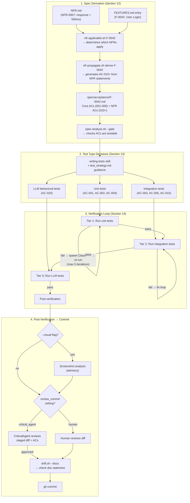

---

## Section 12: The Spec Derivation Pipeline — From NFRs + Features to Testable ACs

**What this section covers**: How a feature entry in FEATURES.md combines with project-wide NFRs to produce a complete, testable acceptance criteria file.

### Running Example: F-0042 Setup

**FEATURES.md entry**:
```markdown
## F-0042: User Login
**Status**: implementing
**Category**: Backend
**Description**: Username/password authentication with session management and rate limiting
```

**NFR.md entry** (one of several that may apply):
```markdown
## NFR-0007: API Response Time
- Category: performance
- Statement: All API endpoints must respond within 500ms p95 latency
- Applies to: component:backend, component:api
- How to measure: Load test results; p95 latency < 500ms
- Current status: met
```

### The AC Template Structure

Every acceptance criteria file follows the template at `.agentic/lib/templates/acceptance.template.md`. The key structural elements:

```markdown
# F-####: [Feature Name] - Acceptance Criteria
**Feature**: [One-sentence description]

## Behavior (what the user needs — technology-agnostic)

## Acceptance Criteria

### [Core Behavior] (P1 — MVP)
**Verify independently**: [how to test this group alone]
- [ ] **AC-001**: [Criterion]
- [ ] **AC-002**: [Criterion]

### [Enhanced Experience] (P2 — better but optional)
- [ ] **AC-003**: [Criterion]

### NFR Constraints (P1 — required)
<!-- Auto-populated by: bash .agentic/lib/tools/nfr-propagate.sh derive F-XXXX -->
- [ ] **AC-010**: [NFR constraint made testable] (NFR-XXXX)

## Verification
### Tests
#### Unit Tests
- [ ] `[test file]` — [what it verifies]
#### Integration Tests (if crossing boundaries)
- [ ] `[test file]` — [what it verifies]
#### Behavioral / LLM Tests (if feature changes agent decision-making)
- [ ] **[TEST-ID]**: [prompt scenario] → agent should [behavior]

## Out of Scope
```

**Key design decision**: Core ACs use IDs 001-009. NFR-derived ACs start at **AC-010**. This deliberate numbering gap means you can always tell at a glance which ACs are feature-specific vs. NFR-derived.

### How `nfr-propagate.sh derive` Works Step by Step

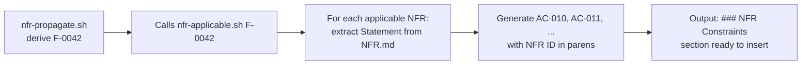

**Step 1 — Determine applicable NFRs**: Calls `nfr-applicable.sh F-0042`, which matches NFRs to the feature using three strategies:
- **Global NFRs** (match `"global|all work|all features"` in "Applies to:") — always apply, high confidence
- **Component-scoped** (match `"component:X"` tags against feature category/description) — high confidence
- **Keyword overlap** (words ≥4 chars from "Applies to:" matched against feature context, excluding stop-words) — low confidence, marked with `(?)`

**Step 2 — Extract statements**: For each applicable NFR, extracts the `Statement:` field from NFR.md.

**Step 3 — Generate ACs**: Formats each as a checkbox line starting at `ac_num=10`:
```
- [ ] **AC-010**: All API endpoints must respond within 500ms p95 latency (NFR-0007)
- [ ] **AC-011**: Work should be planned in small batches (~10 files per commit) (NFR-0003)
```

**Step 4 — Output**: A complete `### NFR Constraints (P1 — required)` markdown block, ready to paste into the AC file. If no NFRs apply, outputs: `<!-- NFRs: none applicable — evaluated YYYY-MM-DD -->`

### Concrete Before/After for F-0042

**Before** (agent writes core ACs manually):
```markdown
## Acceptance Criteria

### Core Login (P1 — MVP)
**Verify independently**: POST /api/login with valid/invalid credentials
- [ ] **AC-001**: Login form accepts username and password
- [ ] **AC-002**: Invalid credentials return 401 with error message
- [ ] **AC-003**: Successful login redirects to dashboard with session cookie

### Security (P1)
- [ ] **AC-004**: Passwords stored using bcrypt with cost factor ≥ 12
- [ ] **AC-005**: Rate limiting: max 5 failed attempts per IP per 15 minutes
```

**After** (`nfr-propagate.sh derive F-0042` output inserted):
```markdown
### NFR Constraints (P1 — required)
**Verify independently**: Check each constraint against the feature implementation
- [ ] **AC-010**: All API endpoints must respond within 500ms p95 latency (NFR-0007)
- [ ] **AC-011**: Acceptance criteria must exist before implementation (NFR-0004)
```

### Keeping NFRs in Sync

| Tool | Command | Purpose |
|------|---------|---------|
| `nfr-applicable.sh` | `nfr-applicable.sh F-0042` | Which NFRs apply to this feature? |
| `nfr-propagate.sh derive` | `nfr-propagate.sh derive F-0042` | Generate `### NFR Constraints` section |
| `nfr-propagate.sh check` | `nfr-propagate.sh check --all` | Staleness: is NFR.md newer than AC file? (mtime comparison) |
| `nfr-propagate.sh sync` | `nfr-propagate.sh sync F-0042` | Diff current AC file vs. fresh derive output (detects MISSING, EXTRA, LEGACY) |
| `nfr-test-check.sh` | `nfr-test-check.sh F-0042` | Which applicable NFRs lack test references in ACs? |
| `nfr-coverage.sh` | `nfr-coverage.sh --detail` | Cross-feature: which features reference each NFR? |
| `spec-analyze.sh` | `spec-analyze.sh F-0042 --gate` | Clarity gate: flags vague terms without metrics, AC↔test gaps, NFR measurability |
| `check-spec-health.sh` | `check-spec-health.sh F-0042` | Structural health: required sections present, test files exist, ACs checked |

### The Clarity Gate

`spec-analyze.sh` performs three semantic checks on the AC file:

1. **Ambiguity detection** — Scans for vague words (`fast`, `scalable`, `efficient`, `responsive`, `performant`, etc.) and only flags them if **no metric is nearby** (no numbers, no `<`, `>`, `≤`, `within`, `under`, `at least`, etc.). Provides rewrite suggestions.

2. **AC↔test coverage gaps** — Identifies ACs with no corresponding test reference in the Verification section.

3. **NFR measurability** — Checks each referenced NFR exists in NFR.md and has a non-placeholder "How to measure" field.

In **Formal** profile, `--gate` mode makes CRITICAL findings exit 1 (blocking). In **Discovery**, it's advisory only.

---

## Section 13: From ACs to Tests — How Test Types Are Decided

**What this section covers**: The framework doesn't have an automatic routing engine that maps ACs to test types. Instead, it guides agents through three layers of structure that converge on the right test type for each AC.

### Running Example: F-0042 AC-to-Test Mapping

```
AC file structure                    Test type           Why this type
──────────────                       ─────────           ─────────────
### Core Login (P1)
  AC-001: login form accepts         Unit test           Isolated component rendering
          username/password
  AC-002: invalid creds → 401        Unit test           Validation logic, no external deps
  AC-003: success → redirect         Integration test    Session creation + HTTP redirect
          with session cookie

### Security (P1)
  AC-004: bcrypt with cost ≥ 12      Unit test           Pure crypto function
  AC-005: rate limiting (5/15min)    Integration test    Stateful, time-based, cross-request

### NFR Constraints (P1)
  AC-010: response < 500ms           Integration test    Performance benchmark under load

### Behavioral / LLM Tests
  AC-020: agent follows login flow   LLM behavioral      Tests agent decision-making
```

### The Three Layers That Guide Test Type Decisions

**Layer 1: The AC Template Structure**

The acceptance template's `## Verification` section has explicit sub-sections for each test type (Unit Tests, Integration Tests, Behavioral/LLM Tests). The agent plans tests **in the spec, before writing code** — this is enforced by `feature_start.md` Gate 1. By requiring the agent to assign each AC to a test section during spec writing, the test type decision happens at design time, not as an afterthought.

**Layer 2: The `writing-tests` Skill**

When writing tests, the skill at `.claude/skills/writing-tests/SKILL.md` follows a 4-step process:

1. **Understand what to test** — Read ACs from `spec/acceptance/F-XXXX.md`
2. **Step 1.5: Check NFR test coverage** — Run `nfr-test-check.sh F-XXXX` to find gaps
3. **Design test cases** — For each AC: happy path, edge cases, error cases
4. **Write tests** — Match existing project conventions, run and verify

**Layer 3: The `test_strategy.md` Reference**

The canonical test strategy at `.agentic/lib/quality/test_strategy.md` defines:

- **Test pyramid**: Unit (most, fast, deterministic) → Integration (boundaries: DB, network, filesystem) → E2E (critical user flows, smallest count)
- **What makes a test "unit"**: Component with **controlled dependencies** (mocked/faked). If it touches real network, DB, or filesystem → integration, not unit.
- **Seven test categories** every AC should consider:

| Category | When Required | Example for F-0042 |
|----------|---------------|---------------------|
| Happy path | Always | Valid login returns 200 + session |
| Edge cases | Always | Empty password, max-length username |
| Invalid input | Always | SQL injection in username field |
| Error cases | Always | DB connection failure during login |
| Time-based | If applicable | Rate limit window expiration |
| Concurrency | If applicable | Simultaneous login from same IP |
| Network failures | If applicable | Auth service timeout handling |

### Agent Context Assembly for Test Writing

When the autonomous engine spawns a test-writing agent, it receives context from the `test-agent.yaml` manifest (4,000 token budget):

| Required file | What it provides |
|---------------|------------------|
| `spec/acceptance/{feature_id}.md` | The ACs to write tests for |
| `STACK.md[test_framework,test_commands]` | Test runner, framework, tier commands |
| `.agentic/quality/test_strategy.md` | Test pyramid, 7 categories, edge case guidance |
| `anti-hallucination.md` | Prevent fabricating test expectations |

### STACK.md Test Tier Configuration

STACK.md defines named test tiers that the verification loop (Section 14) uses:

```markdown
Test commands:
  - Unit: `npm run test`
  - E2E API: `pytest tests/e2e/api/`
  - E2E UI: `npx playwright test`
```

Each tier becomes a `TestTier` object with its own command, timeout, and fix iteration limit. E2E tiers automatically get 300s timeout (vs. 120s default for unit).

**Auto-detection fallback** — If no `Test commands:` section exists in STACK.md, the framework detects test runners from project files:

| Marker file | Detected command |
|-------------|-----------------|
| `pytest.ini` or `pyproject.toml` | `python -m pytest` |
| `package.json` | `npm test` |
| `Cargo.toml` | `cargo test` |
| `go.mod` | `go test ./...` |
| `tests/run_tests.sh` | `bash tests/run_tests.sh` |

### TDD Workflow

When `development_mode: tdd` is set in STACK.md, the test-first cycle applies per AC:

```
Pick AC → Write failing test (RED) → Minimal implementation (GREEN) → Refactor → Commit
```

Pre-commit Check 20 enforces phase ordering. Each phase gets a separate commit with a checkpoint recorded via `wip.sh`.

---

## Section 14: The Verification Loop — From "Tests Fail" to "Commit"

**What this section covers**: The `VerifyLoop` class in `.agentic/lib/auto/verify.py` is the engine that runs tests, detects failures, spawns Claude to fix code, and re-runs until green. This section traces its mechanics with a concrete failure scenario.

### Running Example: AC-005 Rate Limiting Test Fails

The integration test for AC-005 (rate limiting: max 5 failed attempts per IP per 15 minutes) fails because the rate limiter isn't resetting its counter correctly. Here's what the verification loop does.

### VerifyLoop Inner Mechanics

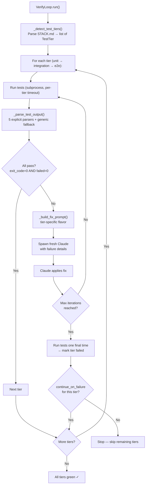

**Key data structure — `TestTier`**:
```python
@dataclass
class TestTier:
    name: str                           # "unit", "e2e-ui", etc.
    command: str                        # The test command
    timeout: int = 120                  # Seconds per test run (e2e: 300)
    max_fix_iterations: int = 5         # Fix attempts per tier
    continue_on_failure: bool = False   # If True, proceed to next tier on fail
    screenshot_dir: str = ""            # For visual review (e2e tiers)
```

### Test Output Parsing

`_parse_test_output()` tries 5 explicit format parsers in precedence order, returning `(passed, failed, total)`:

| Parser | Pattern | Example match |
|--------|---------|---------------|
| **Cypress** | `Passing: N` / `Failing: N` | `Passing: 12` / `Failing: 3` |
| **Jest** | `Tests: X passed, Y failed, Z total` | `Tests: 8 passed, 2 failed, 10 total` |
| **pytest** | `X passed[, Y failed]` | `14 passed, 1 failed` |
| **Go** | Count `^ok` and `^FAIL` lines | `ok  ./auth  0.3s` / `FAIL ./rate  0.1s` |
| **Cargo** | `test result: ... X passed; Y failed` | `test result: ok. 6 passed; 0 failed` |
| **Generic fallback** | exit code only | exit 0 → (1,0,1); else (0,1,1) |

Playwright output is handled by the pytest parser (multi-line variant). There is no dedicated Playwright parser.

### Tier-Aware Fix Prompts

When tests fail, `_build_fix_prompt()` selects context based on the tier type:

**Unit/Integration tiers** (matched by regex `unit|integration`):
- Max output: **4,000 chars** of test output
- Prompt flavor: *"Fix the code so all tests pass. Do NOT modify the tests unless the tests themselves have bugs."*

**E2E tiers** (matched by regex `e2e|ui|visual|dsp|playwright|cypress`):
- Max output: **8,000 chars** of test output (more context for complex failures)
- Prompt flavor: *"These tests simulate real user behavior / end-to-end scenarios. Fix the application behavior so these tests pass. Do NOT modify the tests."*

If test output exceeds the max, it's truncated to the **tail** (most recent output), prefixed with `...(truncated)...`.

### Walking Through the AC-005 Fix Loop

```
Iteration 1:
  Run: pytest tests/integration/test_rate_limit.py
  Output: "1 passed, 1 failed" (the counter reset test fails)
  → Build fix prompt (integration tier, 4K output limit)
  → Spawn Claude: "Fix the code so all tests pass..."
  → Claude identifies the counter reset bug, patches rate_limiter.py

Iteration 2:
  Run: pytest tests/integration/test_rate_limit.py
  Output: "2 passed, 0 failed" ✓
  → Tier passes, move to next tier
```

### Post-Verification Pipeline

After all test tiers are green, several more steps happen before commit:

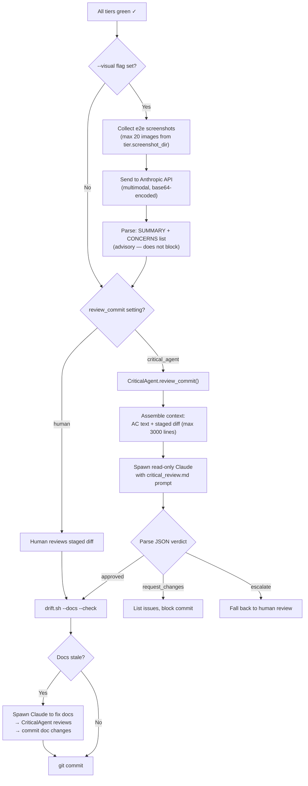

**CriticalAgent verdict structure**:
```json
{
  "verdict": "approved | request_changes | escalate",
  "confidence": "high | medium | low",
  "summary": "One-line assessment",
  "issues": [
    {"severity": "critical|high|medium|low", "category": "...", "description": "...", "location": "..."}
  ],
  "recommendation": "Suggested action"
}
```

The CriticalAgent evaluates against an 8-point checklist: correctness, security (OWASP top-10), testing gaps, AC alignment, NFR compliance, breaking changes, error handling, and code conventions.

### Per-AC Autonomous Execution (TaskRunner)

When running `ag auto task F-0042`, the `TaskRunner` class orchestrates per-AC implementation:

1. **Load ACs** from `spec/acceptance/F-0042.md`
2. **Create feature branch**: `feat/auto-f-0042`
3. **For each AC** (max 3 retries per AC):
   - Spawn fresh Claude to implement the AC
   - Run test suite via `VerifyLoop`
   - If pass + `review_commit: critical_agent` → CriticalAgent reviews → commit
   - Commit message: `feat(F-0042): implement AC-005 — Rate limiting: max 5 failed att...`
4. **Full verification pass** (VerifyLoop across all tiers, max 5 iterations)
5. **Doc drift check** (if `docs_gate` enabled)
6. **Create PR** with AC pass/fail summary

### AC Complexity Estimation (AutoEngine)

The `AutoEngine` (in `engine.py`, separate from TaskRunner) adds a complexity estimation step:

- `_estimate_complexity()` sends AC text to Claude with the `estimate-complexity.md` prompt
- Returns: **SMALL** (1-3 files), **MEDIUM** (4-8 files), or **LARGE** (9+ files / new infrastructure)
- **Heuristic fallback**: Keywords like "full system", "database schema", "authentication system" → LARGE; text > 200 chars → MEDIUM; else SMALL
- **LARGE ACs** are decomposed into 2-5 sequential sub-tasks via `decompose-ac.md` prompt, each independently testable
- Sub-task IDs: `AC-005.1`, `AC-005.2`, etc.

---

## Section 15: Research Phase and Project-Aware Context Assembly

**What this section covers**: How the framework detects a project's tech stack, assembles minimal context for each agent role, and handles the research/exploration phase that precedes planning.

### Context Assembly Pipeline

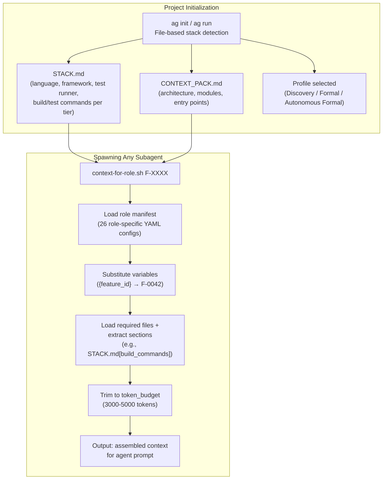

### Stack Detection

`discover.py` performs file-based tech stack detection:

| Marker file | Detected stack |
|-------------|---------------|
| `tsconfig.json` | TypeScript |
| `package.json` | JavaScript/TypeScript (+ framework from dependencies) |
| `pyproject.toml` | Python (+ framework: FastAPI, Django, Flask, etc.) |
| `Cargo.toml` | Rust (+ framework: Actix, Axum, Rocket, etc.) |
| `go.mod` | Go (+ framework: Gin, Echo, Chi, Fiber) |

**Framework detection**: Scans dependency manifests — e.g., `package.json` dependencies for Next.js, React, Express; `pyproject.toml` for FastAPI, Django. Results feed into STACK.md, which drives downstream decisions: test runner detection, output parsing, fix prompt flavor.

### 26 Agent Role Manifests

Each YAML manifest at `.agentic/lib/agents/context-manifests/` defines what an agent role needs to see:

```yaml
# Example: test-agent.yaml
role: test-agent
token_budget: 4000
description: Write failing tests for acceptance criteria (TDD red phase)

required:
  - spec/acceptance/{feature_id}.md
  - STACK.md[test_framework,test_commands]    # Section extraction
  - .agentic/quality/test_strategy.md
  - .agentic/agents/shared/guidelines/anti-hallucination.md

optional:
  - tests/
  - CONTEXT_PACK.md[modules]
```

**Key roles and their token budgets**:

| Role | Budget | Required context | Purpose |
|------|--------|-----------------|---------|
| `implementation-agent` | 5,000 | ACs + build/test commands + code standards | Write code (TDD green phase) |
| `test-agent` | 4,000 | ACs + test framework + test strategy | Write tests (TDD red phase) |
| `planning-agent` | 4,000 | Full CONTEXT_PACK + STACK + research | Create implementation plans |
| `research-agent` | 3,000 | Architecture + stack only | Technology research (no code, no tests) |
| `review-agent` | 6,000 | ACs + diff + code standards | Code review |
| `orchestrator-agent` | 2,000 | Minimal coordination context | Coordinate other agents |

**Section extraction**: The syntax `STACK.md[build_commands,test_commands]` loads ONLY the `## Build` and `## Test` sections from STACK.md, not the entire file. This is how agents stay within token budgets even on large projects.

### How `context-for-role.sh` Works

1. **Read YAML manifest** for the requested role
2. **Substitute variables**: `{feature_id}` → actual feature ID (e.g., `F-0042`)
3. **Always inject**: `core-rules.md` (mandatory for all roles)
4. **Load required files**: With section extraction support — AWK-based `##` header matching
5. **Load optional files**: Only if token budget allows
6. **Token estimation**: `words × 4/3 ≈ tokens` (since average word ≈ 0.75 tokens)
7. **Component scoping**: `--component api` filters to files within that component's path (except `.agentic/`, `spec/`, STACK.md, CONTEXT_PACK.md which are always included)

### The Research/Exploration Phase

Before planning begins, two skills handle investigation:

**`exploring-codebase` skill** — Structured codebase navigation:
- Triggered by: "find", "where is", "explore", "how does this work", "trace"
- 3-step process: understand the question → search efficiently (Glob for files, Grep for content, `ls` for structure) → present findings with file paths and dependency relationships
- Consults `CONTEXT_PACK.md` for "where to look first"

**`researching-topics` skill** — Technology research:
- Triggered by: "research", "compare options", "evaluate", "best practices"
- 4-step process: clarify question → gather from official docs, community, benchmarks → synthesize findings → save to `docs/research/YYYY-MM-DD-topic.md`
- Uses WebSearch and WebFetch tools

**Research-agent context manifest**: Loads architecture + stack only (3,000 token budget), **excludes all code and tests** — this forces research-only behavior by ensuring the agent can't accidentally start implementing.

**Research mode** (`.agentic/lib/workflows/research_mode.md`) defines a five-phase protocol for deeper investigation: Define (5 min) → Gather (15-45 min) → Analyze (10-20 min) → Recommend (5-10 min) → Document (5-10 min). Output feeds into planning as understanding of existing patterns, technology constraints, and integration points.

### Scenario Templates for Framework Verification

Five pre-built project archetypes at `.agentic/lib/auto/scenarios/` test the framework against realistic projects:

| Scenario | Description |
|----------|-------------|
| `cli_tool.yaml` | Command-line application |
| `api_service.yaml` | REST/GraphQL service |
| `todo_app.yaml` | Simple reference application |
| `fullstack_monorepo.yaml` | Frontend + backend in one repo |
| `fullstack_multirepo.yaml` | Multi-repository fullstack setup |

Each defines a STACK.md structure for its project type. Used by `ag auto verify-framework` to spawn agents that build example projects from scratch and verify the full lifecycle end-to-end.

---

# Part IV: The Bigger Picture

## Section 16: Current Inventory (v0.64.0)

### Metrics Snapshot

| Metric | Count |
|--------|-------|
| Features (total) | 198 |
| — Shipped | 179 |
| — Implementing (incl. legacy `in_progress`) | 23 |
| — Planned | 26 |
| — Deprecated | 4 |
| Shell tools (`.agentic/lib/tools/*.sh`) | 81 (+ 5 archived) |
| Autonomous engine modules (`.agentic/lib/auto/*.py`) | 24 |
| Workflows (`.agentic/lib/workflows/*.md`) | 35 |
| Checklists (`.agentic/lib/checklists/*.md`) | 10 |
| Skills (`.claude/skills/`) | 13 |
| Tests (total) | 152 |
| — LLM behavioral | 67 |
| — Python unit/integration | 34 |
| — Shell | 17 |
| — Structural | 13 |
| NFRs defined | 4 (all met) |
| ADRs | 2 |
| CLI gateway (ag.sh + commands/) | 363 + 12 modules |
| Git tags (releases) | 70 |

### Architecture Components

| Layer | Components | Purpose |
|-------|-----------|---------|
| **Constitution** | CLAUDE.md, .cursorrules, copilot-instructions.md, codex-instructions.md | <100-line instruction files loaded at session start |
| **Playbooks** | 13 skills, 35 workflows, 10 checklists | Just-in-time guidance loaded by `ag` commands |
| **State** | STACK.md, STATUS.md, FEATURES.md, JOURNAL.md, BACKLOG.json, AGENTS.json | Durable artifacts tracking project state |
| **Engine** | 24 auto modules, 81 shell tools (+ 5 archived), ag.sh gateway | Execution infrastructure |
| **Verification** | 152 tests, validate_framework.sh, drift checks | Quality assurance |

---

## Section 17: What's In Flight

### Features Currently Implementing (12)

Includes both `implementing` and legacy `in_progress` status entries. Use `grep "Status.*implement\|in.progress" .agentic/spec/FEATURES.md` to get the current list.

### Features Planned (10)

These have FEATURES.md entries with `Status: planned` but no active implementation.

### Pending PRs

Track in HUMAN_NEEDED.md — PRs awaiting human review.

### ADRs

| ADR | Title | Status |
|-----|-------|--------|
| [ADR-001](../.agentic/spec/adr/ADR-001-multi-component-architecture.md) | Multi-Component Architecture & Workflow Engine | Proposed |
| [ADR-002](../.agentic/spec/adr/ADR-002-user-involvement-modes.md) | User Involvement Modes | Proposed |

---

## Section 18: Opportunity Map

Organized by impact and effort:

### High Impact, Moderate Effort

1. **Unified Work Queue (F-0213)** — FEATURES.md has 183 entries mixing shipped contracts with planning noise. BACKLOG.json can't hold heterogeneous items. No dependency tracking. Redesign: shipped features as contracts, active work in unified queue with types/deps/priorities.

2. **Configurable DoD per Task Type (F-0210)** — Spikes shouldn't require "tests passing"; docs tasks shouldn't require "code quality check". Task-type-aware completion checklists would reduce friction for non-standard work items.

3. **Customization Layer (F-033/F-034)** — `.agentic/project/` for user-editable config that survives framework upgrades. Custom DoD, coding conventions, workflow overrides.

### High Impact, High Effort

4. **Protected Main Branch Support (T-0066)** — Framework assumes direct-to-main for state files (`ag done`, `ag flush`). With branch protection rules, these break. Needs architectural solution.

5. **Collision-Proof Feature IDs (F-0193 → F-003)** — Sequential F-XXXX collides in multi-agent/multi-branch. Options: slugs, atomic allocation, UUIDs. ID pattern centralization shipped; collision prevention remains open.

6. ~~**ag.sh Decomposition**~~ — **DONE (F-0221)**. ag.sh decomposed from 4,325 lines into 363-line dispatcher + 12 sourced modules under `commands/`.

### Medium Impact, Low Effort (Quick Wins)

7. **State Machine Enforcement = Blocking** — Currently advisory-only for Formal profile. Making it blocking would close the gap between "gates exist" and "gates are enforced."

8. **Later State Machine Gates** — `gates.py` has gates for all 8 forward transitions. Gates 6-8 (verified→documented, documented→committed, committed→shipped) are primarily advisory. Strengthening these would complete the enforcement chain.

9. **Smoke Test Evidence** — Currently behavioral ("please run the app"). Add structural check: require a smoke test log/screenshot artifact before `ag done`.

10. **Spec Evolution Metrics** — Track `[Discovered]` count per feature, spec churn rate. Surface in retrospective for process learning.

11. **Post-Merge Dogfooding (T-0044)** — Verify `ag` commands work after merge, root files sync with templates, state files valid.

### Visionary (Future Architecture)

12. **MCP Coordination Server** (ADR-001) — Real-time agent coordination for multi-component projects.

13. **Multi-Repo Umbrella** (ADR-001) — Coordinate across repos with shared contracts.

14. **Full Autonomous Scheduling** (ADR-001) — Scheduler finds unblocked transitions, spawns workers, critical agents review.

15. **Design Phase Formalization** — Add explicit "design" phase between planning and specification. Currently implicit — the plan IS the design. For complex features, separate design review (architecture, data model, API surface) before writing ACs.

### What's Missing That Should Exist

16. **End-to-End Workflow Integration Test** — No single test exercises the full 9-phase lifecycle. Would catch gate ordering bugs, artifact sync issues.

17. **Workflow Definition File** — The workflow is spread across 10 checklists, 35 workflow docs, 14 skills, and ag.sh. A single declarative workflow definition (phases, gates, artifacts, profile variations) would be the authoritative source.

18. **Code Annotation Enforcement** — `@feature`, `@acceptance` annotations are in checklists but never enforced. Adding structural check would enable code→spec traceability.

---

# Part V: Quick References

## Section 19: Command Quick Reference

### By Phase

| Phase | Primary Command | What It Does |
|-------|----------------|-------------|
| Session Start | `ag start` / `ag sync` | Dashboard + sync check |
| Planning | `ag plan F-XXXX` | Enter plan mode for feature |
| Specification | `ag spec` | Manage specs and ACs |
| Implementation | `ag implement F-XXXX` | Start implementation (gate-checked) |
| Verification | `ag auto verify` | AC-by-AC verification |
| Documentation | `ag commit` (triggers journal check) | Pre-commit handles doc gates |
| Commit | `ag commit` | Pre-commit checks + commit |
| Completion | `ag done F-XXXX` | Ship feature, bump version |

### Daily Commands

| Command | Purpose |
|---------|---------|
| `ag start` | Begin session, see dashboard |
| `ag sync` | 10-phase state sync |
| `ag backlog list` | View work queue |
| `ag implement F-XXXX` | Start working on feature |
| `ag commit` | Commit with quality gates |
| `ag done F-XXXX` | Complete feature |
| `ag todo "idea"` | Capture an idea |
| `ag test llm` | Run behavioral tests |

### Autonomous Commands

| Command | Purpose |
|---------|---------|
| `ag auto verify` | AC-by-AC verification loop |
| `ag auto verify --visual` | With visual verification |
| `ag auto task F-XXXX` | Single feature autonomously |
| `ag auto crunch` | Multi-feature batch |
| `ag auto epic F-XXXX` | Decompose + execute epic |
| `ag auto epic F-XXXX --parallel` | Parallel epic children |
| `ag auto pipeline` | Sequential agent pipeline |
| `ag auto verify-framework` | Framework self-check |

### Management Commands

| Command | Purpose |
|---------|---------|
| `ag backlog add F-XXXX` | Add to work queue |
| `ag backlog done` | Advance to next item |
| `ag backlog move F-XXXX 0` | Reprioritize |
| `ag review` | List pending reviews |
| `ag review F-XXXX <state>` | Resolve review |
| `ag decompose F-XXXX` | Break feature into children |
| `ag nfr check` | Check NFR compliance |
| `ag audit` | Spec→AC→test chain audit |
| `ag kickoff "vision"` | Generate features from vision |
| `ag coord start` | Start coordination server |

### Token-Efficient State Scripts

| Script | Manages | Example |
|--------|---------|---------|
| `status.sh` | STATUS.md | `bash .agentic/lib/tools/status.sh focus "Task"` |
| `journal.sh` | JOURNAL.md | `bash .agentic/lib/tools/journal.sh "Topic" "Done" "Next" "Blockers" --why "Why"` |
| `blocker.sh` | HUMAN_NEEDED.md | `bash .agentic/lib/tools/blocker.sh add "Title" "type" "Details"` |
| `feature.sh` | FEATURES.md | `bash .agentic/lib/tools/feature.sh F-XXXX status shipped` |
| `todo.sh` | TODO.md | `bash .agentic/lib/tools/todo.sh add "Idea"` |
| `backlog.sh` | BACKLOG.json | `bash .agentic/lib/tools/backlog.sh add F-XXXX` |

### "Where Do I Find X?" Lookup

| Looking For | Location |
|-------------|----------|
| Feature list & status | `.agentic/spec/FEATURES.md` |
| Acceptance criteria | `.agentic/spec/acceptance/F-XXXX.md` |
| NFRs | `.agentic/spec/NFR.md` |
| Current work item | `ag backlog list` (position 0) |
| Work history | `.agentic/journal/JOURNAL.md` |
| Implementation plans | `.agentic/journal/plans/` |
| Project config | `STACK.md` (project root) |
| Project overview | `CONTEXT_PACK.md` (project root) |
| Active agents | `.agentic/session/AGENTS.json` |
| Items needing human | `.agentic/HUMAN_NEEDED.md` |
| Profile defaults | `.agentic/lib/presets/profiles.conf` |
| Quick ideas | `.agentic/TODO.md` |
| Design decisions | `.agentic/spec/adr/` |
| Framework version | `VERSION` (project root) |

---

## Section 20: Recovery Playbook

### Common Recovery Scenarios

**WIP stuck (agent crashed mid-implementation)**
```bash
# Check what's stuck
ag sync
# See AGENTS.json state
python3 .agentic/lib/auto/intents.py list
# Resume or clean up
ag implement F-XXXX   # resumes if WIP exists
# Or manually clean AGENTS.json entry
```

**Plan orphaned (plan in session-scoped location)**
```bash
# Scan for orphaned plans
bash .agentic/lib/tools/plan-scan.sh
# Save to durable location
cp ~/.claude/plans/<plan-file> .agentic/journal/plans/YYYY-MM-DD-F-XXXX-plan.md
```

**Merge conflict on state files**
```bash
# State files (FEATURES.md, JOURNAL.md) — take both changes
git checkout --theirs .agentic/spec/FEATURES.md  # if their status is newer
# Re-run state scripts to normalize format
bash .agentic/lib/tools/feature.sh F-XXXX status shipped
```

**State drift detected**
```bash
# Run full sync
ag sync
# Check specific drift
bash .agentic/lib/tools/drift.sh --docs --check
bash .agentic/lib/tools/drift-check.sh
```

**Agent collision (multiple agents on same branch)**
```bash
# Check for other agents
python3 .agentic/lib/tools/agents_helpers.py --project-root . count-others "$(pwd)" --pid $$
# If >0, use worktree
git worktree add ../my-feature feature/F-XXXX
```

**Pre-commit check failing**
```bash
# Run checks manually to see which fails
bash .agentic/lib/hooks/pre-commit-check.sh --mode full
# On feature branch, escape hatches available:
SKIP_TESTS=1 git commit -m "WIP: work in progress"
# NEVER on main/master — escape hatches are blocked
```

**Backlog out of sync**
```bash
# View current state
ag backlog list
# Force-remove stuck item
bash .agentic/lib/tools/backlog.sh remove F-XXXX
# Re-add in correct position
ag backlog add F-XXXX
ag backlog move F-XXXX 0
```

**Feature status wrong in FEATURES.md**
```bash
# Check state machine view
python3 -m auto.state_machine F-XXXX --status
# Fix via feature.sh (not manual edit)
bash .agentic/lib/tools/feature.sh F-XXXX status <correct-status>
```

---

---

### Keeping This Document Fresh

Metrics (feature counts, module counts, test counts) should be re-verified at each major release. Key verification commands:

```bash
grep -oP '\*\*Status\*\*: \K\S+' .agentic/spec/FEATURES.md | sort | uniq -c  # Feature counts
find .agentic/lib/tools -name "*.sh" | wc -l                                   # Tool count
find tests -name "*.sh" -o -name "*.py" | grep -c test                         # Test count
wc -l .agentic/lib/tools/ag.sh                                                 # CLI gateway size
```

*Generated from framework v0.64.0 source. File paths, gate names, settings, and metrics verified against live codebase.*
