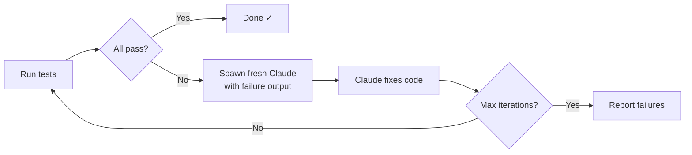
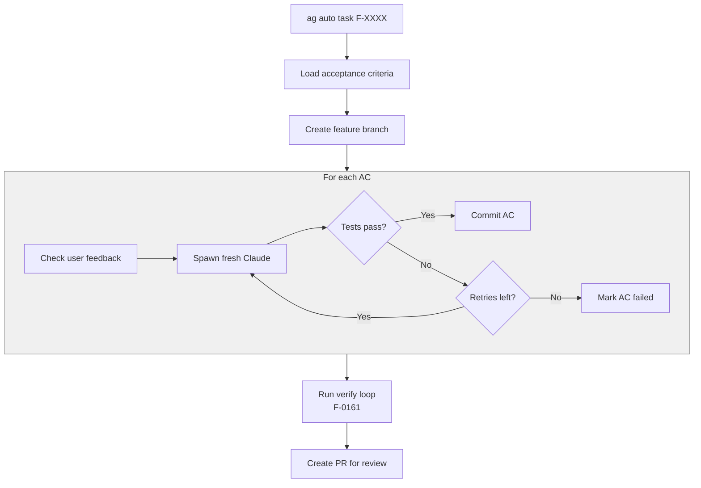
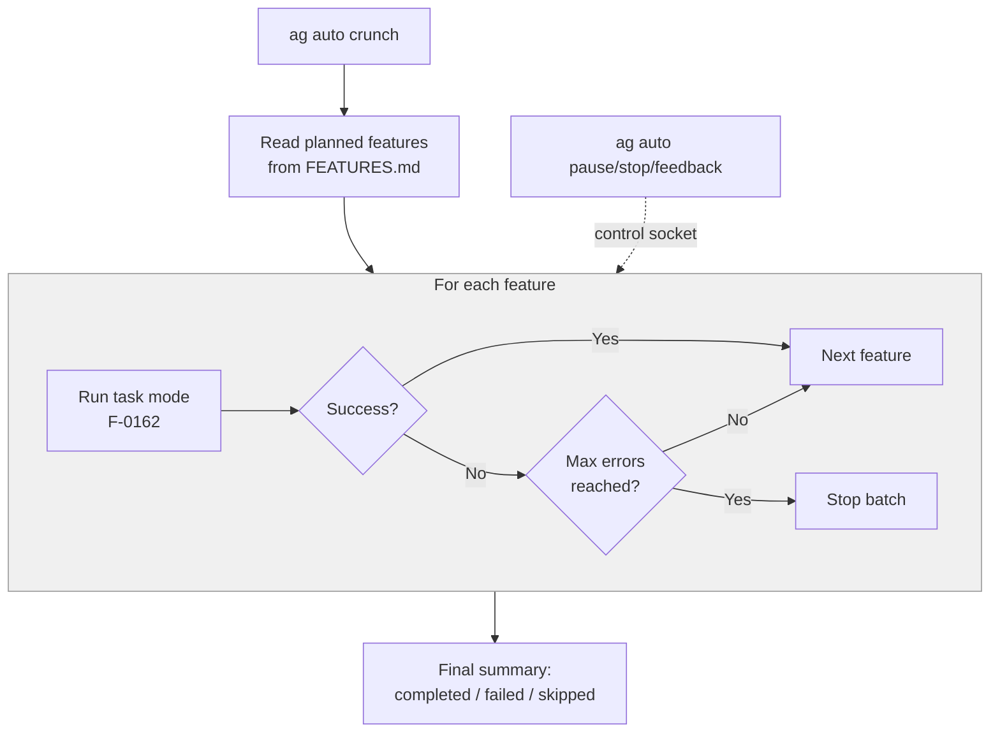
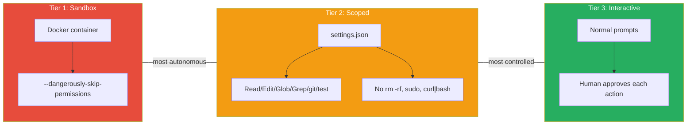

# How the Agentic Framework Delivers Its Promises

**Purpose**: Comprehensive map of how every principle is implemented, what mechanisms exist, which are actively working, and which are dormant or underutilized.

**Generated**: 2026-03-08 | **Framework Version**: 0.47.0

---

## The Big Picture

```mermaid
graph TB
    subgraph PRINCIPLES["PRINCIPLES (Why)"]
        subgraph FOUNDATION["FOUNDATION (WHY)"]
            F1[F1: Developer-Friendly Experience]
            F2[F2: Sustainable Quality]
            F3[F3: Token & Context<br/>Optimization]
        end
        subgraph DESIGN["DESIGN PRINCIPLES (HOW)"]
            D1[D1: Human-Agent Partnership]
            D2[D2: Deterministic Enforcement]
            D3[D3: Durable Artifacts]
            D4[D4: Small Batch + Acceptance-Driven]
            D5[D5: Living Documentation]
            D6[D6: Green Coding]
            D7[D7: Multi-Env Portability]
        end
        subgraph RULES["OPERATIONAL RULES (WHAT)"]
            R1[R1: Anti-Hallucination]
            R2[R2: No Auto-Commits]
            R3[R3: Check Before Creating]
        end
        KISS[META: KISS]
    end

    subgraph FEATURES["FEATURES (What)"]
        %% Developer Experience
        F_SESSION[Session Continuity<br/>F-0021..F-0027]
        F_MANUAL_OPS[Manual Operations<br/>F-0067]
        F_DISCOVERY[Intelligent Onboarding<br/>F-0123, F-0124]
        F_TIP[Tip of the Day<br/>F-0127]
        F_REMIND[Discoverability Reminders<br/>F-0126]

        %% Sustainable Quality
        F_WIP[WIP Recovery<br/>F-0051..F-0053]
        F_MULTI_ENV[Multi-Environment<br/>F-0054]
        F_QUALITY[Quality Standards<br/>F-0015, 7 documents]
        F_SPECS[Spec-Driven Dev<br/>F-0003..F-0006]
        F_PLAN_REVIEW[Plan-Review Loop<br/>F-0120]

        %% Human-Agent Partnership
        F_HUMAN_NEEDED[Human Escalation<br/>F-0026]
        F_PR_WORKFLOW[PR Workflow<br/>F-0096]

        %% Token & Context Optimization
        F_TOKEN_SCRIPTS[Token-Efficient Scripts<br/>F-0041]
        F_AGENT_ROLES[Agent Roles + Manifests<br/>F-0035, F-0036]
        F_ORCHESTRATOR[Orchestrator Agent<br/>F-0081]
        F_AGENT_MODE[Agent Mode Selection<br/>F-0103]
        F_CONTEXT_MANIFESTS[Context Manifests<br/>24 YAML files]

        %% Deterministic Enforcement
        F_PRE_COMMIT[Pre-Commit Gates<br/>F-0016, F-0116]
        F_GIT_HOOKS[Git Hook Enforcement<br/>F-0129]
        F_DOCTOR[Gate-Based Verification<br/>F-0091]
        F_PHASE[Phase Detection<br/>F-0092]
        F_MEMORY_SEED[Memory Seed<br/>defense-in-depth]
        F_THREE_LAYER[Three-Layer Architecture<br/>Constitution+Playbook+State]

        %% Durable Artifacts
        F_STATUS[STATUS.md<br/>F-0024]
        F_JOURNAL[JOURNAL.md<br/>F-0023]
        F_CONTEXT_PACK[CONTEXT_PACK.md<br/>F-0025]
        F_FEATURES_MD[FEATURES.md<br/>F-0003, F-0004]

        %% Small Batch
        F_SMALL_BATCH[Small Batch Dev<br/>F-0007]

        %% Multi-Agent
        F_MULTI_AGENT[Multi-Agent Coordination<br/>F-0031..F-0033]
        F_WORKTREE[Git Worktrees<br/>F-0032, F-0097]
        F_SEQ_PIPELINE[Sequential Pipeline<br/>F-0034]

        %% Onboarding
        F_INIT[Project Init<br/>F-0001]
        F_BROWNFIELD[Brownfield Specs<br/>ag specs]

        %% Testing
        F_LLM_TESTS[LLM Behavioral Tests<br/>F-0122]
        F_MUTATION[Mutation Tests<br/>infrastructure validation]
        F_FRAMEWORK_TESTS[Framework Validation<br/>validate_framework.sh]

        %% Autonomous Workflow (v0.43.0)
        F_AUTO_ENGINE[Autonomous Engine<br/>F-0160]
        F_AUTO_VERIFY[Auto Verify Mode<br/>F-0161]
        F_AUTO_TASK[Auto Task Mode<br/>F-0162]
        F_AUTO_CRUNCH[Auto Crunch Mode<br/>F-0163]

        %% Formal State Machine (v0.47.0)
        F_STATE_MACHINE[Feature State Machine<br/>F-0177, F-0178]

        %% Backlog/Roadmap (v0.49.0)
        F_BACKLOG[Backlog Work Queue<br/>F-0190]

        %% SDD Toolkit Insights (v0.39.0)
        F_SPEC_FORMAT[Spec Format Evolution<br/>F-0148]
        F_CLARIFICATION[Clarification Taxonomy<br/>F-0149]
        F_CHECKPOINTS[Checkpoints & Execution Order<br/>F-0150]
        F_EXTENSIONS[User Extensions<br/>F-0151]
        F_SPEC_ANALYZE[Semantic Spec Analysis<br/>F-0152]
        F_AC_COVERAGE[AC-Level Coverage<br/>F-0153]
    end

    subgraph MECHANISMS["MECHANISMS (How)"]
        %% Scripts
        M_AG[ag.sh gateway<br/>25+ commands]
        M_AUTO_ENGINE[auto/ engine<br/>socket control + state]
        M_PRECOMMIT[pre-commit-check.sh<br/>17 structural gates]
        M_WIP_SH[wip.sh<br/>state machine]
        M_STATUS_SH[status.sh / journal.sh<br/>token-efficient updates]
        M_FEATURE_SH[feature.sh<br/>status transitions]
        M_DOCTOR_PY[doctor.py<br/>multi-phase verification]
        M_CONTEXT_ROLE[context-for-role.sh<br/>+ ALWAYS_INJECT]
        M_SYNC[sync.sh<br/>9-phase drift detection]
        M_DISCOVER[discover.py<br/>brownfield analysis]

        %% Structural
        M_HOOKS_PATH[git core.hooksPath<br/>.agentic/hooks/]
        M_CLAUDE_MD[CLAUDE.md template<br/>~40 lines constitution]
        M_AUTO_ORCH[auto_orchestration.md<br/>playbook, 442 lines]
        M_MEMORY[memory-seed.md<br/>persistent memory]
        M_STACK[STACK.md<br/>machine-readable config]

        %% Testing
        M_HARNESS[harness.sh<br/>LLM test runner]
        M_MUTATION_SH[mutation_test.sh<br/>infrastructure proofs]
        M_STATE_MACHINE[state_machine.py + gates.py<br/>9-state lifecycle]
        M_VALIDATE[validate_framework.sh<br/>500+ acceptance tests]
        M_SPEC_ANALYZE[spec-analyze.sh<br/>semantic consistency]
        M_AC_COV[coverage.py --ac-coverage<br/>per-AC test mapping]

        %% Quality
        M_QUALITY_DOCS[.agentic/quality/<br/>7 standard documents]
        M_QUALITY_WIRING[context manifests<br/>YAML role→quality wiring]
    end

    %% Principle → Feature connections

    %% F1: Developer-Friendly Experience
    F1 --> F_SESSION
    F1 --> F_STATUS
    F1 --> F_MANUAL_OPS
    F1 --> F_HUMAN_NEEDED
    F1 --> F_DISCOVERY
    F1 --> F_TIP
    F1 --> F_REMIND

    %% F2: Sustainable Quality
    F2 --> F_SESSION
    F2 --> F_WIP
    F2 --> F_MULTI_ENV
    F2 --> F_STATUS
    F2 --> F_JOURNAL
    F2 --> F_QUALITY
    F2 --> F_SPECS

    %% F3: Token & Context Optimization
    F3 --> F_TOKEN_SCRIPTS
    F3 --> F_AGENT_ROLES
    F3 --> F_ORCHESTRATOR
    F3 --> F_CONTEXT_MANIFESTS
    F3 --> F_AGENT_MODE

    %% D1: Human-Agent Partnership
    D1 --> F_HUMAN_NEEDED
    D1 --> F_MANUAL_OPS
    D1 --> F_PR_WORKFLOW
    D1 --> F_PLAN_REVIEW

    %% D2: Deterministic Enforcement
    D2 --> F_PRE_COMMIT
    D2 --> F_GIT_HOOKS
    D2 --> F_DOCTOR
    D2 --> F_MEMORY_SEED
    D2 --> F_THREE_LAYER
    D2 --> F_QUALITY

    %% D3: Durable Artifacts
    D3 --> F_STATUS
    D3 --> F_JOURNAL
    D3 --> F_CONTEXT_PACK
    D3 --> F_FEATURES_MD

    %% R1: Anti-Hallucination
    R1 --> F_LLM_TESTS

    %% R2: No Auto-Commits
    R2 --> F_PR_WORKFLOW
    R2 --> F_PRE_COMMIT

    %% R3: Check Before Creating
    R3 --> F_LLM_TESTS

    %% D4: Small Batch + Acceptance-Driven
    D4 --> F_SPECS
    D4 --> F_SMALL_BATCH
    D4 --> F_PLAN_REVIEW
    D4 --> F_QUALITY
    D4 --> F_SPEC_FORMAT
    D4 --> F_CLARIFICATION
    D4 --> F_CHECKPOINTS

    %% D2 → new features
    D2 --> F_SPEC_ANALYZE
    D2 --> F_EXTENSIONS

    %% D5: Living Documentation
    D5 --> F_DISCOVERY
    D5 --> F_AC_COVERAGE

    %% D6: Green Coding
    D6 --> F_TOKEN_SCRIPTS

    %% D7: Multi-Env Portability
    D7 --> F_MULTI_ENV

    %% Feature → Mechanism connections
    F_SESSION --> M_AG
    F_WIP --> M_WIP_SH
    F_TOKEN_SCRIPTS --> M_STATUS_SH
    F_TOKEN_SCRIPTS --> M_FEATURE_SH
    F_PRE_COMMIT --> M_PRECOMMIT
    F_GIT_HOOKS --> M_HOOKS_PATH
    F_DOCTOR --> M_DOCTOR_PY
    F_AGENT_ROLES --> M_CONTEXT_ROLE
    F_CONTEXT_MANIFESTS --> M_CONTEXT_ROLE
    F_THREE_LAYER --> M_CLAUDE_MD
    F_THREE_LAYER --> M_AUTO_ORCH
    F_THREE_LAYER --> M_MEMORY
    F_MEMORY_SEED --> M_MEMORY
    F_DISCOVERY --> M_DISCOVER
    F_BROWNFIELD --> M_AG
    F_LLM_TESTS --> M_HARNESS
    F_MUTATION --> M_MUTATION_SH
    F_FRAMEWORK_TESTS --> M_VALIDATE
    F_PLAN_REVIEW --> M_AG
    F_QUALITY --> M_QUALITY_DOCS
    F_QUALITY --> M_QUALITY_WIRING

    %% Autonomous features → mechanisms
    F_AUTO_ENGINE --> M_AUTO_ENGINE
    F_AUTO_ENGINE --> M_AG
    F_AUTO_VERIFY --> M_AUTO_ENGINE
    F_AUTO_TASK --> M_AUTO_ENGINE
    F_AUTO_CRUNCH --> M_AUTO_ENGINE

    %% State machine ← principles
    D2 --> F_STATE_MACHINE
    D4 --> F_STATE_MACHINE
    F_STATE_MACHINE --> M_STATE_MACHINE
    F_STATE_MACHINE --> M_FEATURE_SH

    %% Backlog ← principles
    D1 --> F_BACKLOG
    D3 --> F_BACKLOG
    F_BACKLOG --> M_AG

    %% Autonomous features ← principles
    D1 --> F_AUTO_ENGINE
    D4 --> F_AUTO_TASK
    F2 --> F_AUTO_VERIFY

    %% SDD Toolkit features → mechanisms
    F_SPEC_ANALYZE --> M_SPEC_ANALYZE
    F_AC_COVERAGE --> M_AC_COV
    F_EXTENSIONS --> M_PRECOMMIT
    F_CHECKPOINTS --> M_AG

    %% Styling
    classDef principle fill:#4a90d9,color:#fff,stroke:#2a5f9e
    classDef foundation fill:#2a5f9e,color:#fff,stroke:#1a3f6e
    classDef feature fill:#50b356,color:#fff,stroke:#2d8031
    classDef mechanism fill:#e8a838,color:#fff,stroke:#b8821c
    classDef dormant fill:#999,color:#fff,stroke:#666

    class F1,F2,F3 foundation
    class D1,D2,D3,D4,D5,D6,D7,R1,R2,R3,KISS principle
    class F_SESSION,F_WIP,F_MULTI_ENV,F_HUMAN_NEEDED,F_MANUAL_OPS,F_PR_WORKFLOW,F_TOKEN_SCRIPTS,F_AGENT_ROLES,F_ORCHESTRATOR,F_CONTEXT_MANIFESTS,F_PRE_COMMIT,F_GIT_HOOKS,F_DOCTOR,F_PHASE,F_MEMORY_SEED,F_THREE_LAYER,F_STATUS,F_JOURNAL,F_CONTEXT_PACK,F_FEATURES_MD,F_SPECS,F_PLAN_REVIEW,F_SMALL_BATCH,F_MULTI_AGENT,F_WORKTREE,F_SEQ_PIPELINE,F_INIT,F_DISCOVERY,F_BROWNFIELD,F_LLM_TESTS,F_MUTATION,F_FRAMEWORK_TESTS,F_QUALITY,F_TIP,F_REMIND,F_AUTO_ENGINE,F_AUTO_VERIFY,F_AUTO_TASK,F_AUTO_CRUNCH,F_STATE_MACHINE feature
    class M_AG,M_PRECOMMIT,M_WIP_SH,M_STATUS_SH,M_FEATURE_SH,M_DOCTOR_PY,M_CONTEXT_ROLE,M_SYNC,M_DISCOVER,M_HOOKS_PATH,M_CLAUDE_MD,M_AUTO_ORCH,M_MEMORY,M_STACK,M_HARNESS,M_MUTATION_SH,M_VALIDATE,M_QUALITY_DOCS,M_QUALITY_WIRING,M_AUTO_ENGINE,M_STATE_MACHINE mechanism
    class F_AGENT_MODE dormant
```



---

## Backlog / Work Queue (v0.49.0)

Git-tracked ordered work queue (`.agentic/BACKLOG.json`) that tells any agent on any machine what to work on next.

**How it works:**
- Position 0 = current work. `ag implement` enforces this — agents can't skip ahead.
- `ag done` auto-advances the queue.
- `ag start` shows current + next prominently.
- `ag backlog add/done/move/list/remove/clear` manages the queue.
- `SKIP_BACKLOG=1` escape hatch for overrides.

**Key mechanisms:**
- `backlog_helpers.py` — Python JSON manipulation (add/remove/move/list/current/done)
- `backlog.sh` — shell wrapper for CLI
- `ag.sh` gates — `cmd_implement` hard block, `cmd_work` hard block, `cmd_done` auto-advance, `cmd_plan`/`cmd_spec` advisory

**Cross-machine flow:** Create backlog → commit → push → pull on another machine → `ag start` shows same queue.

**Relationship to other files:**
- **BACKLOG.json** = execution ORDER (what to work on next)
- **FEATURES.md** = feature REGISTRY + lifecycle state
- **TODO.md** = unfiltered idea inbox (flow: idea → TODO → triage → backlog)
- **STATUS.md** = session snapshot (will eventually reference backlog for "Current focus")
- **WIP.md** = session-level crash recovery (backlog = WHY, WIP = HOW)

---

## Autonomous Workflow Modes (v0.43.0)

Three modes build on each other: Verify → Task → Crunch.

### Verify Mode — Test-Fix Loop



### Task Mode — Per-Feature Implementation



### Crunch Mode — Multi-Feature Batch



### Three-Tier Trust Model



---

## Formal Feature State Machine (v0.47.0)

Features follow a 9-state lifecycle enforced by `state_machine.py` + `gates.py`:

```
planned → specced → criteria_set → tests_written → implementing
→ verified → documented → committed → shipped   (+ deprecated)
```

- **Forward transitions**: sequential, one step at a time (8 transitions)
- **Regression transitions**: going backward (e.g. verified → implementing) with cascade invalidation of intermediate states
- **Skip transitions**: legacy shortcuts (planned → implementing, planned → shipped) for backward compatibility
- **Advisory mode** (default): invalid transitions log warnings but proceed
- **Enforce mode**: invalid transitions are blocked

Each forward transition has a **gate function** checking filesystem preconditions:
- `planned → specced`: Feature exists in FEATURES.md with Description
- `specced → criteria_set`: Acceptance criteria file exists with AC lines
- `criteria_set → tests_written`: Test files reference the feature ID
- `tests_written → implementing`: Advisory TDD reminder
- `implementing → verified`: AC file + test files exist
- `verified → documented`: Advisory changelog/docs reminder
- `documented → committed`: Advisory pre-commit reminder
- `committed → shipped`: Advisory push/PR/VERSION reminder

**Review checkpoints** (after gates pass, before transition writes):
- Configurable per transition via `review_*` settings in STACK.md (modes: `human`, `critical_agent`, `skip`)
- When `human` or `critical_agent`: transition blocks, creates HUMAN_NEEDED entry, awaits `ag review F-XXXX <state>`
- When `skip`: auto-approves (structural gates still apply, but no human/agent review pause)
- Verdict artifacts stored in `.agentic/spec/reviews/F-XXXX/` (git-tracked, permanent record)

CLI: `ag transition F-XXXX <state>`, `ag transition F-XXXX --status`, `ag transition --unblocked`
Review: `ag review` (list pending), `ag review F-XXXX <state>` (approve), `ag review F-XXXX <state> --reject`

---

## Principle-by-Principle Breakdown

### F1: Developer-Friendly Experience (FOUNDATION)

> "The framework makes the developer's life easier — context reconstruction, automatic documentation, guided workflows."

| Feature | How It Works | Status |
|---------|-------------|--------|
| **Session Start Protocol** (F-0021) | `ag start` reads STATUS.md, JOURNAL.md, HUMAN_NEEDED.md, checks WIP.md. Agent greets user with dashboard of current state. | ACTIVE - proven by LLM test 001 |
| **STATUS.md Current State** (F-0024) | `status.sh focus "Task"` updates STATUS without full-file rewrite. Zero-token human readability. | ACTIVE - staleness gate enforced |
| **Manual Operations** (F-0067) | `MANUAL_OPERATIONS.md` documents all queries humans can run without agent (zero tokens). `cat STATUS.md`, `grep` patterns for feature status. | ACTIVE - documentation |
| **HUMAN_NEEDED.md Escalation** (F-0026) | `blocker.sh add "Title" "type" "Details"` creates entries. Agents read at session start. Humans can `cat HUMAN_NEEDED.md` for zero-token check. | ACTIVE |
| **Intelligent Onboarding** (F-0123, F-0124) | `discover.py` for brownfield analysis. `ag specs` for guided spec generation. Plan-resume for multi-session support. | AVAILABLE |
| **Tip of the Day** (F-0127) | Random framework tip at session start. Passive discoverability — helps developers learn framework capabilities over time. | ACTIVE |
| **Discoverability Reminders** (F-0126) | `ag plan` and `ag sync` reminders in dashboard. Surfaces underutilized features. | ACTIVE |

**Hidden mechanism**: The session dashboard (`ag start`) is itself a developer UX feature — it answers "what was I doing?" and "what needs my attention?" without the developer having to ask. Zero cognitive load to resume work.

---

### F2: Sustainable Long-Term Development & Quality Software (FOUNDATION)

> "AI-assisted projects produce properly designed, tested, and documented software that stays reliable over time."

| Feature | How It Works | Status |
|---------|-------------|--------|
| **Session Start Protocol** (F-0021) | `ag start` reads STATUS.md, JOURNAL.md, HUMAN_NEEDED.md, checks WIP.md. Agent greets user with dashboard of current state. | ACTIVE - proven by LLM test 001 |
| **Session End Protocol** (F-0022) | `session_end.md` checklist: update JOURNAL, document blockers, clean up WIP. | ACTIVE - behavioral |
| **JOURNAL.md Tracking** (F-0023) | `journal.sh` appends entries without reading the file (token-efficient). Append-only log of session progress. | ACTIVE - structurally enforced (staleness gate in pre-commit) |
| **STATUS.md Current State** (F-0024) | `status.sh focus "Task"` updates STATUS without full-file rewrite. Zero-token human readability. | ACTIVE - staleness gate enforced |
| **WIP Recovery** (F-0051-0053) | `wip.sh start/checkpoint/complete` creates `.agentic/session/WIP.md` lock. Pre-commit blocks if WIP exists. Session start warns of interrupted work. 5-step recovery protocol. | ACTIVE - structural gate |
| **Multi-Environment Support** (F-0054) | Documented workflow for switching between Claude/Cursor/Copilot when tokens run out. Durable artifacts ensure state survives tool switches. | PASSIVE - documented workflow, no enforcement |
| **Upgrade System** (F-0056, F-0094) | `upgrade.sh` with FEATURE_REGISTRY. Version-aware: only shows features new since user's previous version. `.upgrade_pending` marker. | ACTIVE - structural |
| **Quality Standards** (F-0015) | 7 quality documents in `.agentic/quality/`. Programming standards, test strategy, review checklist, library selection, green coding, integration testing, design for testability. | ACTIVE - wired via context manifests |
| **Spec-Driven Development** (F-0003-0006) | Features defined in spec, acceptance criteria before code, tests verify criteria. Agents can't silently regress features when criteria-based tests exist. | ACTIVE - structural gate (Formal) |

**Hidden mechanism**: The staleness check in `pre-commit-check.sh` (Check 3) compares JOURNAL.md modification time against last git commit. This forces agents to update project state before every commit, ensuring long-term projects never go stale.

**Hidden mechanism**: When `programming_standards.md` is REQUIRED (not optional) in context manifests, the implementation agent receives quality standards before writing any code — quality by default, not quality by review.

---

### F3: Token & Context Optimization (FOUNDATION)

> "Tokens cost money, context windows are limited, and compute has environmental impact. Every decision respects these constraints."

| Feature | How It Works | Status |
|---------|-------------|--------|
| **Token-Efficient Scripts** (F-0041) | `status.sh`, `journal.sh`, `feature.sh`, `blocker.sh` — surgical updates without reading entire files. ~40x more efficient than read-modify-write. | ACTIVE - core mechanism |
| **Subagent Context Assembly** (F-0036) | `context-for-role.sh` + 24 YAML manifests. Each agent gets 2-6K tokens of role-specific context instead of loading everything. `ALWAYS_INJECT` array ensures core-rules.md (~300 tokens) always present. Supports section extraction (e.g., `STACK.md[## Build]`). | AVAILABLE but UNDERUTILIZED in practice |
| **Sequential Agent Pipeline** (F-0034) | 8 specialist agents work in sequence: Research → Plan → Test → Implement → Review → Spec Update → Documentation → Git. Each loads only role-relevant context (<50K vs 150-200K for general agent). | DOCUMENTED but RARELY USED in practice |
| **Orchestrator Agent** (F-0081) | Coordinates pipeline, delegates to specialists. Never implements itself. Ensures framework compliance across handoffs. | DOCUMENTED but RARELY INVOKED manually |
| **Agent Mode Selection** (F-0103) | `agent_mode: premium|balanced|economy` in STACK.md. Controls model selection per task type. Planning always gets best model (bad specs waste more tokens than saved). | IN PROGRESS - config exists, enforcement partial |
| **Modular Guidelines** (F-0102) | Guidelines split into lazy-loaded modules (anti-hallucination.md, token-efficiency.md, etc.). Agents load only relevant modules per task. ~84% token reduction vs monolithic file. | AVAILABLE but loading is agent-discretionary |
| **Instruction File Size Limits** | L-0002 empirical finding: compliance degrades past ~100 lines. All templates slimmed to 38-53 lines. Pre-commit Check 10 warns if instruction files exceed limits. | ACTIVE - structural + empirically validated |
| **Reading Protocols** | `reading_protocols.md` defines token budgets per task type (3-5K for focused feature, not 50K). | DOCUMENTED - behavioral |
| **Tier-Based Model Selection** (F-0082) | Model recommendations use tiers (Cheap/Fast, Mid-tier, Powerful) instead of specific names. Future-proof. | ACTIVE - documented in orchestration tables |
| **Review Subagent Delegation** (F-0192) | `/review` skill delegates to a fresh-context subagent. Diffs, file reads, and checklist processing stay in the subagent's disposable context — main conversation only receives a structured findings report (Must Fix / Should Fix / Consider / Verdict). Small targeted questions can still be reviewed inline. | ACTIVE |

**Hidden mechanism**: The `ag` command gateway is itself a context-efficiency mechanism. By printing just-in-time instructions (playbook references) when agents run commands, it avoids front-loading auto_orchestration.md (442 lines) into every session. Zero tokens until the agent actually needs the guidance.

**Hidden mechanism**: `context-for-role.sh` supports variable substitution in manifests (e.g., `${FEATURE_ID}` → `F-0042`), enabling manifests to dynamically reference the right acceptance criteria file without hardcoding.

---

### D1: Human-Agent Partnership (DESIGN PRINCIPLE)

> "Humans define WHAT, agents handle HOW. Neither alone is optimal."

| Feature | How It Works | Status |
|---------|-------------|--------|
| **HUMAN_NEEDED.md Escalation** (F-0026) | `blocker.sh add "Title" "type" "Details"` creates entries. Agents read at session start. Humans can `cat HUMAN_NEEDED.md` for zero-token check. | ACTIVE |
| **Manual Operations** (F-0067) | `MANUAL_OPERATIONS.md` documents all queries humans can run without agent (zero tokens). `cat STATUS.md`, `grep` patterns for feature status. | ACTIVE - documentation |
| **PR Workflow** (F-0096) | Default for Formal. `pre-commit-check.sh` Check 11 blocks commits to main when `git_workflow: pull_request`. Forces feature branches + human review via PRs. | ACTIVE - structural gate |
| **Plan-Review Loop** (F-0120, F-0191) | Planner creates plan → Critic + Advocate agents review in parallel (fresh context) → orchestrator synthesizes with Revision Guidance → user decides Proceed/Revise/Reject. Iterative. No single reviewer has authority. Configurable: `plan_review_enabled` in STACK.md. | ACTIVE |
| **No Auto-Commits** (R2) | Behavioral rule in CLAUDE.md + memory seed. LLM test 005 validates compliance. Git agent role shows changes and waits for approval. | ACTIVE - behavioral + tested |
| **Scope Drift Warning** (F-0114) | `scope_check.sh` compares changed files against WIP declared scope. Pre-commit warns on drift. Human judges whether drift is acceptable. | ACTIVE - advisory warning |
| **CONTRIBUTIONS.md** | Logs human design insights and direction. Agent tracks human ideas vs agent implementation work. | ACTIVE - behavioral |

**Hidden mechanism**: The `HUMAN_NEEDED.md` → `ag start` pipeline creates a feedback loop: agents flag blockers, humans resolve them between sessions, agents detect resolution at next session start. This is asynchronous human-agent collaboration without token cost.

---

### D2: Deterministic Enforcement (DESIGN PRINCIPLE)

> "Critical behavior is enforced by scripts and gates, not by documentation and hope."

| Feature | How It Works | Status |
|---------|-------------|--------|
| **Pre-Commit Gates** (F-0016, F-0116) | `pre-commit-check.sh` — 17 structural checks. Exit code 1 blocks commit. Checks: WIP lock, acceptance criteria, JOURNAL staleness, FEATURES.md staleness, batch size, test execution, complexity limits, untracked files, instruction file size, branch policy, shipped spec protection (migration required), test file deletion protection, status downgrade protection, custom extension gates. | ACTIVE - proven by mutation tests |
| **Git Hook Enforcement** (F-0129) | `git config core.hooksPath .agentic/hooks` wired in scaffold.sh + upgrade.sh. Git calls pre-commit dispatcher which routes to pre-commit-check.sh. CI detection skips hooks in automated builds. `pre_commit_hook: fast|full|no` in STACK.md. | ACTIVE - mutation-test proven |
| **Gate-Based Verification** (F-0091) | `doctor.py` with modes: `--quick` (advisory), `--full` (comprehensive), `--pre-commit` (blocking), `--phase planning|complete` (phase-specific). Single verification command. | ACTIVE |
| **Phase Detection** (F-0092) | `phase_detect.py` automatically detects dev phase (start, planning, implement, complete, blocked) and runs appropriate gates. | ACTIVE - used by doctor.py |
| **Three-Layer Architecture** | Layer 1: Instruction files (constitution, <100 lines). Layer 2: Playbooks (just-in-time via `ag` commands). Layer 3: Project state (STACK.md, STATUS.md). Each layer has different persistence and enforcement properties. | ACTIVE - design documented in INSTRUCTION_ARCHITECTURE.md |
| **Memory Seed** | `.agentic/init/memory-seed.md` — action triggers seeded into persistent memory during init. Reinforces (not originates) structural rules. Fades in long sessions but structural gates still catch violations. `memory-check.sh` validates integrity at session start. | ACTIVE - defense-in-depth |
| **Distributed Enforcement** | No single orchestrator — ag.sh, pre-commit-check.sh, doctor.py, context-for-role.sh each own their phase. Works across Claude/Cursor/Copilot/Codex. | ACTIVE - architectural design |
| **Specs-Before-Code** (F-0128) | `ag work` hard-blocks in Formal without feature ID. `ag implement` requires approved plan. `doctor.py` checks blocking. Pre-commit detects workflow bypass. Memory seed reinforces. | ACTIVE - 7 enforcement points |
| **One-Feature-At-A-Time** | WIP.md lock allows only one feature. `ag implement F-XXXX` blocks if different feature in WIP. | ACTIVE - structural |
| **Escape Hatches** | `SKIP_TESTS=1`, `SKIP_COMPLEXITY=1`, `SKIP_STALENESS=1` — blocked on main/master branch. Feature branches only. | ACTIVE - safety valve |

**Hidden mechanism**: The "killer test" (S06 in mutation tests) simulates an LLM completely ignoring CLAUDE.md instructions → the git hook still catches the violation. This proves the defense-in-depth architecture actually works: behavioral layers can fail, but structural layers still protect.

**Hidden mechanism**: The `pre-commit-check.sh` fast mode (`--mode fast`) skips slow checks (tests, complexity, untracked) for rapid iteration while still catching critical violations (WIP, staleness, branch policy). This is selected via `pre_commit_hook: fast` in STACK.md.

---

### D3: Durable Artifacts (DESIGN PRINCIPLE)

> "Living documents that capture project truth, readable by both humans and agents."

| Feature | How It Works | Status |
|---------|-------------|--------|
| **CONTEXT_PACK.md** (F-0025) | Architecture snapshot: modules, entry points, key files, data flow. Read FIRST at session start. Template with code style examples section. | ACTIVE - manually maintained |
| **STATUS.md** (F-0024) | Current focus, progress, next steps, blockers. Updated via `status.sh` (token-efficient). Staleness enforced by pre-commit. | ACTIVE - structurally enforced |
| **JOURNAL.md** (F-0023) | Append-only session log via `journal.sh`. Staleness enforced. `--why` flag documents reasoning. | ACTIVE - structurally enforced |
| **FEATURES.md** (F-0003, F-0004) | Feature tracking with lifecycle (planned → in_progress → shipped). Machine-readable YAML frontmatter. Updated via `feature.sh`. Staleness enforced when spec files change. | ACTIVE - Formal only |
| **HUMAN_NEEDED.md** (F-0026) | Blockers requiring human action. Updated via `blocker.sh`. | ACTIVE |
| **Acceptance Criteria** (F-0005) | `spec/acceptance/F-####.md` per feature. Pre-commit blocks if shipped feature has no acceptance file. | ACTIVE - structural gate |
| **STACK.md** | Machine-readable project config. Parsed by ag.sh (grep/sed), doctor.py (YAML). Profile (discovery/formal/autonomous_formal), git workflow, agent mode, plan-review settings, complexity limits. | ACTIVE - core config |

**Hidden mechanism**: The git-tracked vs gitignored state split is deliberate: STATUS.md/JOURNAL.md in git (survives across machines), WIP.md/AGENTS_ACTIVE.md gitignored (session-local). This means a human can `git pull` and instantly see project state without any agent.

---

### D4: Small Batch + Acceptance-Driven Development (DESIGN PRINCIPLE)

> "Work in small, isolated batches. Define acceptance criteria before implementation."

| Feature | How It Works | Status |
|---------|-------------|--------|
| **Small Batch Enforcement** (F-0007) | Pre-commit Check 7: blocks >10 files staged, >500 lines added, >500-line code files. Configurable in STACK.md. | ACTIVE - structural gate |
| **Acceptance-Driven Flow** (F-0006) | Define criteria → implement → test → update specs → commit. `ag implement` requires `spec/acceptance/F-####.md` to exist. | ACTIVE - structural gate (Formal) |
| **Plan-Review Loop** (F-0120) | Planner + Reviewer agents iterate on plans before implementation. Max 3 iterations before human escalation. Configurable: `plan_review_enabled`, `plan_review_max_iterations` in STACK.md. | ACTIVE but invocation is inconsistent |
| **Feature Completion Validator** (F-0017) | `feature-complete.sh` validates all criteria met before marking shipped. `ag done` triggers this. | ACTIVE |
| **Spec Evolution** (F-0010) | Specs evolve during implementation. Discoveries get documented. Not rigid waterfall. | ACTIVE - workflow |

---

## Features Mapped to Multiple Principles

Some features serve multiple principles. Key cross-cutting features:

| Feature | Principles Served |
|---------|-------------------|
| **Session Start Protocol** (F-0021) | F1 (Developer UX), F2 (Sustainability) |
| **STATUS.md** (F-0024) | F1 (Developer UX), F2 (Sustainability), D3 (Durable Artifacts) |
| **HUMAN_NEEDED.md** (F-0026) | F1 (Developer UX), D1 (Partnership) |
| **Quality Standards** (F-0015) | F2 (Quality), D2 (Enforcement), D4 (Acceptance-Driven) |
| **Token-Efficient Scripts** (F-0041) | F3 (Token & Context Optimization), D6 (Green Coding) |

---

## Features NOT Mapped to Principles (Orphans)

These features exist but don't clearly derive from the 13 principles:

| Feature | What It Does | Possible Principle |
|---------|-------------|-------------------|
| **Framework Age Check** (F-0044) | Warns if framework >1 month old | F2 (Sustainability) + F1 (Developer UX) |
| **Emergency Quick Reference** (F-0077) | EMERGENCY.md for when tokens run out | F3 (Token & Context Optimization) + D1 (Partnership) |
| **Issue/Bug Tracking** (F-0079) | Formal I-#### tracking parallel to F-#### | D4 (Small Batch) |
| **ADRs** (F-0101) | Architecture Decision Records | D5 (Living Docs) |
| **Spec Migration System** (F-0117) | Track how specs evolved over time | D5 (Living Docs) |
| **Documentation Drift Detection** (F-0118) | Detect stale docs | D5 (Living Docs) |
| **Feature Change Manifests** (F-0119) | Git history per feature | D3 (Durable Artifacts) |
| **Claude Skills** (F-0098, F-0143) | Hand-crafted Claude Skills with Anthropic spec compliance | F3 (Token & Context Optimization) |

---

## Dormant, Underutilized, and Removed Features

### Currently Dormant / Underutilized

| Feature | Status | Why Dormant | Revival Potential |
|---------|--------|-------------|-------------------|
| **Sequential Agent Pipeline** (F-0034) | Documented, rarely used | Most development happens with single agent + Task tool subagents. The full 8-agent pipeline is overkill for typical tasks. No tooling to auto-trigger the sequence. | HIGH — Claude Code's Task tool could orchestrate this. The 24 context manifests and role definitions are ready. Missing: an `ag pipeline F-XXXX` command that spawns agents sequentially. |
| **Orchestrator Agent** (F-0081) | Documented, rarely invoked | Users don't manually invoke orchestrator. The `ag` gateway handles most coordination. Cursor's agent mode could use orchestrator-agent.md but it's not wired. | MEDIUM — Would shine in Cursor agent mode. Need clearer "when to invoke" signals. |
| **Context Manifests** (24 YAML files) | Available, rarely loaded explicitly | Agents don't invoke `context-for-role.sh` unless explicitly instructed. The mechanism works but there's no auto-trigger from `ag implement` → context-for-role.sh. | HIGH — Could wire into `ag implement` and `ag plan` to auto-assemble context for subagents. |
| **Multi-Agent / Git Worktrees** (F-0031-0033, F-0097, F-0194) | Active infrastructure | `worktree.sh` wired into `ag implement` (when `worktree_mode: always`). Single AGENTS.json registry replaces WIP.md + AGENTS_ACTIVE.md. `ag worktree` command for manual management. Auto-cleanup via `ag done`. | HIGH — Infrastructure complete (F-0194). Ready for real multi-agent scenarios. |
| **Plan-Review Loop** (F-0120, F-0191) | Partially active | `ag plan` exists with dialectical review (Critic + Advocate, fresh context). But agents sometimes skip to implementation without going through the loop. `ag implement` has a plan-review gate but it's not consistently triggered. | HIGH — The dialectical mechanism is complete and merged. Need stronger behavioral enforcement or a structural gate that blocks `ag implement` without an APPROVED plan artifact. |
| **TDD Mode** (F-0008) | Documented | `development_mode: tdd` in STACK.md. Pipeline aware (Test Agent before Implementation Agent). But no structural enforcement — agent can ignore TDD mode. | LOW — Behavioral only, and most users prefer acceptance-driven over strict TDD. |
| **Automatic Journaling** (F-0027) | Partially active | Two-tier logging (SESSION_LOG.md for checkpoints, JOURNAL.md for milestones) was designed. `session_log.sh` exists. But in practice, only JOURNAL.md is used via `journal.sh`. SESSION_LOG.md is effectively unused. | LOW — JOURNAL.md + git history provides sufficient logging. The two-tier system adds complexity without clear benefit. |
| **Feature Graph / Dependency Visualization** (F-0075) | Tools exist, rarely used | `feature_graph.py`, `deps.py`, `coverage.py` exist. Feature annotations (`@feature F-####`) supported. But agents rarely add annotations to code, and graph tools are never auto-invoked. | MEDIUM — Could be valuable for large projects. Need to make annotation checking structural. |
| **Brownfield Spec Pipeline** (F-0124) | Complete, never used on real project | `ag specs` command, domain detection, plan-resume, multi-session support — all built. Never tested on a real brownfield project. | HIGH — This is a showcase feature waiting for real-world validation. |
| **Agent Mode Selection** (F-0103) | Partially implemented | Config in STACK.md, delegation tables in auto_orchestration.md. But no structural enforcement — agents don't consistently check `agent_mode` before spawning subagents. | MEDIUM — Needs `ag.sh` to pass model hints when printing delegation guidance. |
| **Scope Check** (F-0114) | Available, rarely triggered | `scope_check.sh` exists. Pre-commit can warn on scope drift. But it requires WIP.md to have declared files, which is often incomplete. | LOW — The concept is sound but WIP metadata is too unreliable to compare against. |

### Removed / Superseded Features

| Feature | Introduced | Removed | Why |
|---------|-----------|---------|-----|
| **Continue-Here Generator** (F-0028) | v0.3.5 | v0.12.0 | Superseded by STATUS.md phase tracking. The continue-here.py file still exists but is deprecated. |
| **Attribution Stamps / Watermark** | v0.1.x | ~v0.10 | Auto-injected "Engineered with Agentic AF" stamps into project files. `watermark.sh` and `build-stamper.sh` removed (now in archived/). Appropriately removed — invisible branding in user projects was questionable. |
| **status.json intermediary** | v0.11 | v0.24 | STATUS.md was updated via JSON intermediary. Eliminated: status.sh now updates STATUS.md directly. Simpler. |
| **Monolithic agent_operating_guidelines.md** | v0.3.5 | v0.11.3 | Was 1000+ lines. Split into modules (F-0102). Original still exists but guidelines/ subdirectory has modular versions. |
| **Pipeline State Files** | v0.9.5 | ? | `.agentic/pipeline/` for tracking sequential agent pipeline state. Still referenced in docs but rarely if ever used. |
| **Archived Tools** | Various | Various | `arch_diff.sh`, `build-stamper.sh`, `bulk_update.py`, `consistency.sh`, `pipeline_list.sh`, `search.sh` — all in `.agentic/tools/archived/`. |

### Features That Were Planned But Never Built

| Feature | Status | Description |
|---------|--------|-------------|
| **Multi-Agent Helper Scripts** (F-0108) | planned | `agents_active.sh`, `check_agent_conflicts.sh`, `sync_worktrees.sh`, `git_mode.sh`, `upgrade_profile.sh` — all documented with code sketches but never implemented. |
| **Game Development Support** | PLANNED commit exists | Comprehensive game dev quality profiles (Unity, Unreal, Godot) — committed as PLANNED but never implemented. |
| **Commercial Media Services** | PLANNED commit exists | Asset workflow, visual design support — committed as PLANNED but never implemented. |
| **Comprehensive Licensing Support** | PLANNED commit exists | Project licensing automation — committed as PLANNED but never implemented. |

---

## The Enforcement Architecture (How It Actually Works)

### Three Layers × Three Enforcement Tiers

```
┌─────────────────────────────────────────────────────────┐
│                    STRUCTURAL GATES                      │
│  (Scripts with exit codes - impossible to bypass)        │
│                                                          │
│  pre-commit-check.sh (17 checks)                        │
│  git core.hooksPath → .agentic/hooks/                   │
│  ag implement → requires acceptance criteria             │
│  ag work → blocks without feature ID (Formal)          │
│  ag done → runs doctor.sh --phase complete              │
│  wip.sh → one-feature-at-a-time lock                    │
│  complexity limits → max files/lines/length              │
│  branch policy → blocks commits to main (PR workflow)    │
│  staleness checks → JOURNAL/STATUS/FEATURES             │
└─────────────────────────────────────────────────────────┘
          ▲ catches violations even if ▼ fails
┌─────────────────────────────────────────────────────────┐
│                  BEHAVIORAL RULES                        │
│  (Instruction files + memory - probabilistic)            │
│                                                          │
│  CLAUDE.md rules + Claude Skills (Claude Code)            │
│  Memory seed (imperative action rules)                   │
│  Auto-orchestration playbook (just-in-time)              │
│  core-rules.md (always-injected to subagents)            │
│  Agent operating guidelines                              │
│  9 checklists (session, feature, commit, etc.)           │
└─────────────────────────────────────────────────────────┘
          ▲ catches violations even if ▼ fails
┌─────────────────────────────────────────────────────────┐
│                     LLM TESTS                            │
│  (Prove behavioral compliance empirically)               │
│                                                          │
│  48+ behavioral tests in tests/llm/                      │
│  Trigger compliance (003, 010)                           │
│  Token script usage (004, 019)                           │
│  Anti-hallucination (027, 028, 029)                      │
│  No auto-commit (005)                                    │
│  Bug-fix-test-first (048)                                │
│  Specs-before-code (050)                                 │
│  3 mutation tests (infrastructure validation)            │
│  184 acceptance tests (validate_framework.sh)            │
└─────────────────────────────────────────────────────────┘
```

### The ag.sh Gateway

`ag.sh` is the central entry point. It routes intent to the right mechanism:

| Command | What It Does | Enforcement |
|---------|-------------|-------------|
| `ag start` | Read state, check WIP, memory integrity, display dashboard | Advisory (soft start) |
| `ag sync` | 9-phase drift detection + auto-fix | Advisory (user-initiated) |
| `ag work "desc"` | Create WIP, start task. Formal: BLOCKS without feature ID. | Structural (Formal) |
| `ag plan F-XXXX` | Create plan with optional review loop | Structural (must have acceptance) |
| `ag implement F-XXXX` | Check acceptance, check approved plan, create WIP, print guidance | Structural (multiple gates) |
| `ag commit` | Run pre-commit-check.sh, show diff, wait for approval | Structural (exit codes) |
| `ag done F-XXXX` | Run doctor.sh --phase complete, feature.sh status shipped | Structural (validation) |
| `ag specs` | Brownfield spec generation with plan-review | Structural (domain-by-domain) |
| `ag trace F-XXXX` | Show spec-code traceability | Read-only |
| `ag hooks install\|status\|disable` | Git hook management | Structural |
| `ag test llm` | Run LLM behavioral tests | Validation |

---

## Task-Specific Quality Standards

The framework ships 7 quality documents in `.agentic/quality/` that define how code should be written, tested, and reviewed. These aren't generic guidelines — they're wired into specific agent roles via context manifests. This is a concrete implementation of F2 (Sustainable Quality): quality by default, not quality by hope.

### The 7 Quality Documents

| Document | Purpose | Key Content |
|----------|---------|-------------|
| `programming_standards.md` | How to write code | Clarity over cleverness, security first, small & focused functions, good/bad examples |
| `test_strategy.md` | How to write tests | Test pyramid, what counts as a "unit", coverage categories (happy path, edge cases, boundaries) |
| `review_checklist.md` | How to review code | 6-section checklist: Correctness, Tests, Design, Performance, Security, Docs |
| `library_selection.md` | When to use a library vs build | Decision framework with real-world chess.js counter-example |
| `green_coding.md` | Green optimizations | Rule: green optimizations must NEVER introduce bugs; cache invalidation examples |
| `integration_testing.md` | When integration tests are needed | DB, APIs, filesystem, cross-module interaction triggers |
| `design_for_testability.md` | Architecture for testable code | Pure core + imperative shell, dependency injection, seams |

### How Quality Connects to Agents

The wiring from quality docs to agent roles happens through context manifests (`.agentic/agents/context-manifests/*.yaml`):

```
┌──────────────────────┐     YAML manifest     ┌─────────────────────────┐
│  Quality Documents   │ ──────────────────────→│     Agent Role          │
│  .agentic/quality/*  │     required/optional  │                         │
└──────────────────────┘                        └─────────────────────────┘

 programming_standards ──── REQUIRED ──→ implementation-agent (writes code)
 programming_standards ──── REQUIRED ──→ review-agent         (reviews code)
 testing_standards     ──── REQUIRED ──→ test-agent           (writes tests)
 review_checklist      ──── REQUIRED ──→ review-agent         (reviews code)
```

### Missing: Stack-Specific Quality Profiles

F-0015 (Quality Profiles) references stack-specific quality rules for different project types (audio plugins, web apps, mobile). The `quality_profiles/` directory exists but is **empty**. The feature is shipped in FEATURES.md but the content was never built.

This would allow projects to declare their stack (e.g., `stack_type: web-react` in STACK.md) and automatically get relevant quality rules (React patterns, accessibility checks, bundle size limits) injected into agent context. Currently, all projects get the same generic quality standards regardless of their technology stack.

---

## Assessment: What's Working Well vs What Needs Attention

### Working Well (Actively Delivering Value)

1. **Token-efficient scripts** — Used in every session. Proven 40x efficiency gain.
2. **Pre-commit gates** — 17 checks, mutation-test proven. Cannot be bypassed.
3. **Git hook enforcement** — `core.hooksPath` wiring means hooks actually run.
4. **Durable artifacts** — STATUS/JOURNAL/CONTEXT_PACK survive context resets reliably.
5. **Three-layer architecture** — Clear separation of constitution/playbook/state.
6. **Session start protocol** — Agents consistently resume with context.
7. **WIP tracking** — Prevents lost work and parallel feature chaos.
8. **Memory seed** — Behavioral reinforcement that demonstrably improves compliance.
9. **LLM test infrastructure** — 48+ tests prove framework claims empirically.
10. **Small batch enforcement** — Structural gates prevent runaway commits.

### Needs Attention (Underutilized Potential)

1. **Sequential Agent Pipeline** — 24 manifests + 14 role definitions exist but are never auto-triggered. The `ag implement` flow should optionally invoke `context-for-role.sh` for subagent delegation.
2. **Plan-Review Loop** — Complete mechanism but inconsistently invoked. Could add structural gate: no `ag implement` without APPROVED plan artifact.
3. **Context Manifests** — High-value mechanism that's invisible. Agents don't know to use `context-for-role.sh` unless the orchestrator or auto_orchestration.md tells them.
4. **Multi-Agent Coordination** — Thoroughly documented but never battle-tested. The first real multi-agent project would likely expose coordination gaps.
5. **Brownfield Onboarding** — Complete feature (`ag specs`) never tested on a real existing project.
6. **Feature Annotations** — `@feature`, `@acceptance`, `@nfr` annotations supported by coverage.py but agents rarely add them. No structural enforcement.
7. **Agent Mode Selection** — Config exists but no structural path from `agent_mode` setting → actual model selection in Task tool calls.

### Intentionally Behavioral (Cannot Be Structurally Enforced)

These will always rely on behavioral reinforcement:
- Anti-hallucination (R1)
- No auto-commits (R2)
- Check before creating (R3)
- Smoke testing before "done"
- Code quality standards (see Task-Specific Quality Standards section above)

---

## Tool Inventory (67 active tools)

### Core Workflow (daily use)
`ag.sh`, `status.sh`, `journal.sh`, `feature.sh`, `blocker.sh`, `wip.sh`

### Quality Gates
`pre-commit-check.sh`, `doctor.py`/`doctor.sh`, `validate_specs.py`, `validate_framework.sh` (tests)

### Analysis & Traceability
`coverage.py`, `drift.sh`, `scope_check.sh`, `consistency.py`, `phase_detect.py`, `query_features.py`, `feature_graph.py`, `deps.py`, `whatchanged.py`

### Discovery & Onboarding
`discover.py`, `discover.sh`, `render_proposals.py`, `accept.py`/`accept.sh`

### Multi-Agent
`context-for-role.sh`, `worktree.sh`, `setup-agent.sh`, `suggest-agents.sh`, `create-agent.sh`, `project-health.sh`

### Sync & Maintenance
`sync.sh`, `sync_docs.py`/`sync_docs.sh`, `memory-check.sh`, `manifest.sh`, `migration.sh`, `upgrade.sh`, `framework_age.sh`

### Testing
`tests/llm/harness.sh`, `mutation_test.sh`, `llm-test-status.sh`

### Utilities
`quick_feature.sh`, `quick_issue.sh`, `dashboard.sh`, `brief.sh`, `session_log.sh`, `list-tools.sh`, `report.py`/`report.sh`, `check-untracked.sh`, `check-environment.sh`, `doc-check.sh`, `version_check.sh`, `validation-cache.sh`, `organize_features.py`, `feature_stats.py`, `upgrade_spec_format.py`, `validate_formats.py`, `enable-formal.sh`, `generate-skills.sh`, `start.sh`, `task.sh`, `continue_here.py` (deprecated), `retro_check.sh`, `verify.py`/`verify.sh`

### Archived (6 tools)
`arch_diff.sh`, `build-stamper.sh`, `bulk_update.py`, `consistency.sh`, `pipeline_list.sh`, `search.sh`

---

## Recommendations for Revival

### Priority 1: Wire Context Manifests into ag implement
The 24 YAML manifests and `context-for-role.sh` are the framework's most sophisticated yet invisible feature. When `ag implement F-XXXX` runs, it should print: "Assemble subagent context with: `bash .agentic/tools/context-for-role.sh implementation-agent F-XXXX`". This would activate the entire agent specialization stack with zero new code.

### Priority 2: Enforce Plan-Review Gate
`ag implement` checks for an approved plan but doesn't hard-block without one. Making this structural (exit 1 if no `.agentic/journal/plans/F-XXXX-plan.md` with Status: APPROVED) would ensure the plan-review loop is consistently used for complex features.

**Update (v0.50.0)**: Plan review now uses dialectical mechanism (F-0191) — Critic + Advocate agents replace the single reviewer. The mechanism is complete; the enforcement gap (hard-blocking `ag implement` without APPROVED plan) remains a separate issue.

### Priority 3: Real-World Multi-Agent Test
Set up a two-agent worktree scenario on a real project. This would validate F-0031-0033, F-0097, and expose gaps in the coordination protocol before documenting it as "working."

### Priority 4: Brownfield Validation
Run `ag specs` on a real existing project. The discovery engine (detect_infra_patterns, detect_domains, feature clustering) has 75 tests but zero real-world validation.

### Priority 5: Feature Annotations as Advisory Gate
Add an advisory check to pre-commit: "X files changed but have no @feature annotations." Not blocking, but raising awareness would improve traceability.

---

*This document is a living analysis. Update when features are activated, removed, or their status changes.*
