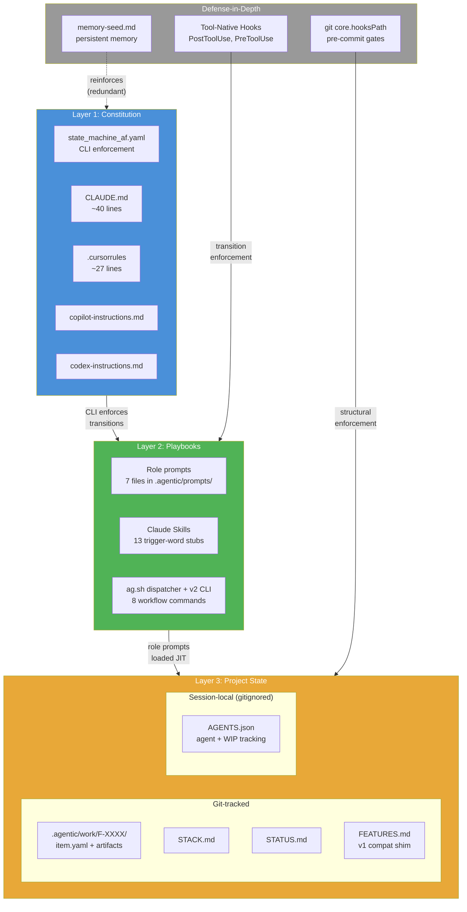

# Instruction Architecture Design Document

**Status**: Authoritative design basis for the Agentic AI Framework's instruction file architecture.
**Last validated**: 2026-03-19
**Owner**: Framework maintainer (whoever merges changes to `.agentic/`)

**Rule**: When source research documents and this design document disagree, this document wins.

---

## 1. Research Basis

This design synthesizes two independent research efforts:

- **ChatGPT 5.2 research** (`docs/research/context_and_subagents_research_2026_02_06.md`) — architectural analysis of instruction persistence across multi-agent systems. Excellent framework reasoning; cited sources are generic (e.g., lesswrong.com without specific articles). Evidence quality: ARCHITECTURAL REASONING.
- **Claude Opus 4.6 research** (`docs/research/2026-02-07-subagent-context-inheritance.md`) — tool-specific investigation with verified sources, direct quotes, and per-tool confidence levels. Evidence quality: VERIFIED TOOL DOCS.

### Where sources agree, differ, and differ in evidence quality

| Finding | ChatGPT 5.2 | Claude (Opus 4.6) | Agreement |
|---------|-------------|-------------------|-----------|
| Subagents are context-isolated | YES — architectural analysis | YES — confirmed for Claude (HIGH), Cursor (HIGH), Copilot (UNCLEAR) | FULL |
| Instruction files serve orchestrator only | YES | YES — confirmed across tools with sources | FULL |
| Context retention is unreliable | YES — "never rely on passive retention" | YES — L-0002: degrades past ~100 lines (empirical) | FULL |
| Three-layer architecture needed | YES — Constitution/Playbooks/State | Partially — framework has pieces but no formal layering | ALIGNED |
| Structural enforcement > behavioral | YES — "orchestrator is enforcement layer" | YES — D2 (Deterministic Enforcement), pre-commit gates | FULL |
| Post-task validation mandatory | YES — finalization check pattern | `ag done` runs doctor.sh but `\|\| true` suppresses failures | NARROW GAP |
| Constitution size: 300-800 tokens | YES (no cited empirical basis) | ~100 lines / ~1500 tokens max (LLM test-validated) | DEVIATION |

**Constitution size deviation**: The ChatGPT research recommends 300-800 tokens (~15-40 lines). The framework's empirical finding (L-0002) is that compliance degrades past ~100 lines (~1500 tokens). The proposed slimmed target of ~40-50 lines (~800-1000 tokens) exceeds the ChatGPT upper bound by ~25%. This is a conscious choice: the framework's instruction files carry competing high-priority rules (gates, triggers, protocols) that dilute each other faster than single-purpose constitutions. The 100-line upper bound from L-0002 remains the framework's validated ceiling. The ChatGPT recommendation is noted as aspirational guidance without cited empirical basis.

**Gemini**: The ChatGPT research notes Gemini is stateless between calls, supports up to ~1M tokens, and has no native orchestrator memory. Documented here for future reference — the framework doesn't support Gemini yet. Gemini CLI's hook system is mature (AfterTool with regex matchers). Including unactionable findings in the main design would weaken the document's authority.

---

## 2. The Three-Layer Architecture

> **v2 update**: The three-layer model is preserved but the *implementation* of each layer has shifted. v1 used instruction files + playbook docs + STACK.md config. v2 uses CLI enforcement via state machine + role prompts loaded JIT + per-feature work items in `.agentic/work/F-XXXX/`. See the v2 column in each layer below.



### Layer 1: Constitution (CLI enforcement + instruction files)

| Aspect | v1 | v2 |
|--------|-----|-----|
| **Primary enforcement** | Instruction files (<100 lines) | `state_machine_af.yaml` — CLI enforces transitions with artifact preconditions |
| **Instruction files** | CLAUDE.md, .cursorrules, copilot, codex (38-54 lines) | Same files, same size — behavioral rules that can't be structurally enforced |
| **What moved** | Gates table, delegation table, session protocols → Layer 2 | Workflow sequencing → state machine YAML; gate logic → preconditions.py |

**Files**: CLAUDE.md, .cursorrules, copilot-instructions.md, codex-instructions.md — still the behavioral constitution. `state_machine_af.yaml` — the structural constitution (10 states, transitions, modes, profiles).

**Design principle**: The state machine enforces workflow ordering structurally (exit 1 on invalid transitions). Instruction files contain ONLY rules that cannot be structurally enforced (anti-hallucination, "ask when uncertain", trigger words).

**Research basis**: Same as v1 — 300-800 tokens (ChatGPT), under 100 lines (L-0002). v2 reduces reliance on instruction file compliance by moving more enforcement into the CLI.

### Layer 2: Playbooks (role prompts loaded JIT on transitions)

| Aspect | v1 | v2 |
|--------|-----|-----|
| **Key files** | auto_orchestration.md (442 lines), 9 checklists, quality standards, workflow docs | 7 role prompts in `.agentic/prompts/` (~350 lines total) + `conventions.md` |
| **Loading mechanism** | `ag` commands print guidance from playbook files | CLI transition emits the role prompt for the target state |
| **Skills** | 12 hand-crafted skills with instructions + scripts + references | 13 trigger-word stubs (~370 lines total) that route to `ag` commands |

**Role prompts** are the v2 playbook mechanism. When a transition succeeds (e.g., `ag transition F-XXXX implementation`), the CLI emits the `implementer.md` role prompt. State-to-prompt mapping: `planning` → `planner.md`, `plan_review` → `reviewer.md`, `spec` → `planner.md`, `implementation` → `implementer.md`, `verification` → `verifier.md`, `docs` → `implementer.md`, `ready_to_ship` → `verifier.md`. Additional prompts: `debugger.md`, `session.md`, `explorer.md`.

**Skills** in v2 are reduced to trigger-word stubs — they match user intent to the right `ag` command but no longer bundle full playbook content. The role prompts replace skill references + checklists + workflow docs.

### Layer 3: Project State (per-feature work items)

| Aspect | v1 | v2 |
|--------|-----|-----|
| **Feature state** | FEATURES.md entries + STACK.md settings | `.agentic/work/F-XXXX/item.yaml` (status, mode, profile, transitions) |
| **Artifacts** | Scattered: `spec/acceptance/`, `journal/plans/`, `spec/reviews/` | Co-located: `.agentic/work/F-XXXX/plan.md`, `spec.md`, `review.md`, `verification.json` |
| **Config** | STACK.md (grep/sed parsing) | `state_machine_af.yaml` (structured YAML) |
| **Compat** | N/A | FEATURES.md sync shim keeps v1 status in sync during transition |

**Git-tracked state**:
- `.agentic/work/F-XXXX/item.yaml` — work item state (status, mode, profile, priority, transition history)
- `.agentic/work/F-XXXX/plan.md`, `spec.md`, `review.md`, `verification.json`, `journal.md` — co-located artifacts
- STACK.md — still used for project-level config (git workflow, verification commands override)
- STATUS.md — session snapshot, updated by `status.sh`

**Session-local state** (gitignored):
- `AGENTS.json` — agent registration + work-in-progress tracking

**Design property**: All feature state is co-located in `.agentic/work/F-XXXX/`. Artifact preconditions (e.g., "plan.md must exist before plan_review") are checked by the CLI against the work directory. This eliminates the v1 pattern of scattered artifacts validated by complex shell scripts.

### Defense-in-Depth: Hooks

The framework uses two categories of hooks for structural enforcement:

```
Defense-in-Depth: Hooks
├── Git Hooks (agent-agnostic)
│   └── pre-commit-check.sh — 21 structural gates
└── Tool-Native Hooks (per-tool, structural enforcement at transition points)
    ├── Claude Code: PostToolUse(ExitPlanMode), SessionStart, Stop, etc.
    └── [Other tools: future — Gemini, Codex, Copilot, Cursor]
```

**Git hooks** run at commit time — they are the universal backstop. **Tool-native hooks** fire at workflow transition points (e.g., exiting plan mode) and can inject instructions into the agent's context before the next action. Together they provide defense-in-depth: tool hooks catch violations early (at the transition), git hooks catch them late (at commit time).

**⚠ F-0300 finding (v0.69.0)**: Tool-native hooks were shipped as scripts but never *registered* in `.claude/settings.json` during init. The entire tool-hook enforcement layer was inert in every initialized project. Additionally, Claude Code requires a session restart to pick up newly registered hooks — no hot-reload. Both gaps together meant defense-in-depth had only one active layer (git hooks), which is itself bypassed when `git_mode=deferred`. Fix: R0 in F-0300 adds hook registration to scaffold and init. See `docs/KEY_INSIGHTS.md` §18 and A12 in §8.

### Defense-in-Depth: Memory Seed Layer

The framework includes a **memory-seed** mechanism (`.agentic/lib/init/memory-seed.md`) that seeds key workflow patterns into each tool's persistent memory during init. This coexists with this document's design principle #2 in §5 ("Never rely on memory") [note: this is the doc's own design principle list, not framework principle D2] because memory-seed is **redundant reinforcement, not primary enforcement**.

**The relationship**: Scripts enforce; memory reinforces. `pre-commit-check.sh` structurally blocks bad commits regardless of what the agent remembers. Memory-seed makes the agent *less likely* to attempt the bad commit in the first place. If memory fails, structural gates still catch the violation.

**The compression problem**: All instruction mechanisms — CLAUDE.md, `.claude/rules/*.md`, auto-memory MEMORY.md — are loaded at session start but get compressed as context grows during long sessions. Behavioral instructions fade over time within a session. Only structural enforcement (scripts with exit codes) survives the entire session reliably. Memory-seed helps most in the early-to-mid session window; structural gates are the only reliable late-session enforcement.

**Integrity checking**: `memory-check.sh` runs at session start (via `ag start`) and performs a coarse heuristic validation — checking version markers and sentinel strings. It is advisory only (never blocking) and catches gross overwrites, not subtle drift.

**Memory is NOT a fourth layer** — it is defense-in-depth reinforcement of the existing three layers. The hierarchy remains: structural enforcement > instruction files > memory reinforcement.

**Tool memory landscape**:

| Tool | Memory Location | Auto-Memory? | Seedable? |
|------|----------------|-------------|-----------|
| Claude Code | `~/.claude/projects/<hash>/memory/MEMORY.md` (~200 lines loaded at start) | Yes | Agent writes during init |
| Cursor | `.cursor/rules/*.mdc` + `learned-memories.mdc` | Yes | File-based (`.mdc` w/ YAML frontmatter) |
| Windsurf | `.windsurf/rules/*.md`, `~/.codeium/windsurf/memories/global_rules.md` | Yes | File-based (12K char/file limit) |
| Copilot | `.github/copilot-instructions.md`, `.github/instructions/*.instructions.md` | No | File-based |
| Codex CLI | `AGENTS.md` (repo root + subdirs), `~/.codex/AGENTS.md` | Emerging | File-based (can read CLAUDE.md via `project_doc_fallback_filenames`) |

### Orchestrator Enforcement (distributed model)

The framework uses a **distributed enforcement model** — this is a conscious design choice that diverges from the ChatGPT research's centralized orchestrator recommendation. Rationale: the framework operates across Claude Code, Cursor, Copilot, and Codex — no single orchestrator process is possible. The distributed model (each script enforces its phase) achieves the same guarantees.

**Enforcement points**:
- `ag implement` — checks acceptance criteria + approved plan
- `pre-commit-check.sh` — runs 21 structural checks
- `ag done` — runs `doctor.sh --phase complete` (but `|| true` in `cmd_done()` currently suppresses failures — see Gap 4)
- `context-for-role.sh` — assembles role-specific context for subagents
- `ag auto verify/task/crunch` — autonomous engine with Unix socket control, per-AC Claude instances, three-tier trust model (F-0160–F-0163)

### Context Window Decay in Autonomous Sessions

Context windows fill monotonically — every tool call, file read, and response adds tokens. Agents cannot clear their own context (`/clear` is a user action). As the window fills, the runtime performs **automatic compression**: older messages are summarized to make room. This compression is lossy. Instructions, design decisions, and nuanced rules get reduced to summaries that lose fidelity. The agent cannot detect what was lost.

This is **context rot** — a gradual, invisible degradation of the agent's ability to follow its own rules. It is the single biggest threat to instruction compliance in long-running sessions.

#### What survives compression vs. what doesn't

| Context element | Loaded when | Survives compression? | Implication |
|---|---|---|---|
| System prompt (CLAUDE.md, MEMORY.md, skill descriptions) | Session start | **YES** — system prompt is never compressed | Constitutional rules must live here |
| Skill full instructions | Mid-session (on trigger match) | **NO** — compressed like any user/assistant message | Workflow details loaded JIT degrade over time |
| File contents from Read tool | Mid-session | **NO** — early reads compressed first (FIFO) | Agents lose file contents they read 30+ messages ago |
| Tool call results | Mid-session | **NO** — older results summarized | Test output, git status, etc. fade |
| Agent's own reasoning | Mid-session | **NO** — loses detail progressively | Earlier design decisions become vague |
| CLI exit codes / script enforcement | Every invocation | **N/A — not in context at all** | Structural enforcement is immune to context state |
| State files on disk (JOURNAL, STATUS, item.yaml) | Re-readable anytime | **YES** — durable, outside context window | External state is the reliable memory |

**The critical asymmetry**: Instructions in the system prompt survive the entire session. Instructions loaded mid-session via skills, role prompts, or file reads do not. This is the architectural reason the Constitution layer (CLAUDE.md, ~50 lines) is kept small and front-loaded — it's the only instruction delivery mechanism that reliably persists.

#### Why autonomous sessions are especially vulnerable

In interactive mode, humans naturally create context breaks — switching tasks, running `/clear`, starting new sessions. These breaks reset the context window. In autonomous mode (`ag auto task`, `ag auto epic`, `ag auto crunch`), sessions can run for extended periods without human intervention. A long autonomous session accumulates context from dozens of file reads, tool calls, test runs, and commits. By the end, skill instructions loaded early in the session may have been compressed into vague summaries — or compressed away entirely.

The agent does not know this happened. It continues operating with full confidence on a degraded instruction set. This is unlike a human forgetting something — a human has a sense of uncertainty. The agent has none.

#### Architectural mitigations

The framework cannot prevent context decay. It architects around it so that decay doesn't compromise outcomes:

**1. Fresh subagents bound context rot per unit of work.**
`ag auto task` spawns a fresh Claude instance for each acceptance criterion. Each subagent receives exactly the context it needs via `context-for-role.sh` (5–10K focused tokens). Context rot is bounded to the scope of a single AC — not the entire feature or session. When the subagent completes, its degraded context is discarded. The next AC gets a clean window.

**2. External state files serve as the durable memory.**
JOURNAL.md, STATUS.md, AGENTS.json, `.agentic/work/F-XXXX/item.yaml`, `verification.json` — these persist on disk, outside any context window. When a fresh subagent starts, it reads current state from files. The files ARE the project's memory; the context window is just a working scratchpad. This is why the framework insists on `journal.sh` and `status.sh` updates before commits — they externalize state that would otherwise be trapped in a decaying context.

**3. Just-in-time playbook loading delays the onset of compression.**
Skills and role prompts are loaded only when triggered, not all at session start. A session that loads 2 skills uses ~4K of playbook tokens; loading all 13 would use ~26K. The leaner the baseline context, the longer before compression begins eating instructions.

**4. CLI state machine enforcement is immune to context state.**
The v2 workflow engine enforces transitions via Python exit codes, not LLM judgment. `ag transition F-XXXX implementation` checks whether `spec.md` exists in the work directory — a filesystem operation. It doesn't matter if the agent's context has been compressed to 10% fidelity. Structural enforcement works identically at token 1 and token 100K. This is the strongest argument for the state machine approach (see §5, principle 1: "Never rely on memory").

**5. Memory-seed in the system prompt survives the entire session.**
Persistent memory rules (trigger words, workflow patterns, anti-patterns) are loaded as part of the system prompt. The system prompt is never compressed. Even when mid-session skill instructions are lost, the memory-seed patterns remain. This is redundant reinforcement by design — the same rules exist in skills (lossy) and memory (persistent).

**6. Dashboard enables zero-cost session restart.**
`dashboard.sh` re-derives the full project state from files at session start. A new conversation picks up exactly where the previous one left off. This makes `/clear` + new session a recovery mechanism: when context has degraded, the user (or a human checkpoint in an autonomous workflow) can restart with zero state loss.

#### What the framework cannot do

- **Agents cannot self-clear.** There is no tool to reset the context window.
- **Agents cannot detect degradation.** A session with compressed instructions doesn't know what was lost. It may confidently violate rules it was following 20 messages ago.
- **Compression is not selective.** The runtime compresses older messages uniformly — it can't preserve "important" skill instructions while discarding "unimportant" file reads.
- **Single long sessions without subagents will degrade.** If `ag auto` is not used and a human manually drives a 50+ message implementation session, context will rot. The framework mitigates consequences (external state, structural gates) but cannot prevent the degradation itself.

#### Design implications

1. **Any rule that must always apply → structural enforcement (script/CLI gate), not instructions.** Instructions degrade; exit codes don't.
2. **Any state that must survive → external file, not conversation history.** Context is volatile; disk is durable.
3. **Any long workflow → decompose into subagent-sized units.** Fresh context beats accumulated context.
4. **Constitutional content → system prompt (~50 lines).** The only instruction channel that survives the entire session.
5. **Everything else → just-in-time loading.** Delay compression by not loading what isn't needed yet.

These principles directly inform the three-layer architecture: the Constitution (Layer 1) is kept small because only the system prompt survives compression. Playbooks (Layer 2) are loaded JIT because mid-session instructions are ephemeral. State (Layer 3) lives on disk because the context window is unreliable for persistence.

---

## 3. What Already Works (DO NOT CHANGE)

These mechanisms are proven and stable. Changes require strong justification:

- **pre-commit-check.sh** — 21 structural gates
- **context-for-role.sh** + 24 context manifests — subagent context injection
- **Token-efficient scripts** — journal.sh, status.sh, feature.sh, blocker.sh
- **LLM behavioral test suite** — 48+ tests validating instruction compliance
- **auto_orchestration.md** — primary playbook for agent workflows
- **`ag` gateway** — structural enforcement entry point
- **Trigger table format** in instruction files — tested (003/010 pass), proven. Claude Code: trigger delivery moved to Skills (F-0143); other tools retain trigger table
- **AGENT_QUICK_START.md** — "one rule: run doctor.sh" pattern
- **Manifest-based guideline injection** in context-for-role.sh — 7 of 24 manifests currently include anti-hallucination.md
- **STACK.md parsing** via ag.sh (grep/sed) — works today, no need to replace
- **Git-tracked vs gitignored state split** — STATUS.md in git for cross-machine; AGENTS.json gitignored for session-local

---

## 4. Gaps to Close

### Gap 1: Instruction files mix constitution with playbook content — RESOLVED

**Final line counts** (all under L-0002 ceiling of 100):

| File | Before | After | Reduction |
|------|--------|-------|-----------|
| Template CLAUDE.md | 79 | 40 | 49% |
| Template copilot | 69 | 38 | 45% |
| Template codex | 71 | 40 | 44% |
| Template cursor .mdc | 35 | 37 | +2 (added playbook pointer) |
| Root CLAUDE.md | 92 | 53 | 42% |
| Root .codex/instructions.md | 286 | 52 | 82% |
| Root .github/copilot-instructions.md | 77 | 49 | 36% |
| Root .cursorrules | 27 | 27 | unchanged (already lean) |

Moved content (gates table, delegation/agent mode, session protocols, agent boundaries) to `auto_orchestration.md` (334 → 442 lines). All templates now contain constitutional content. Claude Code further offloads triggers to Skills (F-0143), achieving ~40-line templates.

**Note**: Original design doc baseline for `.cursorrules` was incorrectly listed as 71 lines (that was the codex template). Actual root `.cursorrules` is 27 lines.

### Gap 2: Subagents don't consistently receive critical constitutional rules — RESOLVED

**Status**: RESOLVED — Option (b) implemented.

`context-for-role.sh` now has an `ALWAYS_INJECT` array that loads `core-rules.md` (~300 tokens) BEFORE manifest-declared files, counted against the token budget. All 24 agent roles receive the constitutional minimum (no fabrication, no auto-commit, token-efficient scripts, ask when uncertain). The existing manifest-based injection mechanism remains completely intact — always-inject is an additive layer on top.

### Gap 3: `ag` commands don't print playbook references — RESOLVED

`ag implement` now prints references to `auto_orchestration.md` and `feature_implementation.md`. `ag commit` prints reference to `before_commit.md`. `ag done` already had `feature_complete.md` reference.

**Note**: Assumption A7 (agents follow stdout references) remains untested. References are harmless regardless — they add information without removing anything.

### Gap 4: `ag done` doesn't block on validation failures — RESOLVED

`cmd_done()` (Formal) now runs `doctor.sh --phase complete` with proper error handling — failure prints a RED warning instead of being silently suppressed by `|| true`. Discovery profile now runs `doctor.sh --quick` as a non-blocking warning.

`cmd_implement()` line 528 retains `|| true` for `doctor.sh --phase planning` — this is intentional. Planning is early-stage; blocking would be overly strict.

---

## 5. Design Principles

These principles govern future framework changes to instruction architecture:

1. **Never rely on memory** — if a rule must always apply, enforce it structurally (script/gate), not behaviorally (instruction text)
2. **Constitution = what cannot be structurally enforced** — anti-hallucination, "ask when uncertain", trigger word responses
3. **Playbooks = how to follow rules** — loaded by `ag` commands at the right moment, not pinned in context
4. **State = machine-readable** — STACK.md parsed by ag.sh; STATUS.md sections parsed by status.sh
5. **Distributed enforcement** — ag.sh + pre-commit-check.sh + context-for-role.sh each own their phase. Framework design choice diverging from ChatGPT's centralized recommendation; rationale: cross-tool compatibility
6. **Test behavioral rules empirically** — LLM tests prove which instruction file content agents actually follow. No behavioral rule should be added without a corresponding test
7. **LLM-optimized formats** — every file agents read should be structured for AI parsing: YAML frontmatter for discovery (~20 tokens to decide relevance vs ~2K to read the file), consistent field patterns for grep-parsing (`**Status**: shipped`), tables for lookup. Human-readable AND LLM-scannable — these are not competing goals. See `PRINCIPLES.md` F3 and `docs/KEY_INSIGHTS.md` §12
8. **Embed enforcement in artifacts for cross-turn workflows** — instruction files (CLAUDE.md, skills, memory) are loaded at turn start but lose effect when a workflow spans multiple turns (plan mode exit → next user message). Embed mandatory next-steps directly in the work artifact (e.g., plan output), not just in instruction files. The artifact survives turn boundaries; instructions may not. See `docs/KEY_INSIGHTS.md` §14, `FRAMEWORK_DEVELOPMENT.md` § "LLM agents lose continuity at turn boundaries"

---

## 6. Relationship to Source Research Documents

This design document synthesizes and supersedes the two source research documents:

- `docs/research/context_and_subagents_research_2026_02_06.md` (ChatGPT 5.2 research) — retained as historical source
- `docs/research/2026-02-07-subagent-context-inheritance.md` (Claude Opus 4.6 research) — retained as historical source

**Rule**: Source documents are historical evidence, not authoritative guidance. They should NOT be updated — amendments go into this design document.

---

## 7. Maintenance

**Update triggers**:
- New LLM test results that contradict a finding
- Tool updates that change subagent behavior (e.g., Copilot clarifies context inheritance)
- New tool support added to framework (e.g., Gemini)

**Process**: Changes to this document require the same plan-review discipline as the original creation — no ad-hoc edits that weaken the evidence base.

---

## 8. Testable Assumptions

The design makes assumptions that should be validated over time. Each has a status:

| # | Assumption | Status | How to Test |
|---|-----------|--------|-------------|
| A1 | Trigger table format has high agent compliance | VALIDATED — tests 003/010 pass | LLM test suite |
| A2 | Token-efficient scripts are used when referenced | VALIDATED — tests 004/019 pass | LLM test suite |
| A3 | ~100 lines is the practical instruction file ceiling | VALIDATED — L-0002 empirical finding | LLM tests at varying file sizes |
| A4 | Subagents don't inherit CLAUDE.md (Claude Code) | CONFIRMED — official docs | Check docs on major tool updates |
| A5 | Subagents don't inherit .cursorrules (Cursor) | CONFIRMED — official docs + changelog | Check docs on major tool updates |
| A6 | Distributed enforcement achieves same guarantees as centralized orchestrator | ASSUMED — architectural reasoning, not empirically tested | Run full workflow with deliberate violations, check if gates catch them |
| A7 | `ag` command stdout has high salience to agents | UNTESTED — proposed in Gap 3 | Create LLM test: does agent follow instruction printed by `ag` command? |
| A8 | ~40-50 lines is achievable while keeping trigger table + token scripts + core rules | VALIDATED — template CLAUDE.md at 40 lines, root at 54, all under 100-line ceiling (F-0143) | Achieved via Skills offloading triggers |
| A9 | Copilot loads copilot-instructions.md into subagent sessions | UNKNOWN — contradictory docs | Empirical test with distinctive instruction |
| A10 | Git-tracked STATUS.md survives cross-machine workflow | RESOLVED — status.json eliminated; STATUS.md is the sole cross-machine state file | N/A — STATUS.md is already git-tracked and used directly |
| A11 | Tool-native PostToolUse hooks fire reliably on ExitPlanMode in Claude Code | VALIDATED — F-0234 (ExitPlanMode), F-0239 (Bash) confirmed in field | Manual test: enter/exit plan mode, verify hook output appears in agent context |
| A12 | Enforcement chains are wired end-to-end in fresh projects | **INVALIDATED** — F-0300 (Street Fury). Hook scripts existed, gate.py logic correct, but hooks never registered in settings.json + Claude requires restart for hook activation. Two wiring breaks silenced the entire enforcement layer. | End-to-end test: init fresh project → start Claude session → attempt blocked Write → verify denial fires. Must test full chain, not individual components. |

**Update this table** when assumptions are validated or invalidated. Failed assumptions trigger design document amendments.

**A12 lesson**: Component tests ("does gate.py return deny?") passed while the system was completely unprotected. The enforcement code existed, the hook scripts existed, the registration was missing, and hot-reload isn't supported. Integration tests that exercise the full activation path — init → registration → session start → tool call → hook fires → gate executes → denial returned — are the only way to catch wiring gaps. See `docs/KEY_INSIGHTS.md` §18.

---

## 9. Open Questions

### Blocks implementation decisions (resolve before implementing gaps)

- ~~**How aggressively to slim instruction files?**~~ RESOLVED — triggers moved to Skills for Claude Code, ~40-line templates achieved (F-0143). Other tools retain trigger tables in instruction files.
- **Does `ag` command stdout have higher salience than file content?** (Untested) — directly affects Gap 3

### Exploratory (can be deferred)

#### Tool-Native Hook Transition Points

Transition points where tool-native hooks can structurally enforce workflow rules:

| Transition | Hook Trigger | Value | Status |
|---|---|---|---|
| Plan mode exit → save + review | PostToolUse(ExitPlanMode) | Block coding without approved plan | **Implemented (F-0234)** |
| After `gh pr merge` → warn to use `ag merge` | PostToolUse(Bash) + parse cmd | Catch bypassed entry point | **Implemented (F-0239)** |
| On user prompt → warn unshipped features | UserPromptSubmit + git log parse | Catch merged-but-not-done on main | **Implemented (F-0239)** |
| Before file edit → verify artifacts | PreToolUse(Write\|Edit) | Block coding without required artifacts | **Implemented (Phase 4)** |
| Before destructive git → collision guard | PreToolUse(Bash) + parse cmd | Prevent stash/reset with active agents | Future |
| After `ag done` → verify completeness | PostToolUse(Bash) + parse cmd | Ensure ACs checked, docs updated | Future |
| Before PR creation → pre-submit check | PreToolUse(Bash) + parse `gh pr` | Ensure tests pass | Future |

- Does table format (trigger words) have higher compliance than prose format?
- Would a "router" CLAUDE.md (purely dispatch, no rules) outperform the current hybrid?
- Could the attention budget be relaxed to 150-200 lines now that subagent bloat isn't a concern?
- Does Copilot load copilot-instructions.md into subagent sessions? (Needs empirical test)
- Gemini: when/if support is added, how does its stateless model affect the architecture?
