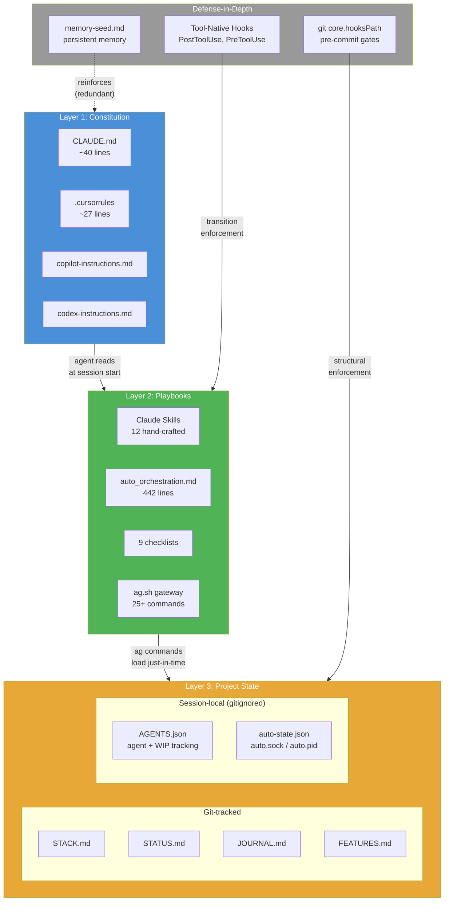

# Instruction Architecture Design Document

**Status**: Authoritative design basis for the Agentic AI Framework's instruction file architecture.
**Last validated**: 2026-03-06
**Owner**: Framework maintainer (whoever merges changes to `.agentic/`)

**Rule**: When source research documents and this design document disagree, this document wins.

---

## 1. Research Basis

This design synthesizes two independent research efforts:

- **ChatGPT 5.2 research** (`docs/research/context_and_subagents_research_2026_02_06.md`) — architectural analysis of instruction persistence across multi-agent systems. Excellent framework reasoning; cited sources are generic (e.g., lesswrong.com without specific articles). Evidence quality: ARCHITECTURAL REASONING.
- **Claude Opus 4.6 research** (`docs/research/2026-02-07-subagent-context-inheritance.md`) — tool-specific investigation with verified sources, direct quotes, and per-tool confidence levels. Evidence quality: VERIFIED TOOL DOCS.

### Where sources agree, differ, and differ in evidence quality

| Finding | ChatGPT 5.2 | Claude (Opus 4.6) | Agreement |
|---------|-------------|-------------------|-----------|
| Subagents are context-isolated | YES — architectural analysis | YES — confirmed for Claude (HIGH), Cursor (HIGH), Copilot (UNCLEAR) | FULL |
| Instruction files serve orchestrator only | YES | YES — confirmed across tools with sources | FULL |
| Context retention is unreliable | YES — "never rely on passive retention" | YES — L-0002: degrades past ~100 lines (empirical) | FULL |
| Three-layer architecture needed | YES — Constitution/Playbooks/State | Partially — framework has pieces but no formal layering | ALIGNED |
| Structural enforcement > behavioral | YES — "orchestrator is enforcement layer" | YES — D2 (Deterministic Enforcement), pre-commit gates | FULL |
| Post-task validation mandatory | YES — finalization check pattern | `ag done` runs doctor.sh but `\|\| true` suppresses failures | NARROW GAP |
| Constitution size: 300-800 tokens | YES (no cited empirical basis) | ~100 lines / ~1500 tokens max (LLM test-validated) | DEVIATION |

**Constitution size deviation**: The ChatGPT research recommends 300-800 tokens (~15-40 lines). The framework's empirical finding (L-0002) is that compliance degrades past ~100 lines (~1500 tokens). The proposed slimmed target of ~40-50 lines (~800-1000 tokens) exceeds the ChatGPT upper bound by ~25%. This is a conscious choice: the framework's instruction files carry competing high-priority rules (gates, triggers, protocols) that dilute each other faster than single-purpose constitutions. The 100-line upper bound from L-0002 remains the framework's validated ceiling. The ChatGPT recommendation is noted as aspirational guidance without cited empirical basis.

**Gemini**: The ChatGPT research notes Gemini is stateless between calls, supports up to ~1M tokens, and has no native orchestrator memory. Documented here for future reference — the framework doesn't support Gemini yet. Gemini CLI's hook system is mature (AfterTool with regex matchers). Including unactionable findings in the main design would weaken the document's authority.

---

## 2. The Three-Layer Architecture



### Layer 1: Constitution (instruction files)

**Files**: CLAUDE.md, .cursorrules, copilot-instructions.md, codex-instructions.md

**Current state**: 38-54 lines across tools (template CLAUDE.md: 40, root CLAUDE.md: 54, cursorrules: 27, copilot: 38, codex: 40). For Claude Code, trigger words have moved to Skills (see Layer 2).

**Research says**: 300-800 tokens, invariant rules only (ChatGPT); under 100 lines for attention quality (L-0002).

**Design principle**: Instruction files ARE the constitution. They should contain ONLY rules that cannot be structurally enforced.

**What stays** (cannot be structurally enforced — agent must choose to comply):
- Trigger table — tested, tests 003/010 pass. **For Claude Code, the trigger table has been moved to Skills (`.claude/skills/*/SKILL.md` descriptions, F-0143). Other tools retain the trigger table in their instruction files.**
- Token-efficient scripts references — tested, tests 004/019 pass
- "Never auto-commit" — behavioral rule
- "Never fabricate APIs" — behavioral rule
- Core behavioral boundaries (ask when uncertain, etc.)

**What moves to Layer 2** (already structurally enforced):
- Gates table — informational; pre-commit-check.sh enforces regardless
- Delegation table — orchestrator implementation detail
- Session protocol details — structurally handled by `ag start`

**Applies to both**: Root CLAUDE.md (framework development) AND template CLAUDE.md (`.agentic/lib/agents/claude/CLAUDE.md`). Different audiences, same constitutional principle.

### Layer 2: Playbooks (already exist)

**Key files**: auto_orchestration.md (442 lines), agent_operating_guidelines.md (127 lines), 9 checklists, quality standards, workflow docs.

**Loading mechanism**: `ag` commands print relevant instructions at the right moment. auto_orchestration.md is NOT referenced in any instruction file — it is accessed indirectly when agents run `ag implement`, `ag commit`, etc., which print task-specific guidance. This is intentional: just-in-time delivery via scripts.

**Gap**: `ag` commands don't explicitly tell the agent WHICH playbook file to read for deeper details. See Gap 3.

#### Skills (Claude Code-specific playbook delivery)

Skills are Claude Code's native mechanism for delivering playbook-level instructions. They implement the same principle as Layer 2 (just-in-time delivery) via tool-native UI — Claude Code surfaces the right skill based on task description, so agents receive workflow instructions without loading the full auto_orchestration.md playbook.

- **Source**: `.agentic/lib/agents/claude/skills/` (hand-crafted, 12 skills) + `.agentic/local/extensions/skills/` (project-specific, F-0151)
- **Generated to**: `.claude/skills/` (by `generate-skills.sh`, merges framework + extension skills)
- **Each skill bundles**: `SKILL.md` (instructions) + `scripts/` (gates/validation) + `references/` (playbook copies)
- **Progressive disclosure**: YAML frontmatter on 168 of 212 `.agentic/` files enables ~96% discovery savings (~184K tokens saved per full scan)
- **Context cost**: Only skill descriptions (~900 tokens) are always loaded in the system prompt. `.agentic/` frontmatter is inert — never auto-loaded, zero token cost until explicitly read. Full analysis: `docs/research/2026-03-01-frontmatter-context-impact.md`

Other tools (Cursor, Copilot, Codex) continue using `auto_orchestration.md` + `ag` commands for Layer 2 delivery. Skills are additive — they don't replace the existing Layer 2 mechanism, they provide a tool-native alternative for Claude Code (F-0143).

### Layer 3: Project State

**Git-tracked state** (survives across machines):
- STACK.md — git-tracked, parseable config file read by ag.sh with grep/sed
- STATUS.md — holds all runtime state (focus, progress, next, blocker) plus roadmap, risks, decisions. Updated directly by status.sh.

**Session-local state** (gitignored):
- `AGENTS.json` — agent registration + work-in-progress tracking (replaces WIP.md and AGENTS_ACTIVE.md)
- `.agentic/session/auto.sock` — Unix domain socket for engine control
- `.agentic/session/auto.pid` — engine PID file
- `.agentic/session/auto-state.json` — engine progress state
- `.agentic/session/crunch-state.json` — batch mode progress

**Design property**: State that must survive across machines goes in git-tracked files. State that is session-local goes in gitignored files. This distinction must be preserved.

**Future consideration**: A compact config.json (aggregating STACK.md keys + runtime state) could help subagent context injection. Lower priority than Gaps 1-4 — STACK.md parsing works today.

### Defense-in-Depth: Hooks

The framework uses two categories of hooks for structural enforcement:

```
Defense-in-Depth: Hooks
├── Git Hooks (agent-agnostic)
│   └── pre-commit-check.sh — 21 structural gates
└── Tool-Native Hooks (per-tool, structural enforcement at transition points)
    ├── Claude Code: PostToolUse(ExitPlanMode), SessionStart, Stop, etc.
    └── [Other tools: future — Gemini, Codex, Copilot, Cursor]
```

**Git hooks** run at commit time — they are the universal backstop. **Tool-native hooks** fire at workflow transition points (e.g., exiting plan mode) and can inject instructions into the agent's context before the next action. Together they provide defense-in-depth: tool hooks catch violations early (at the transition), git hooks catch them late (at commit time).

### Defense-in-Depth: Memory Seed Layer

The framework includes a **memory-seed** mechanism (`.agentic/lib/init/memory-seed.md`) that seeds key workflow patterns into each tool's persistent memory during init. This coexists with this document's design principle #2 in §5 ("Never rely on memory") [note: this is the doc's own design principle list, not framework principle D2] because memory-seed is **redundant reinforcement, not primary enforcement**.

**The relationship**: Scripts enforce; memory reinforces. `pre-commit-check.sh` structurally blocks bad commits regardless of what the agent remembers. Memory-seed makes the agent *less likely* to attempt the bad commit in the first place. If memory fails, structural gates still catch the violation.

**The compression problem**: All instruction mechanisms — CLAUDE.md, `.claude/rules/*.md`, auto-memory MEMORY.md — are loaded at session start but get compressed as context grows during long sessions. Behavioral instructions fade over time within a session. Only structural enforcement (scripts with exit codes) survives the entire session reliably. Memory-seed helps most in the early-to-mid session window; structural gates are the only reliable late-session enforcement.

**Integrity checking**: `memory-check.sh` runs at session start (via `ag start`) and performs a coarse heuristic validation — checking version markers and sentinel strings. It is advisory only (never blocking) and catches gross overwrites, not subtle drift.

**Memory is NOT a fourth layer** — it is defense-in-depth reinforcement of the existing three layers. The hierarchy remains: structural enforcement > instruction files > memory reinforcement.

**Tool memory landscape**:

| Tool | Memory Location | Auto-Memory? | Seedable? |
|------|----------------|-------------|-----------|
| Claude Code | `~/.claude/projects/<hash>/memory/MEMORY.md` (~200 lines loaded at start) | Yes | Agent writes during init |
| Cursor | `.cursor/rules/*.mdc` + `learned-memories.mdc` | Yes | File-based (`.mdc` w/ YAML frontmatter) |
| Windsurf | `.windsurf/rules/*.md`, `~/.codeium/windsurf/memories/global_rules.md` | Yes | File-based (12K char/file limit) |
| Copilot | `.github/copilot-instructions.md`, `.github/instructions/*.instructions.md` | No | File-based |
| Codex CLI | `AGENTS.md` (repo root + subdirs), `~/.codex/AGENTS.md` | Emerging | File-based (can read CLAUDE.md via `project_doc_fallback_filenames`) |

### Orchestrator Enforcement (distributed model)

The framework uses a **distributed enforcement model** — this is a conscious design choice that diverges from the ChatGPT research's centralized orchestrator recommendation. Rationale: the framework operates across Claude Code, Cursor, Copilot, and Codex — no single orchestrator process is possible. The distributed model (each script enforces its phase) achieves the same guarantees.

**Enforcement points**:
- `ag implement` — checks acceptance criteria + approved plan
- `pre-commit-check.sh` — runs 21 structural checks
- `ag done` — runs `doctor.sh --phase complete` (but `|| true` in `cmd_done()` currently suppresses failures — see Gap 4)
- `context-for-role.sh` — assembles role-specific context for subagents
- `ag auto verify/task/crunch` — autonomous engine with Unix socket control, per-AC Claude instances, three-tier trust model (F-0160–F-0163)

---

## 3. What Already Works (DO NOT CHANGE)

These mechanisms are proven and stable. Changes require strong justification:

- **pre-commit-check.sh** — 21 structural gates
- **context-for-role.sh** + 24 context manifests — subagent context injection
- **Token-efficient scripts** — journal.sh, status.sh, feature.sh, blocker.sh
- **LLM behavioral test suite** — 48+ tests validating instruction compliance
- **auto_orchestration.md** — primary playbook for agent workflows
- **`ag` gateway** — structural enforcement entry point
- **Trigger table format** in instruction files — tested (003/010 pass), proven. Claude Code: trigger delivery moved to Skills (F-0143); other tools retain trigger table
- **AGENT_QUICK_START.md** — "one rule: run doctor.sh" pattern
- **Manifest-based guideline injection** in context-for-role.sh — 7 of 24 manifests currently include anti-hallucination.md
- **STACK.md parsing** via ag.sh (grep/sed) — works today, no need to replace
- **Git-tracked vs gitignored state split** — STATUS.md in git for cross-machine; AGENTS.json gitignored for session-local

---

## 4. Gaps to Close

### Gap 1: Instruction files mix constitution with playbook content — RESOLVED

**Final line counts** (all under L-0002 ceiling of 100):

| File | Before | After | Reduction |
|------|--------|-------|-----------|
| Template CLAUDE.md | 79 | 40 | 49% |
| Template copilot | 69 | 38 | 45% |
| Template codex | 71 | 40 | 44% |
| Template cursor .mdc | 35 | 37 | +2 (added playbook pointer) |
| Root CLAUDE.md | 92 | 53 | 42% |
| Root .codex/instructions.md | 286 | 52 | 82% |
| Root .github/copilot-instructions.md | 77 | 49 | 36% |
| Root .cursorrules | 27 | 27 | unchanged (already lean) |

Moved content (gates table, delegation/agent mode, session protocols, agent boundaries) to `auto_orchestration.md` (334 → 442 lines). All templates now contain constitutional content. Claude Code further offloads triggers to Skills (F-0143), achieving ~40-line templates.

**Note**: Original design doc baseline for `.cursorrules` was incorrectly listed as 71 lines (that was the codex template). Actual root `.cursorrules` is 27 lines.

### Gap 2: Subagents don't consistently receive critical constitutional rules — RESOLVED

**Status**: RESOLVED — Option (b) implemented.

`context-for-role.sh` now has an `ALWAYS_INJECT` array that loads `core-rules.md` (~300 tokens) BEFORE manifest-declared files, counted against the token budget. All 24 agent roles receive the constitutional minimum (no fabrication, no auto-commit, token-efficient scripts, ask when uncertain). The existing manifest-based injection mechanism remains completely intact — always-inject is an additive layer on top.

### Gap 3: `ag` commands don't print playbook references — RESOLVED

`ag implement` now prints references to `auto_orchestration.md` and `feature_implementation.md`. `ag commit` prints reference to `before_commit.md`. `ag done` already had `feature_complete.md` reference.

**Note**: Assumption A7 (agents follow stdout references) remains untested. References are harmless regardless — they add information without removing anything.

### Gap 4: `ag done` doesn't block on validation failures — RESOLVED

`cmd_done()` (Formal) now runs `doctor.sh --phase complete` with proper error handling — failure prints a RED warning instead of being silently suppressed by `|| true`. Discovery profile now runs `doctor.sh --quick` as a non-blocking warning.

`cmd_implement()` line 528 retains `|| true` for `doctor.sh --phase planning` — this is intentional. Planning is early-stage; blocking would be overly strict.

---

## 5. Design Principles

These principles govern future framework changes to instruction architecture:

1. **Never rely on memory** — if a rule must always apply, enforce it structurally (script/gate), not behaviorally (instruction text)
2. **Constitution = what cannot be structurally enforced** — anti-hallucination, "ask when uncertain", trigger word responses
3. **Playbooks = how to follow rules** — loaded by `ag` commands at the right moment, not pinned in context
4. **State = machine-readable** — STACK.md parsed by ag.sh; STATUS.md sections parsed by status.sh
5. **Distributed enforcement** — ag.sh + pre-commit-check.sh + context-for-role.sh each own their phase. Framework design choice diverging from ChatGPT's centralized recommendation; rationale: cross-tool compatibility
6. **Test behavioral rules empirically** — LLM tests prove which instruction file content agents actually follow. No behavioral rule should be added without a corresponding test
7. **LLM-optimized formats** — every file agents read should be structured for AI parsing: YAML frontmatter for discovery (~20 tokens to decide relevance vs ~2K to read the file), consistent field patterns for grep-parsing (`**Status**: shipped`), tables for lookup. Human-readable AND LLM-scannable — these are not competing goals. See `PRINCIPLES.md` F3 and `docs/KEY_INSIGHTS.md` §12
8. **Embed enforcement in artifacts for cross-turn workflows** — instruction files (CLAUDE.md, skills, memory) are loaded at turn start but lose effect when a workflow spans multiple turns (plan mode exit → next user message). Embed mandatory next-steps directly in the work artifact (e.g., plan output), not just in instruction files. The artifact survives turn boundaries; instructions may not. See `docs/KEY_INSIGHTS.md` §14, `FRAMEWORK_DEVELOPMENT.md` § "LLM agents lose continuity at turn boundaries"

---

## 6. Relationship to Source Research Documents

This design document synthesizes and supersedes the two source research documents:

- `docs/research/context_and_subagents_research_2026_02_06.md` (ChatGPT 5.2 research) — retained as historical source
- `docs/research/2026-02-07-subagent-context-inheritance.md` (Claude Opus 4.6 research) — retained as historical source

**Rule**: Source documents are historical evidence, not authoritative guidance. They should NOT be updated — amendments go into this design document.

---

## 7. Maintenance

**Update triggers**:
- New LLM test results that contradict a finding
- Tool updates that change subagent behavior (e.g., Copilot clarifies context inheritance)
- New tool support added to framework (e.g., Gemini)

**Process**: Changes to this document require the same plan-review discipline as the original creation — no ad-hoc edits that weaken the evidence base.

---

## 8. Testable Assumptions

The design makes assumptions that should be validated over time. Each has a status:

| # | Assumption | Status | How to Test |
|---|-----------|--------|-------------|
| A1 | Trigger table format has high agent compliance | VALIDATED — tests 003/010 pass | LLM test suite |
| A2 | Token-efficient scripts are used when referenced | VALIDATED — tests 004/019 pass | LLM test suite |
| A3 | ~100 lines is the practical instruction file ceiling | VALIDATED — L-0002 empirical finding | LLM tests at varying file sizes |
| A4 | Subagents don't inherit CLAUDE.md (Claude Code) | CONFIRMED — official docs | Check docs on major tool updates |
| A5 | Subagents don't inherit .cursorrules (Cursor) | CONFIRMED — official docs + changelog | Check docs on major tool updates |
| A6 | Distributed enforcement achieves same guarantees as centralized orchestrator | ASSUMED — architectural reasoning, not empirically tested | Run full workflow with deliberate violations, check if gates catch them |
| A7 | `ag` command stdout has high salience to agents | UNTESTED — proposed in Gap 3 | Create LLM test: does agent follow instruction printed by `ag` command? |
| A8 | ~40-50 lines is achievable while keeping trigger table + token scripts + core rules | VALIDATED — template CLAUDE.md at 40 lines, root at 54, all under 100-line ceiling (F-0143) | Achieved via Skills offloading triggers |
| A9 | Copilot loads copilot-instructions.md into subagent sessions | UNKNOWN — contradictory docs | Empirical test with distinctive instruction |
| A10 | Git-tracked STATUS.md survives cross-machine workflow | RESOLVED — status.json eliminated; STATUS.md is the sole cross-machine state file | N/A — STATUS.md is already git-tracked and used directly |
| A11 | Tool-native PostToolUse hooks fire reliably on ExitPlanMode in Claude Code | UNTESTED — implemented in F-0234, awaiting field validation | Manual test: enter/exit plan mode, verify hook output appears in agent context |

**Update this table** when assumptions are validated or invalidated. Failed assumptions trigger design document amendments.

---

## 9. Open Questions

### Blocks implementation decisions (resolve before implementing gaps)

- ~~**How aggressively to slim instruction files?**~~ RESOLVED — triggers moved to Skills for Claude Code, ~40-line templates achieved (F-0143). Other tools retain trigger tables in instruction files.
- **Does `ag` command stdout have higher salience than file content?** (Untested) — directly affects Gap 3

### Exploratory (can be deferred)

#### Tool-Native Hook Transition Points

Transition points where tool-native hooks can structurally enforce workflow rules:

| Transition | Hook Trigger | Value | Status |
|---|---|---|---|
| Plan mode exit → save + review | PostToolUse(ExitPlanMode) | Block coding without approved plan | **Implemented (F-0234)** |
| Before file edit → verify approved plan | PreToolUse(Write\|Edit) | Block coding without plan | Future |
| Before destructive git → collision guard | PreToolUse(Bash) + parse cmd | Prevent stash/reset with active agents | Future |
| After `ag done` → verify completeness | PostToolUse(Bash) + parse cmd | Ensure ACs checked, docs updated | Future |
| Before PR creation → pre-submit check | PreToolUse(Bash) + parse `gh pr` | Ensure tests pass | Future |

- Does table format (trigger words) have higher compliance than prose format?
- Would a "router" CLAUDE.md (purely dispatch, no rules) outperform the current hybrid?
- Could the attention budget be relaxed to 150-200 lines now that subagent bloat isn't a concern?
- Does Copilot load copilot-instructions.md into subagent sessions? (Needs empirical test)
- Gemini: when/if support is added, how does its stateless model affect the architecture?
