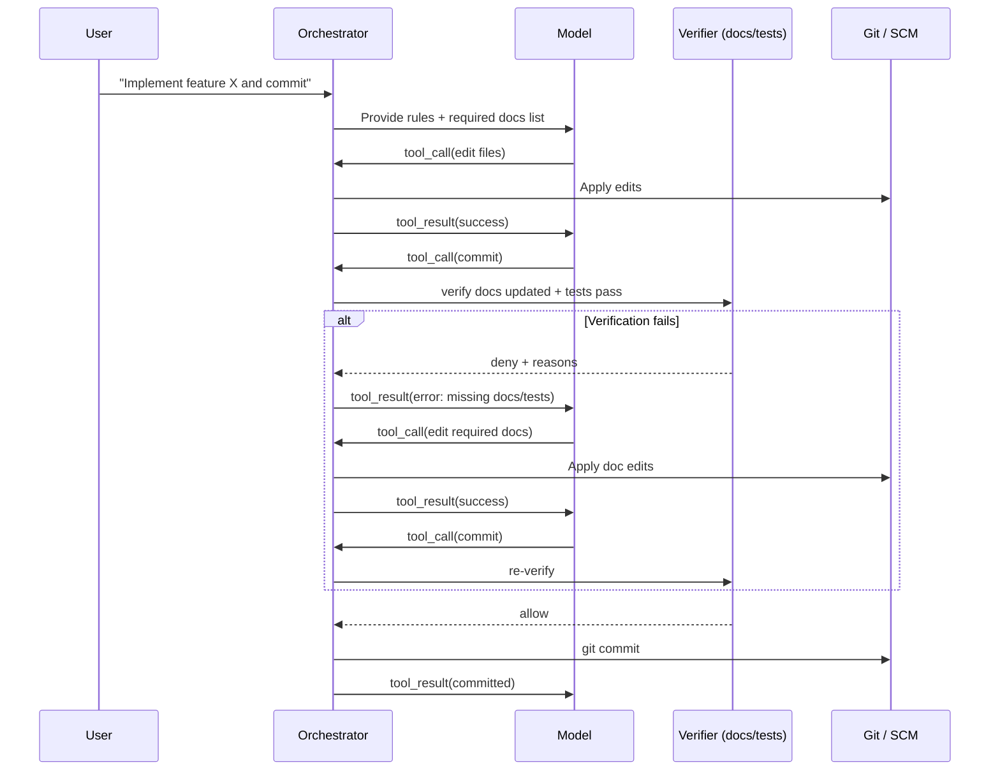

# Enforcing Persistent Behavioral Patterns and Protected-Memory-Like Mechanisms in LLM-Based Assistants

2026-11-02
By ChatGPT 5.2 Deep research

## Executive summary

Persistent “always do X before Y” behaviors in LLM-based assistants are **not** reliably achieved by prompting alone, even when using high-priority system/developer instructions. Modern assistants (Claude, Cursor, OpenAI Codex, GitHub Copilot, Gemini) provide stronger primitives—**instruction layering, stateful conversation objects/IDs, tool-calling controls, external retrieval, and guardrail hooks**—but each comes with different persistence guarantees and failure modes (context growth, compaction side effects, tool-call forgetting, and nondeterministic instruction adherence). citeturn17view3turn28view2turn31view3turn29view0turn19view0

Across platforms, the most reliable architecture for enforcing workflows like **“before committing, update these two documents”** is to (1) treat LLM output as a proposal, (2) run all side effects through a **policy-enforcing middleware layer** (or native hook system where available), and (3) keep durable project rules and workflow state in **versioned, external stores** (repo files, structured memory files, or an indexed knowledge base) that can be re-injected via retrieval each turn. Where supported, use **tool-choice forcing / permission hooks** to prevent bypass. citeturn38view0turn34view0turn29view2turn19view0turn31view3

Key takeaways by product (high-level):
- **Claude (Anthropic)**: strongest “developer-controlled persistent memory” primitive via the **Memory tool** (client-side, file-based persistence) plus **server-side context editing** (e.g., clearing old tool results) to mitigate context overflow; also supports **tool_choice** forcing and strict tool schemas for more deterministic tool invocation. citeturn28view1turn28view2turn38view0  
- **OpenAI Codex / OpenAI API**: robust **statefulness** via `store: true`, `previous_response_id`, and the **Conversations API** for durable conversation objects storing messages + tool calls/outputs; Codex adds **AGENTS.md**, **skills**, and a **SDK** that can resume threads—useful for persistent workflows. citeturn31view3turn29view0turn30view0turn31view0turn37view0  
- **GitHub Copilot**: unusually strong operational enforcement via **hooks** (e.g., `preToolUse`) that can **deny tool execution** with a machine-readable `permissionDecision`. Copilot also has **repository-scoped Copilot Memory** (public preview) and layered instruction files. citeturn15view0turn34view0turn17view0turn17view3  
- **Gemini (Google)**: long-context models + strong grounding/RAG ecosystem (Vertex AI RAG Engine; grounding with Google Search). For statefulness, the **Interactions API (Beta)** provides server-side state with `previous_interaction_id` and retrieval of past interactions, but stability caveats apply. citeturn19view0turn35view2turn19view3turn20search3turn18search2  
- **Cursor**: focuses on persistent project instruction via **Rules** and agentic workflows (including Cloud Agents); supports **MCP** for external tool integration and has APIs (Cloud Agents API + OpenAPI spec), but publicly documented “memory” primitives are less clear/less accessible than Copilot’s hooks or Claude’s memory tool—so enforcement typically relies on repo rules + external middleware + SCM hooks/CI. citeturn5search1turn23search2turn24view3turn23search4turn9search13  

## Practical framework for “persistent behavior” in LLM assistants

“Persistent behavioral patterns” and “protected memory” are best treated as a **stack**, not a single feature:

At the top are **instruction layers** (system/developer messages, repo instruction files, rules). These are persuasive but not fully binding, and platforms explicitly warn that nondeterminism means instructions may not be followed consistently. citeturn17view3turn19view2

Under that is **state persistence**: durable conversation IDs/threads/interaction objects that store tool calls and outputs, enabling continuity without resending all history. This reduces “forgetting” due to context trimming but does not guarantee compliance; it just makes the state available. citeturn29view0turn31view3turn35view2turn19view0

Then comes **retrieval augmentation (RAG/grounding)**: dynamically re-injecting authoritative rules, checklists, and project facts at decision points. This combats drift as the conversation grows and reduces reliance on “the model remembers.” citeturn19view3turn20search3turn0search19turn31view3

Finally—and most importantly for enforcement—are **guardrails at the action boundary**: hooks/middleware that can allow/deny commits, tool calls, or deployments regardless of what the model “intends.” GitHub Copilot CLI hooks are a first-class example; elsewhere you build this boundary yourself. citeturn34view0turn38view0turn31view3

## Platform deep dives and enforcement patterns

### Claude by Anthropic

**Official persistence and control primitives**

Claude’s Developer Platform provides a particularly explicit “persistent memory” mechanism via the **Memory tool**: Claude can create/read/update/delete files in a dedicated memories directory that persists across sessions, while the developer controls storage because it is **client-side**. This is functionally close to “protected memory” as long as you enforce access controls and treat memory writes as gated side effects. citeturn28view1

For long-running sessions and context growth, Anthropic provides **Context editing** (beta), which runs server-side and can selectively clear content like old tool results. The docs highlight **tool result clearing** (useful for heavy-tool agents) and emphasize you keep your full local history while the platform edits what is sent to the model. It also explicitly notes integration with the Memory tool so Claude can save important information before it is cleared. citeturn28view2turn28view1

Claude also supports:
- **Tool-choice forcing** (`tool_choice` with `auto/any/tool/none`) to require tool invocation in certain steps, plus strict schemas for stronger determinism (“Guaranteed tool calls with strict tools”). citeturn38view0  
- A strict formatting constraint: tool result blocks must immediately follow corresponding tool use blocks, otherwise you can trigger API errors—this is relevant to “tool-call persistence” because it forces the orchestrator to maintain a correct call/result chain. citeturn38view2  
- **Prompt caching**, which can cache consistent prompt prefixes and reduce cost/latency; system content blocks can be cache-controlled. This can make “protected instruction headers” cheaper to resend every turn. citeturn28view3turn38view0  

On context size, Anthropic advertises large contexts, including Claude Opus 4.6 featuring a **1M context window** (product page). citeturn0search21

**RAG and retrieval approaches**

Anthropic emphasizes that if your knowledge base is under ~200k tokens you may include it directly; beyond that you need more scalable retrieval. Anthropic published “Contextual Retrieval,” a RAG preprocessing approach combining contextual embeddings + contextual BM25 to reduce retrieval failures. citeturn0search19

**Guardrails and practical enforcement for “update docs before commit”**

The reliable pattern is to **never expose a raw “commit” tool**. Instead expose a single gated capability (e.g., `verify_and_commit`) and/or enforce a policy step via tool-choice forcing:

- Put the workflow contract in a stable system layer and in durable memory (read-only “policy header” stored outside model write access).
- Require a **verification tool call** (doc check + tests) immediately before any commit tool call.
- In middleware, block commits unless verifiers succeed.

Claude-specific levers:
- Use `tool_choice` to force the verifier tool in “commit mode.” citeturn38view0  
- Use Memory tool to store and retrieve the “two documents” list, decision logs, and last verification timestamp, but treat memory writes as privileged operations controlled by your tool executor. citeturn28view1  
- Use Context editing to prevent tool-result bloat, while ensuring important outputs are stored to memory before clearing. citeturn28view2  

**Claude middleware pseudocode (language-agnostic)**

```pseudo
POLICY = {
  required_docs: ["docs/ARCHITECTURE.md", "docs/CHANGELOG.md"],
  require_tests: true
}

on_tool_call(tool_name, args, session_state):
  if tool_name == "git_commit":
    # Hard block: agent never gets direct commit capability
    return error("Use verify_and_commit tool")

  if tool_name == "verify_and_commit":
    assert args.message != ""
    # 1) Verify docs changed
    changed = git_diff_name_only()
    missing = POLICY.required_docs - changed
    if missing not empty:
      return tool_result({
        ok: false,
        reason: "Required docs not updated",
        missing_docs: missing
      })
    # 2) Verify tests
    if POLICY.require_tests:
      status = run_tests()
      if status.failed:
        return tool_result({ ok:false, reason:"Tests failed", details: status.summary })

    # 3) Commit
    run("git commit -am", args.message)
    return tool_result({ ok:true })
```

### Cursor

**Official persistence and control primitives (as publicly documented)**

Cursor positions its agent as a composition of **instructions, tools, and user messages**, with orchestration tuned per model. citeturn4search2

Cursor’s durable instruction mechanism is **Rules**. The docs describe persistent instructions with multiple scopes (User/Project/Team) and also reference **AGENTS.md** as part of instructing the agent. citeturn5search1

Cursor supports tool extensibility via **Model Context Protocol (MCP)**. Cursor’s MCP docs note programmatic registration (via an extension API) to avoid manually editing config files—useful for enterprise rollouts. citeturn23search2  
OpenAI’s MCP docs also explicitly mention Cursor has native MCP support and reads configuration from `mcp.json`, reinforcing that Cursor is a first-class MCP client. citeturn9search14turn23search18

Cursor also ships **Cloud Agents**, enabling autonomous agent runs in isolated cloud environments (product blog). citeturn24view3  
Cursor documents a Cloud Agents API and provides an OpenAPI spec; however, publicly surfaced snippets show some ambiguity around auth naming (docs mention Basic auth, while the OpenAPI snippet references `bearerAuth`). Treat auth details as subject to change and verify against your account’s current docs/spec. citeturn23search0turn23search4

**Community/third-party findings relevant to persistence**

Community discussion indicates that Cursor’s BYOK support may lag newer OpenAI endpoints (e.g., a report that GPT-5.1 Codex models require `/v1/responses` while Cursor BYOK supported `/v1/chat/completions` at the time). This matters for persistence because OpenAI statefulness features are centered on Responses/Conversations. citeturn9search13

Because Cursor’s own “memory” behavior is not consistently documented in accessible official pages, many teams implement “memory banks” as repo documentation patterns (community repos and guides). Treat these as community patterns, not platform guarantees. citeturn5search7turn4search8

**Practical techniques for “update docs before commit”**

Cursor’s strongest enforcement is typically **external**:
- Put the workflow in repo-level Rules/AGENTS.md so the agent plans to comply. citeturn5search1  
- Expose a verifier/commit gate via **MCP tools**:
  - `check_required_docs_updated()`
  - `run_tests()`
  - `commit_changes()` (that refuses unless checks pass)

Because Cursor can call MCP tools, you can implement the same enforcement boundary as in Claude/OpenAI, but tool execution happens in your MCP server.

Also enforce independently of the agent by using standard SCM mechanisms (pre-commit hooks, CI required checks). This catches “tool-call forgetting” or partial compliance.

**Cursor MCP-based enforcement pseudocode**

```pseudo
# MCP server exposes:
tool check_required_docs_updated(required_docs: list<string>) -> {ok, missing, changed}
tool run_tests() -> {ok, summary}
tool guarded_commit(message: string, required_docs: list<string>) -> {ok, reason}

guarded_commit(message, required_docs):
  diff = git_diff_name_only()
  missing = required_docs - diff
  if missing not empty:
    return {ok:false, reason:"Missing required doc updates", missing:missing}
  tests = run_tests()
  if !tests.ok:
    return {ok:false, reason:"Tests failed", details:tests.summary}
  git_commit(message)
  return {ok:true}
```

### OpenAI Codex and the OpenAI API stack

This section covers two layers: (1) **OpenAI API primitives** used by many assistants, and (2) **Codex-specific workflow packaging**.

**OpenAI API primitives for long-term instructions and persistent state**

OpenAI’s model instruction hierarchy is explicit in the Responses API reference: messages with `developer` or `system` roles take precedence over `user` role messages. citeturn29view2

For persistence:
- The Responses API supports **multi-turn interactions** and can preserve state; OpenAI’s migration guide highlights `store: true` for turn-to-turn statefulness, preserving reasoning and tool context. citeturn31view3  
- The **Conversations API** persists conversation state as a long-running object with a durable identifier; conversations store items including messages, tool calls, and tool outputs. citeturn29view0  
- The Agents SDK cookbook notes basic memory support through `previous_response_id` chaining, with the option to manage context manually by re-supplying outputs as input. citeturn29view3  

For tools:
- Responses API supports built-in tools (e.g., web search, file search, computer use, code interpreter) and remote MCPs, plus custom tools. citeturn31view3turn29view2

**Codex-specific persistence and workflow packaging**

Codex provides repo-level instruction discovery via **AGENTS.md** layering; it documents a hierarchy with overrides (e.g., `AGENTS.override.md`) and notes Codex stops searching once it reaches the current directory—so you can scope instructions tightly. citeturn30view0

Codex introduces **Agent Skills** (open standard) with progressive disclosure: metadata is read first, full `SKILL.md` content is loaded only when needed. This is a “protected-memory-like” mechanism because it reduces prompt bloat while keeping specialized rules discoverable. citeturn30view3

For durable threads:
- Codex SDK allows starting a thread, calling `run()` multiple times, and resuming via a thread ID. citeturn31view0  

For coding-agent constraints:
- GPT-5.1 Codex model docs specify a **400,000 token context window** and up to **128,000 max output tokens** (model-dependent). citeturn37view0  

**ChatGPT “Memory” vs API persistence**

ChatGPT has a consumer-facing Memory feature (saved memories + chat history, user-controlled), but community discussion indicates there historically was no equivalent “Memory toggle” in the API. Treat API persistence as something you implement via Conversations/Responses/your DB rather than relying on ChatGPT UI memory. citeturn10search3turn10search7turn10search14

**Enforcement pattern for “update docs before commit”**

OpenAI’s best fit is a **policy-orchestrated agent loop**:
- Use repo-scoped AGENTS.md to declare the workflow.
- Implement a `verify_and_commit` tool (or a chain: `verify_docs`, `verify_tests`, `commit`) and do not expose raw commit to the model.
- Use Conversations API so the verifier state (what was checked, when) and tool outputs are durable.
- Optional: encode the workflow as a Codex Skill (instructions + scripts), so it triggers automatically when a task smells like “commit/ship.” citeturn29view0turn30view3turn31view3

**OpenAI/Codex enforcement pseudocode**

```pseudo
# In OpenAI Responses API:
# - Use a developer/system message to define policy.
# - Provide a single custom tool: verify_and_commit

tool verify_and_commit(message: string) -> {ok: bool, reason?: string}

verify_and_commit(message):
  required_docs = ["docs/ARCHITECTURE.md", "docs/CHANGELOG.md"]
  changed = git_diff_name_only()
  if any doc not in changed:
    return {ok:false, reason:"Docs missing; update required docs before commit"}
  if tests_fail():
    return {ok:false, reason:"Tests failing"}
  git_commit(message)
  return {ok:true}
```

### GitHub Copilot (Copilot Chat, Copilot coding agent, Copilot CLI)

**Instruction persistence and guardrails**

GitHub documents layered custom instructions:
- Repository-wide instructions: `.github/copilot-instructions.md`  
- Path-specific instructions: `.github/instructions/**/*.instructions.md`  
- Agent instructions: `AGENTS.md`, `CLAUDE.md`, or `GEMINI.md`, where the nearest `AGENTS.md` in the directory tree takes precedence. citeturn12view0turn17view3  

GitHub explicitly notes nondeterminism: Copilot may not always follow custom instructions in exactly the same way every time. This is the key “don’t rely on prompts as enforcement” warning. citeturn17view3

**Copilot Memory**

GitHub documents **Copilot Memory** (agentic memory) as repository-scoped “memories” that Copilot learns from actions in a repository. Memory is off by default, in public preview, and can be enabled at enterprise/org/personal settings. Memories are **repository-scoped, not user-scoped**, and can be reviewed/deleted by repo owners. citeturn17view0turn17view1

This is a persistence primitive, but it’s not a deterministic rules engine; it’s a learned context store.

**Tool/call invocation persistence and enforcement via hooks**

GitHub Copilot CLI (and coding agent environments) support **hooks** configured in a `.github/hooks/` JSON file on the default branch. Hook types include `preToolUse` and `postToolUse`, among others. citeturn15view0turn33view0

Critically, the hooks configuration reference shows scripts can output JSON such as:

- `{"permissionDecision":"deny","permissionDecisionReason":"..."}`

…and includes examples of conditional blocking and code quality enforcement using `preToolUse`. citeturn34view0turn34view1

This is one of the strongest “protected-memory-like enforcement” mechanisms available in mainstream assistants: **you can deny actions even if the model wants to proceed**.

**Recommended enforcement for “before commit update two documents”**

Use **two layers**:
1. Put the rule in `.github/copilot-instructions.md` and nearest `AGENTS.md` so the agent plans for it. citeturn17view3turn12view0  
2. Enforce with a `preToolUse` hook that denies commits unless the required docs appear in the diff.

**Copilot hook example (based on documented hook IO patterns)**

`/.github/hooks/hooks.json` (conceptual):
```json
{
  "version": 1,
  "hooks": {
    "preToolUse": [
      { "type": "command", "bash": "./scripts/block-commit-unless-docs-updated.sh" }
    ]
  }
}
```

`block-commit-unless-docs-updated.sh` (conceptual; reads stdin JSON, returns permissionDecision):
```bash
#!/bin/bash
INPUT=$(cat)
TOOL=$(echo "$INPUT" | jq -r '.toolName')

# Only inspect shell tool calls
if [ "$TOOL" != "bash" ]; then
  exit 0
fi

CMD=$(echo "$INPUT" | jq -r '.toolArgs' | jq -r '.command')

# Only gate commits
if echo "$CMD" | grep -qE '^git commit\b'; then
  CHANGED=$(git diff --name-only --cached; git diff --name-only)

  REQ1="docs/ARCHITECTURE.md"
  REQ2="docs/CHANGELOG.md"
  echo "$CHANGED" | grep -q "$REQ1" || MISSING="$MISSING $REQ1"
  echo "$CHANGED" | grep -q "$REQ2" || MISSING="$MISSING $REQ2"

  if [ ! -z "$MISSING" ]; then
    jq -n --arg r "Missing required docs:$MISSING" \
      '{permissionDecision:"deny", permissionDecisionReason:$r}'
  fi
fi
```

This pattern is directly aligned with GitHub’s documented examples for denying dangerous tools or enforcing linting in `preToolUse`. citeturn34view0turn34view1turn15view0

### Google Gemini

**Long-term instructions / system messages**

On Vertex AI, Google documents **system instructions** as instructions processed before prompts, used to define role/persona/formatting/goals. It also cautions that system instructions guide behavior but don’t fully prevent jailbreaks/leaks, and they remain subject to data use policies. citeturn19view2

**Context window**

Google states Gemini long-context availability, including documentation that “Gemini comes standard with a 1-million-token context window” in Vertex AI long-context docs (model-dependent). citeturn18search2

**Statefulness and persistence**

Historically (community forum), developers discussed that Gemini API did not have server-side session memory comparable to “previous_response_id” patterns; client-side state management was typical. citeturn18search23turn18search8

However, as of early 2026, Google’s **Interactions API (Beta)** explicitly adds server-side state management:
- You can continue a conversation using `previous_interaction_id` (server retrieves conversation history, you don’t resend all history). citeturn35view2  
- You can retrieve past interactions by ID with `interactions.get()`. citeturn35view3  
- Google notes the API is early beta and breaking changes may occur; for production, it recommends the standard `generateContent` API for stability. citeturn19view0turn35view1  

**RAG and grounding**

Gemini’s ecosystem for grounding is strong:
- **Grounding with Google Search** provides real-time web grounding and citations. citeturn20search3  
- On Vertex AI, **Vertex AI RAG Engine** is a managed framework for RAG, including data ingestion, chunking, embeddings, corpus/indexing, retrieval, and generation. citeturn19view3  
- Gemini API also supports structured outputs (JSON Schema) and function calling—useful for deterministic tool interfaces. citeturn20search2turn18search1  

**Enforcement pattern for “update docs before commit”**

Gemini does not provide a universal “hook” system like Copilot’s. The standard approach is:
- Use system instructions + structured outputs/function calls to strongly shape behavior.
- Implement commit as a tool and enforce in the tool executor.
- Use Interactions API (if acceptable) for server-side state so the agent can reference prior verification steps; otherwise keep state in your DB.

**Gemini tool-executor pseudocode**

```pseudo
# Model can call:
# - edit_file
# - check_docs_updated
# - run_tests
# - commit

on_function_call(name, args, interaction_state):
  if name == "commit":
    if !interaction_state.docs_ok:
      return function_result(name, {ok:false, reason:"Docs not verified"})
    if !interaction_state.tests_ok:
      return function_result(name, {ok:false, reason:"Tests not verified"})
    git_commit(args.message)
    return function_result(name, {ok:true})

  if name == "check_docs_updated":
    missing = required_docs - git_diff_name_only()
    ok = (missing empty)
    interaction_state.docs_ok = ok
    return function_result(name, {ok, missing})

  if name == "run_tests":
    ok = run_tests().ok
    interaction_state.tests_ok = ok
    return function_result(name, {ok})
```

## Recommended reference architectures for workflow enforcement

### Architecture pattern that generalizes across all platforms

```mermaid
flowchart TB
  U[User / Developer] --> UI[Client UI / IDE / CLI]
  UI --> ORCH[Orchestrator / Middleware]

  ORCH -->|System + Rules + Retrieved Policies| LLM[LLM Assistant]
  ORCH <--> RETR[(Policy & Memory Store\n- AGENTS.md / Rules\n- Memory files\n- Vector DB / RAG index)]

  LLM -->|Tool calls| ORCH
  ORCH -->|Execute tools| TOOLS[Side-effect tools\n(files/tests/git/deploy)]
  TOOLS -->|Tool results| ORCH --> LLM

  ORCH --> POLICY[Policy Engine\n(checklists, allow/deny)]
  POLICY --> ORCH
```

This pattern is explicitly supported by platforms that allow tool calling (Claude tool-use flow; OpenAI Responses tool calling; Gemini function calling; Copilot via agent tool execution + hooks; Cursor via MCP tools). citeturn38view0turn31view3turn18search1turn34view0turn23search2

### Commit-gate flow that prevents “tool-call forgetting”



Copilot CLI hooks can implement the verifier as a first-class preToolUse deny, while other platforms implement the same gate in middleware. citeturn34view0turn38view0turn31view3turn19view0

## Comparison table of capabilities and recommended enforcement patterns

| Product | Long-term instructions (official primitives) | Persistent / protected memory primitives | Tool invocation persistence & controls | Context window notes | RAG / grounding options | Best enforcement pattern for “update docs before commit” | Practical persistence guarantee |
|---|---|---|---|---|---|---|---|
| Claude (Anthropic) | System prompts + tool-use system prompt constructed from tool definitions and system prompt citeturn28view0turn28view3 | **Memory tool**: file-based persistence across sessions; client-side controlled; combine w/ context editing citeturn28view1turn28view2 | `tool_choice` forcing (`auto/any/tool/none`), strict tools; tool-result ordering constraints citeturn38view0turn38view2 | Claude line includes up to **1M context** on some models (e.g., Opus 4.6) citeturn0search21 | Anthropic contextual retrieval + RAG guidance citeturn0search19 | Expose only `verify_and_commit`; enforce in tool executor; store workflow state in Memory tool; use context editing to prevent tool-result bloat citeturn28view1turn28view2 citeturn38view0 | High if you gate tools; Memory tool provides durable store but is developer-managed citeturn28view1 |
| Cursor | Persistent Rules + AGENTS.md mentioned as instruction mechanism citeturn5search1turn4search2 | “Memory” not clearly established in accessible official docs; often implemented via repo “memory bank” patterns (community) citeturn5search7turn4search8 | MCP integration; use MCP tools as gated action boundary; Cloud Agents for longer horizons citeturn23search2turn24view3 | Depends on chosen underlying model; verify per model/provider; community notes endpoint differences for Responses vs Chat Completions in BYOK citeturn9search13 | MCP + external retrieval; model-dependent; Cursor can be a client to RAG services via tools citeturn23search2turn9search14 | Implement gated commit tool via MCP server; also enforce via repo pre-commit/CI | Medium-to-high if you gate tools externally; otherwise limited |
| OpenAI Codex + OpenAI API | Explicit role hierarchy (`developer`/`system` > `user`) citeturn29view2; Codex repo instructions via AGENTS.md layering citeturn30view0 | API: persistent state via `store:true`, Conversations API durable objects citeturn31view3turn29view0; Codex: threads via SDK resumeThread citeturn31view0 | Responses API built-in tools + MCP + tool_choice; Conversations store tool calls & outputs citeturn31view3turn29view0turn29view2 | GPT-5.1 Codex: **400k context**, **128k max output** citeturn37view0 | Built-in file search/web search; MCP; typical agent RAG patterns citeturn31view3turn29view2 | Use `verify_and_commit` tool; store state in Conversations; encode workflow as Codex Skill (scripts + instructions) citeturn29view0turn30view3turn31view0 | High if you use Conversations + gated tools; otherwise prompt-only is weak citeturn29view0turn31view3 |
| GitHub Copilot | Custom instructions with precedence (personal > repo > org); repo files incl `.github/copilot-instructions.md`, `.github/instructions/**/*.instructions.md`, and agent files (AGENTS.md/CLAUDE.md/GEMINI.md) citeturn17view3turn12view0 | Copilot Memory (preview): repository-scoped memories; enabled per user/org/enterprise; review/delete possible citeturn17view0turn17view1 | **Hooks**: `preToolUse` can deny with `permissionDecision:"deny"`; multiple hook types supported citeturn15view0turn34view0turn34view1 | Context limits vary by model/integration; community notes variability and caps citeturn16search6turn16search18 | Copilot can use MCP + indexing features; RAG often external citeturn12view3turn13view0 | Enforce at `preToolUse`: deny `git commit` unless required docs updated; keep rule in instruction file too citeturn34view0turn17view3 | Very high when hooks gate tool execution; memory helps but is non-deterministic citeturn34view1turn17view3 |
| Google Gemini | System instructions documented (Vertex AI) citeturn19view2 | No universal “memory” guarantee; instead use RAG stores; **Interactions API (Beta)** provides server-side state by ID citeturn19view0turn35view2 | Function calling; Interactions API supports retrieval of past interaction state; safety settings configurable citeturn18search1turn35view2turn20search0 | Vertex AI long-context docs: Gemini comes with **1M token context** (model-dependent) citeturn18search2 | Vertex AI RAG Engine; grounding with Google Search; URL context citeturn19view3turn20search3turn20search14 | Middleware-enforced `verify_and_commit` tool; persist verification state via Interactions IDs or your DB; use structured outputs to reduce ambiguity citeturn35view2turn20search2turn18search1 | High if you gate tool execution; Interactions adds continuity but is Beta citeturn19view0turn35view1 |

## Limits, failure modes, and hardening checklist

Even with the best primitives, the common failure modes remain:

For prompting and instruction files, nondeterminism means occasional noncompliance; this is explicitly acknowledged by GitHub Copilot docs and implied by system instruction caveats in Vertex AI docs. citeturn17view3turn19view2

For long conversations, “forgetting” often manifests as:
- **Context overflow** that triggers trimming/compaction/clearing. Anthropic directly addresses this with server-side compaction/context editing and tool-result clearing; OpenAI addresses it with conversation state primitives and compaction guidance in their “Run and scale” docs (stateful APIs imply the need for summarization/compaction). citeturn28view2turn31view3turn29view0  
- **Tool-call forgetting**: the model doesn’t call the verifier tool or tries to commit prematurely. The only robust fix is a gate at the tool boundary (Copilot hooks or your own middleware), not more prompting. citeturn34view0turn38view0turn29view0  

Hardening checklist (platform-agnostic):
- Make the “commit” capability **non-bypassable**: only allow a guarded commit tool or hook-gated commit path. citeturn34view1turn38view0turn31view3  
- Store workflow requirements in **version-controlled artifacts** (AGENTS.md, copilot-instructions, Cursor Rules) and retrieve them each turn. citeturn12view0turn30view0turn5search1  
- Keep “policy memory” **read-only to the model** where possible; if using writable memory tools (Claude Memory tool), restrict writes to safe subpaths and review updates. citeturn28view1  
- Use structured tool interfaces (JSON schema / strict tools) to reduce ambiguity in verifier results and to enable deterministic “deny” reasons. citeturn20search2turn38view0turn34view1  
- For platforms with state IDs (OpenAI Conversations; Gemini Interactions), persist verification evidence inside the durable conversation object and re-check at commit-time rather than trusting remembered state. citeturn29view0turn35view2  

