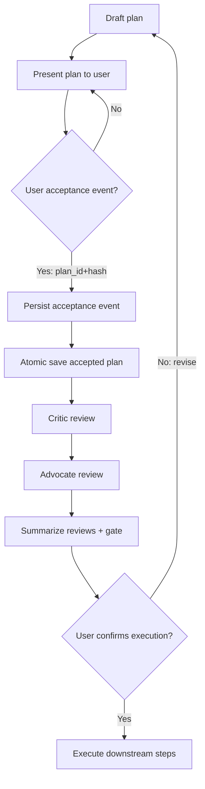
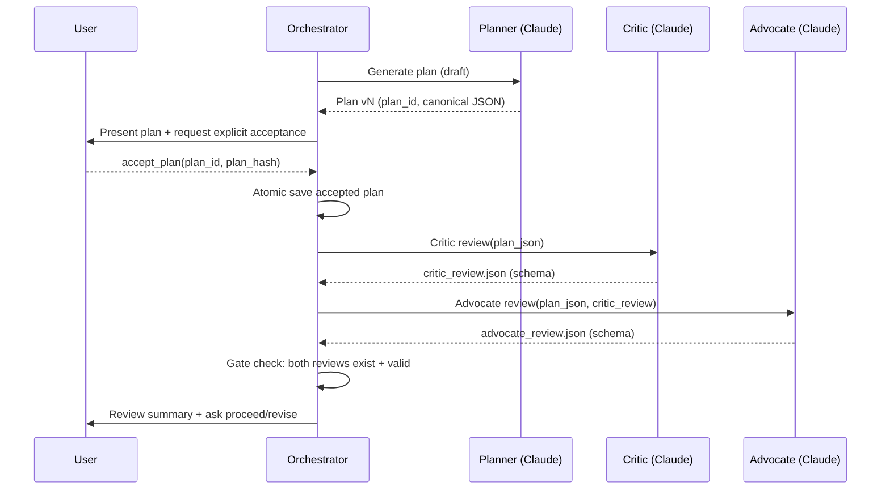

# Reliable Post-Acceptance Enforcement for Claude Agents: Atomic Plan Saving and Mandatory Two-Agent Review

## Executive summary

Building an LLM-based agent that **never** skips two post-plan actions—**(a)** atomically saving the accepted plan to a specified project directory and **(b)** always running a mandatory **two-agent review round** (critic + advocate)—requires treating these actions as **workflow invariants enforced outside the model**, not as “best-effort instructions.” Claude can follow carefully structured prompts, but the most robust approach combines (1) **explicit acceptance semantics** (an unambiguous acceptance event), (2) **external orchestration** (a state machine that gates progress), and (3) **tooling with schema guarantees** to reduce ambiguity and malformed outputs (e.g., strict tool schemas). Claude’s own tool-use docs explicitly support schema-conformant tool calls via `strict: true` and a tool-use sampling loop with `stop_reason: tool_use`, which you can leverage to reduce agent-side sloppiness but not to eliminate it. citeturn3view0turn6view0

For the save requirement, the durable “atomic save” pattern is: **write to a temp file in the same directory → flush + fsync temp file → atomic replace (rename) into final path**; and if you care about crash/power-loss durability, also **fsync the parent directory** because `fsync()` on the file alone does not guarantee the directory entry has been persisted. citeturn10view0turn11view1 A practical implementation uses `os.replace()` (atomic per POSIX requirement when successful) and keeps temp files on the same filesystem. citeturn10view0

For the mandatory two-agent review, the key is **gating**: the orchestrator must refuse to proceed to “execution” (or any next phase) unless it has persisted (1) the accepted plan artifact and (2) both review artifacts—each meeting a strict schema and completion checks. Frameworks like **LangGraph** provide a concrete way to encode this as a durable graph with interrupts (pause/resume) and checkpointing so “acceptance → save → critic → advocate” is enforced even across failures. citeturn7view0turn7view1turn7view2

**Recommended defaults (because you did not specify them):**
- **Claude model**: start with **`claude-sonnet-4-6`** for an agentic workflow balancing speed/cost, and use **`claude-opus-4-6`** for the critic if you want maximum depth on risk detection; Anthropic’s model guidance positions Opus as the “most complex tasks” choice and provides explicit model IDs. citeturn13search0turn13search23turn6view1  
- **Project directory**: require a configured absolute path (e.g., `PROJECT_DIR=/srv/myapp/project`), never accept the directory from arbitrary user text without validation (prevents path traversal mistakes).  
- **Execution environment**: assume Linux on a local filesystem (POSIX semantics) unless you know you’re on NFS/network storage; Linux `rename(2)` explicitly warns that on NFS you can’t assume a failed op means “not renamed,” and locking semantics vary. citeturn11view2turn1search7

---

## Acceptance semantics and exact trigger points

To make post-acceptance actions reliable, you need a definition of “plan accepted” that is **machine-detectable and unambiguous**. Relying on natural-language phrases like “looks good” is fragile. The agent’s workflow should treat plan acceptance as a **state transition** with a clearly defined trigger.

### Recommended definition of “accepted plan”
Treat a plan as “accepted” only when all of the following are true:

1. **A specific plan version is identified**: `plan_id` (UUID or monotonic ID) and `plan_hash` (e.g., SHA-256 of canonical plan JSON).  
2. **A user (or UI) sends an explicit acceptance event** referencing that exact `plan_id` and `plan_hash`. This can be:
   - a UI button click that calls your backend `accept_plan(plan_id, plan_hash)`, or  
   - a structured user message such as `{"type":"accept_plan","plan_id":"...","plan_hash":"..."}` (do not infer acceptance from prose).  
3. **The orchestrator validates** that the acceptance references the currently pending plan draft (prevents “accepting” a previous plan silently).

This aligns cleanly with Claude’s stateless Messages API usage: you (the application) carry the state and decide when a transition occurs; the API itself is stateless and expects you to send relevant history. citeturn6view1turn6view2

### Where acceptance sits in the workflow
A robust lifecycle looks like:

- `draft_plan` → `present_plan` → `await_acceptance` → **`accepted(plan_id, plan_hash)`** → `save_accepted_plan` → `critic_review` → `advocate_review` → `review_summary` → `await_execute_confirmation`

The core design choice: **acceptance is a transition controlled by the orchestrator**, not by the model. The model proposes; the orchestrator disposes.



**Invariant:** the orchestrator must not allow transition to `Execute downstream steps` unless both post-acceptance actions have completed and are recorded.

---

## Enforcement mechanisms and architecture options

You asked for enforcement mechanisms spanning prompt engineering, system messages, tool wrappers, and external orchestration. The reliable pattern is layered: **prompting** sets intent, **tools** constrain I/O, and an **orchestrator** enforces ordering and non-skippability.

### Prompt engineering and system messages
Claude’s docs emphasize that clear, direct instructions and explicit step ordering improves compliance—especially with tool use. citeturn3view1turn6view0

However, prompt-only enforcement cannot be made truly “never skipping,” because:
- the model can still omit steps under context pressure, misinterpret acceptance, or follow a conflicting instruction in a long context window.
- tool calls are requested by the model; prompting can guide but doesn’t guarantee ordering without external checks.

**Use prompting for:**
- producing a canonical plan format (JSON/YAML) that’s stable for hashing and comparison,
- clearly announcing “awaiting acceptance,”
- instructing the agent that *after acceptance* it must request the save tool and the reviews—while acknowledging the orchestrator will enforce it anyway.

**System prompt placement:** Claude’s Messages API uses a **top-level `system` parameter**; there is no `"system"` role inside the `messages` array. citeturn6view2turn5search10

### Tool wrappers and schema guarantees
Claude tool use provides a stable enforcement lever:
- Tool definitions include `name`, `description`, and `input_schema` (JSON Schema) with name restrictions, and Claude can be forced into structured tool-call behavior. citeturn6view0turn3view0
- Adding `strict: true` can “guarantee schema conformance” for tool inputs—reducing malformed arguments. citeturn3view0
- For client tools, the API response uses `stop_reason: tool_use`, indicating Claude is requesting a tool call; your runner executes it and returns a `tool_result`. citeturn3view0

But “tool wrappers” are most powerful when paired with a controller that:
- refuses tool execution in forbidden states,
- automatically triggers mandatory steps on acceptance regardless of whether the model remembered.

### External orchestration with durable workflow state
This is the strongest approach: encode acceptance → save → reviews as a **state machine / workflow graph** that the model participates in, but cannot bypass.

**LangGraph (LangChain) as a reference implementation:**
- Supports **interrupts** that pause execution and wait for external input; when triggered, LangGraph saves state and resumes later, which maps well to “await acceptance” gates. citeturn7view1
- Provides **durability modes**; `sync` persists checkpoints before the next step starts, improving resilience to crashes mid-workflow. citeturn7view0
- Has HITL middleware that can interrupt on specific tool calls (e.g., any file write), forcing approval/edit/reject decisions; conceptually useful for gating “write to project directory.” citeturn7view2

**Microsoft Agent Framework** also frames the “agents vs workflows” split: use workflows when steps are well-defined and you need explicit control over execution order, plus robust state management for long-running / HITL scenarios. citeturn8view1

### Sandboxed execution and “programmatic tool calling”
Anthropic’s “Programmatic Tool Calling” pitch is that letting Claude write orchestration code (loops/conditionals/error handling) provides more precise control flow than natural-language tool invocation. citeturn3view3 This can reduce mistakes, but it still must run under an external policy that enforces invariants (otherwise the code can omit review steps too).

### Comparison table of enforcement approaches

| Approach | Reliability (never-skip) | Complexity | Security posture | Implementation effort | Notes |
|---|---|---|---|---|---|
| Prompt-only (system + user prompts) | Low–Medium | Low | Medium (depends on guardrails) | Low | Works for demos; cannot guarantee ordering/completion under all conditions. Claude docs recommend clarity and explicit steps, but that’s guidance, not a hard guarantee. citeturn3view1 |
| Prompt + tools (strict schemas) | Medium | Medium | Medium–High | Medium | `strict: true` reduces malformed tool calls; `stop_reason: tool_use` enables a tool loop. Still, the model can “forget” to call tools unless the orchestrator forces it. citeturn3view0 |
| External orchestrator (state machine / workflow graph) | High | Medium–High | High | Medium–High | Most reliable: acceptance triggers enforced steps. LangGraph interrupts/checkpointing make “await acceptance” and post-acceptance sequencing durable. citeturn7view1turn7view0 |
| Sandboxed execution (programmatic tool calling) + orchestrator | High | High | High (if sandboxed correctly) | High | Best for complex multi-tool pipelines; still require invariant checks. Anthropic notes code-based orchestration gives more explicit control flow and error handling. citeturn3view3 |

---

## Atomic plan-save design with verification and audit

You asked for atomic file-save strategies (locks, transactions, temp+rename), plus verification (checksums, timestamps, logs). This section focuses on the filesystem layer and the “proof” that the plan was saved correctly.

### Atomic save goals
You want the saved plan file to be:
- **atomic for readers**: readers see either the old full plan or the new full plan, never a partial write,
- **durable enough for your risk profile**: if the process crashes, you don’t end up with corrupt content (temp file pattern helps); if the machine loses power, you may still need fsync patterns.

### Canonical atomic write pattern (temp file + atomic replace)
In Python, `os.replace(src, dst)` is documented to:
- replace `dst` silently if it exists and is a file (permissions permitting),
- be atomic if successful (POSIX requirement),
- and fail if `src` and `dst` are on different filesystems (a key reason to create the temp file in the **same directory**). citeturn10view0

Also note Python highlights: “If you want cross-platform overwriting of the destination, use replace().” citeturn10view2

A robust atomic save function (Python-oriented, but language-agnostic in concept):

```python
from __future__ import annotations
import os, json, hashlib, time, tempfile
from pathlib import Path
from typing import Any

def sha256_bytes(b: bytes) -> str:
    return hashlib.sha256(b).hexdigest()

def atomic_write_bytes(dest: Path, data: bytes, *, fsync_dir: bool = True) -> None:
    """
    Atomic replace write:
    1) write temp file in same directory,
    2) flush + fsync temp file,
    3) os.replace into destination (atomic if successful),
    4) optionally fsync parent directory for durability.
    """
    dest = dest.resolve()
    dest.parent.mkdir(parents=True, exist_ok=True)

    # Temp file must be on same filesystem => create in dest.parent
    fd, tmp_name = tempfile.mkstemp(prefix=f".{dest.name}.", suffix=".tmp", dir=str(dest.parent))
    tmp_path = Path(tmp_name)

    try:
        with os.fdopen(fd, "wb") as f:
            f.write(data)
            f.flush()
            os.fsync(f.fileno())

        os.replace(tmp_path, dest)  # atomic replace if successful citeturn10view0

        if fsync_dir:
            # fsync() does not ensure the directory entry is durable; fsync dir fd too. citeturn11view1
            dir_fd = os.open(str(dest.parent), os.O_DIRECTORY)
            try:
                os.fsync(dir_fd)
            finally:
                os.close(dir_fd)

    finally:
        # Best-effort cleanup if replace failed before moving temp into place
        if tmp_path.exists():
            try:
                tmp_path.unlink()
            except OSError:
                pass

def save_accepted_plan(project_dir: Path, plan_obj: dict[str, Any]) -> dict[str, Any]:
    # Canonical JSON => stable hash; ensure deterministic encoding.
    payload = json.dumps(plan_obj, sort_keys=True, ensure_ascii=False, separators=(",", ":")).encode("utf-8")
    plan_hash = sha256_bytes(payload)
    ts = time.strftime("%Y-%m-%dT%H:%M:%SZ", time.gmtime())

    dest = (project_dir / "plans" / f"accepted_plan_{plan_obj['plan_id']}.json")
    atomic_write_bytes(dest, payload)

    return {"path": str(dest), "sha256": plan_hash, "timestamp_utc": ts}
```

**Why the directory fsync matters:** Linux `fsync(2)` documents that calling `fsync()` on a file “does not necessarily ensure that the entry in the directory containing the file has also reached disk” and that you need an explicit `fsync()` on a directory file descriptor. citeturn11view1

**Alternative (library):** `atomicwrites` documents a similar pattern: it fsyncs the temp file after writing and fsyncs the parent directory after the move (POSIX). citeturn9search1turn1search28 (Note: check maintenance status before adopting any third-party dependency.)

### Optional file locking (race condition control)
Atomic replace prevents partial reads, but it doesn’t prevent **multiple writers** from racing (last writer wins). If that matters, add a lock.

On Linux, `flock(2)` provides advisory locks and supports shared/exclusive modes. citeturn11view3 Advisory means other processes *can* ignore it; it’s a coordination tool, not a mandatory enforcement barrier.

Also, locks and network filesystems can be tricky:
- Ubuntu’s `flock(2)` notes historic NFS limitations and emulation details; you must validate behavior in your environment. citeturn1search7turn1search26  
- Linux `rename(2)` warns that on NFS you cannot assume a failed rename means it didn’t happen (server crash + RPC retransmits). citeturn11view2

If you need a strong single-writer invariant, consider:
- a **lock file** in the project directory using `flock`,
- or storing plans as **immutable versioned files** (by plan hash) rather than rewriting a single fixed filename.

### Verification and audit artifacts
To verify and audit the invariant “accepted plan saved atomically and reviews ran,” capture artifacts that are hard to fake accidentally:

- **Plan artifact**: `plans/accepted_plan_<plan_id>.json` plus `sha256` in metadata.
- **Review artifacts**: `reviews/<plan_id>/critic.json`, `reviews/<plan_id>/advocate.json`, `reviews/<plan_id>/summary.json`.
- **Audit log** (append-only): each entry includes:
  - timestamp (UTC + local), user identity, plan_id, plan_hash,
  - model name (e.g., `claude-sonnet-4-6`), tool runner version,
  - file paths written, and review pass/fail.

If you want deterministic, replayable workflows, store the **acceptance event** itself as a signed/immutable record (even a JSON line in an append-only log).

---

## Mandatory two-agent review protocol and concrete prompt templates

You asked for “critic and advocate” roles, evaluation criteria, scoring rubric, required outputs, plus interaction protocols. The core is: **two separate role prompts** + **schema-validated outputs** + **orchestrator gating**.

### Protocol overview
At minimum, enforce:
1. **Critic agent**: tries to falsify the plan, find risks, missing steps, and safety/security issues.
2. **Advocate agent**: tries to defend the plan, clarify assumptions, propose mitigations and improvements, and argue for feasibility.

Run them sequentially or in parallel; sequential reduces complexity (advocate can respond to critic), parallel reduces cross-contamination/bias.



### Required outputs (schemas)
To prevent “missing fields” failures, you have two options:

- **Tool-call submission**: define tools `submit_critic_review` and `submit_advocate_review` with JSON Schema and `strict: true` so Claude’s tool inputs match the schema. Claude tool use explicitly supports this strict schema conformance. citeturn3view0turn6view0  
- **Structured outputs** (if you’re using Claude’s structured output feature); your enforcement still needs runtime validation.

Below is an example **review schema** your orchestrator can validate:

```json
{
  "plan_id": "uuid",
  "reviewer_role": "critic | advocate",
  "overall_verdict": "pass | pass_with_changes | fail",
  "scores": {
    "correctness": 1,
    "completeness": 1,
    "feasibility": 1,
    "security": 1,
    "race_conditions": 1,
    "auditability": 1
  },
  "blocking_issues": [
    {"id": "C-1", "title": "...", "explanation": "...", "recommended_fix": "..."}
  ],
  "non_blocking_suggestions": [
    {"id": "C-S1", "title": "...", "recommendation": "..."}
  ],
  "assumptions_detected": ["..."],
  "checks_performed": ["..."],
  "required_followups": ["..."],
  "timestamp_utc": "RFC3339 string"
}
```

**Scoring rubric (1–5)**
- 1 = unacceptable, 3 = acceptable with notable gaps, 5 = excellent.  
Require `overall_verdict = fail` if any of: correctness ≤2, security ≤2, or any blocking issue is present.

### Concrete system message examples

#### Planner system message (Claude)
Use the Messages API top-level `system` parameter (not a system role message). citeturn6view2

**System (planner):**
> You are the Planner agent. Produce one plan draft at a time as canonical JSON with stable key ordering rules.  
> Never claim a plan is “accepted.” Only the orchestrator can mark acceptance.  
> After presenting the plan, wait for an explicit acceptance event `accept_plan(plan_id, plan_hash)` from the user/orchestrator.

**User prompt (planner):**
> Draft an implementation plan for: {TASK}.  
> Output **only** canonical JSON with fields: `plan_id` (uuid), `title`, `assumptions`, `steps` (ordered list), `artifacts` (files), `risk_controls`, `rollback`, `verification`, `estimated_effort`.  
> Include a `plan_hash_basis` describing how the hash is computed (canonical JSON bytes, sorted keys, UTF-8).  
> End with `awaiting_acceptance: true`.

Rationale: you want a plan that is stable for hashing and easy to compare.

#### Critic system message
**System (critic):**
> You are the Critic reviewer. Your job is to find reasons the accepted plan can fail in production.  
> Focus on: ambiguous acceptance triggers, enforcement gaps, filesystem atomicity, durability, race conditions, security/permissions, and audit completeness.  
> Output must strictly follow the provided JSON schema. If you cannot assess something, mark it as a blocking issue.

#### Advocate system message
**System (advocate):**
> You are the Advocate reviewer. Your job is to defend the plan’s feasibility and propose mitigations and clarifications that preserve the plan’s intent.  
> You must respond to Critic blocking issues with either (a) an explicit mitigation that resolves it, or (b) agreement that it is unresolved and should block execution.  
> Output must strictly follow the provided JSON schema.

### Agent interaction policies (anti-skip guardrails)
Regardless of prompting, enforce in code:

- **The orchestrator must call both reviewers after acceptance**, even if the planner says “already reviewed.”
- **Execution gating policy:** if `critic.overall_verdict == "fail"` or `advocate.overall_verdict == "fail"`, the system must not proceed to execution. Instead, it returns review results and asks the user to revise/re-accept.

---

## Failure modes, recovery, concurrency, and security/permissions

This section enumerates the most common ways these invariants break—and how to recover while keeping “never skip” semantics.

### Failure modes and recoveries

**Acceptance ambiguity / accidental acceptance**
- *Mode*: user says “ok” and the model treats it as acceptance.  
- *Fix*: only accept structured acceptance events; do not infer acceptance from text. Store acceptance as a distinct event record.

**Partial writes / corrupted plan files**
- *Mode*: writing directly to the target file and crashing mid-write.  
- *Fix*: temp file + `os.replace()` atomic write. Python documents `os.replace()` as atomic if successful. citeturn10view0

**Rename without durability**
- *Mode*: after rename, crash/power loss loses directory entry or content not flushed.  
- *Fix*: `fsync()` temp file before replace; then `fsync()` the parent directory. Linux documents the directory-fsync requirement explicitly. citeturn11view1turn9search1

**Concurrent acceptances / multiple orchestrator instances**
- *Mode*: two workers both process acceptance, race on same destination.  
- *Fix*: lock file around the acceptance handler; or store accepted plans as immutable versioned files (`accepted_plan_<plan_id>.json`) and avoid overwriting a single name. Use `flock(2)` advisory locking if on local FS. citeturn11view3

**Reviewer step skipped**
- *Mode*: model outputs “review complete” without running critic/advocate.  
- *Fix*: orchestrator must verify review artifacts exist and validate schema before unlocking the next stage.

**Tool call failures / schema mismatch**
- *Mode*: agent issues malformed tool args.  
- *Fix*: use `strict: true` tool definitions so Claude’s tool calls match schema. citeturn3view0

**Network filesystem corner cases (NFS)**
- *Mode*: rename semantics and failure reporting can be surprising; Linux rename warns explicitly about NFS failure ambiguity. citeturn11view2  
- *Fix*: if on NFS, treat rename as potentially “unknown” on error; implement idempotent writes and post-write verification (read-back + checksum file). Validate locking behavior (NFS versions differ). citeturn1search7turn1search26

### Race conditions to explicitly guard
- “Last writer wins” if multiple acceptances write to the same file name.
- TOCTOU path problems if the “project directory” is user-supplied and not validated.
- Review ordering: if you allow parallel critic/advocate calls, ensure the aggregator waits for both.

### Security/permissions controls
At minimum:
- Run the write tool with **least privilege** and a fixed **allowlist root directory**.
- Validate that `resolved_output_path` is within `project_dir.resolve()` (prevent `../` escape).
- Consider using directory file descriptors and “relative-to-dir-fd” operations where available; Python documents `src_dir_fd`/`dst_dir_fd` options for rename/replace to use paths relative to directory descriptors, which can mitigate certain path races. citeturn10view0turn10view2  
- Use auditable logs that record who accepted what and which model producedwhich reviews.

### User confirmation flows
A recommended safe flow:
1. Planner outputs plan and explicitly requests acceptance.
2. User accepts with the structured acceptance event.
3. Orchestrator saves plan and runs critic+advocate.
4. Orchestrator posts:
   - the critic verdict,
   - the advocate verdict,
   - a combined “go/no-go” decision,
   - and requests explicit “Proceed” confirmation (or “Revise plan”).

This greatly reduces “silent drift” where reviewer feedback materially changes the plan without re-acceptance.

---

## Orchestration code patterns, tests, and implementation checklist

You requested orchestration pseudocode (prefer Python), plus tests and metrics (unit/integration/chaos).

### Orchestrator skeleton (Python-like pseudocode)

```python
from dataclasses import dataclass
from pathlib import Path
from typing import Optional, Dict, Any

@dataclass
class WorkflowState:
    phase: str
    plan: Optional[Dict[str, Any]] = None
    plan_hash: Optional[str] = None
    accepted: bool = False
    critic_review: Optional[Dict[str, Any]] = None
    advocate_review: Optional[Dict[str, Any]] = None

class Orchestrator:
    def __init__(self, project_dir: Path, llm_client):
        self.project_dir = project_dir.resolve()
        self.llm = llm_client  # wraps Claude Messages API

    def present_plan(self, task: str) -> WorkflowState:
        plan = self.llm.generate_plan(task=task)  # planner call
        plan_hash = compute_plan_hash(plan)
        return WorkflowState(phase="await_acceptance", plan=plan, plan_hash=plan_hash)

    def accept_plan(self, state: WorkflowState, plan_id: str, plan_hash: str) -> WorkflowState:
        # Acceptance trigger point: only here, only with exact match
        assert state.phase == "await_acceptance"
        assert state.plan and state.plan["plan_id"] == plan_id
        assert state.plan_hash == plan_hash

        # 1) Save accepted plan atomically (hard invariant)
        save_meta = save_accepted_plan(self.project_dir, state.plan)

        state.accepted = True
        state.phase = "post_acceptance_review_required"
        state.plan_hash = save_meta["sha256"]

        # 2) Mandatory review (hard invariant)
        state.critic_review = self.llm.critic_review(plan=state.plan)
        validate_review_schema(state.critic_review, role="critic", plan_id=plan_id)

        state.advocate_review = self.llm.advocate_review(plan=state.plan, critic=state.critic_review)
        validate_review_schema(state.advocate_review, role="advocate", plan_id=plan_id)

        state.phase = "await_execute_confirmation"
        persist_reviews(self.project_dir, plan_id, state.critic_review, state.advocate_review)

        return state

    def can_execute(self, state: WorkflowState) -> bool:
        if state.phase != "await_execute_confirmation":
            return False
        if not state.accepted:
            return False
        if not state.critic_review or not state.advocate_review:
            return False
        if state.critic_review["overall_verdict"] == "fail":
            return False
        if state.advocate_review["overall_verdict"] == "fail":
            return False
        return True
```

**Notes tied to primary sources:**
- You can implement `llm_client` using Claude’s Messages API patterns; the API is stateless and you supply relevant history. citeturn6view1  
- If you use tools, model tool requests are signaled by `stop_reason: tool_use`, and strict schemas can be enabled. citeturn3view0

### Suggested tests and reliability metrics

**Unit tests**
- `atomic_write_bytes()`:
  - writes correct content,
  - never leaves partial content at the target path,
  - cleans up temp files on exceptions,
  - handles existing destination (overwrite) using `os.replace()` semantics. citeturn10view0  
- `accept_plan()`:
  - refuses acceptance if plan_id/hash mismatch,
  - refuses acceptance in wrong phase.

**Integration tests**
- End-to-end “acceptance triggers both post-actions”:
  - generate plan,
  - simulate acceptance event,
  - assert plan file exists and hash matches,
  - assert critic & advocate artifacts exist and pass schema validation,
  - assert state == `await_execute_confirmation`.

**Chaos tests**
- Kill the process:
  - after temp file write but before replace,
  - after replace but before directory fsync,
  - during critic call,
  - between critic and advocate calls.
- If you use a durable workflow engine (e.g., LangGraph), test that restart resumes at the correct checkpoint; interrupts explicitly save state and can resume later, and durability modes affect crash resilience. citeturn7view1turn7view0

**Metrics**
- **Post-acceptance invariant completion rate**: `% acceptances where {plan_saved && critic_done && advocate_done}`.
- **Mean time to detect invariant violation**: should be near-zero if gating is correct (violations should be impossible).
- **Write integrity rate**: `% of saved plans where read-back SHA == recorded SHA`.
- **Review latency** and **review defect yield**: blocking issues per N plans.

### Implementation checklist

- Define a **canonical plan format** and hashing method; ensure every plan has `plan_id`.  
- Implement a strict **acceptance event** (`accept_plan(plan_id, plan_hash)`), never inferred from prose.  
- Build an orchestrator with explicit phases and gating; do not allow execution unless `saved && critic && advocate`.  
- Implement atomic save: temp-in-dir → flush+fsync file → `os.replace()` → fsync parent dir. citeturn10view0turn11view1  
- Add optional locking if multiple processes can accept plans concurrently (`flock` advisory locks). citeturn11view3  
- Persist review artifacts and an append-only audit record with timestamps, hashes, and model IDs.  
- Add unit + integration + chaos tests; if using a workflow engine, use durable checkpointing/interrupts for acceptance gates. citeturn7view1turn7view0  
- Run a security pass: path allowlist, resolved-path containment checks, least privilege for file write tools.  
- Add a final user confirmation step (“Proceed”) after review results are displayed.

---

**Assumptions acknowledged (not specified by you):**
- **Project directory path**: unspecified ⇒ recommend configuring an absolute allowlisted `PROJECT_DIR` and refusing runtime overrides unless validated.
- **Claude model version**: unspecified ⇒ recommend `claude-sonnet-4-6` as default; optionally `claude-opus-4-6` for critic depth. citeturn13search23turn13search0turn6view1  
- **Execution environment**: unspecified ⇒ assume Linux/local filesystem; if on NFS, treat rename/locking semantics as higher risk and add read-back verification and idempotency. citeturn11view2turn1search7