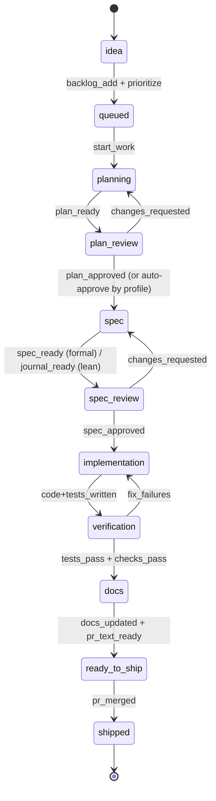
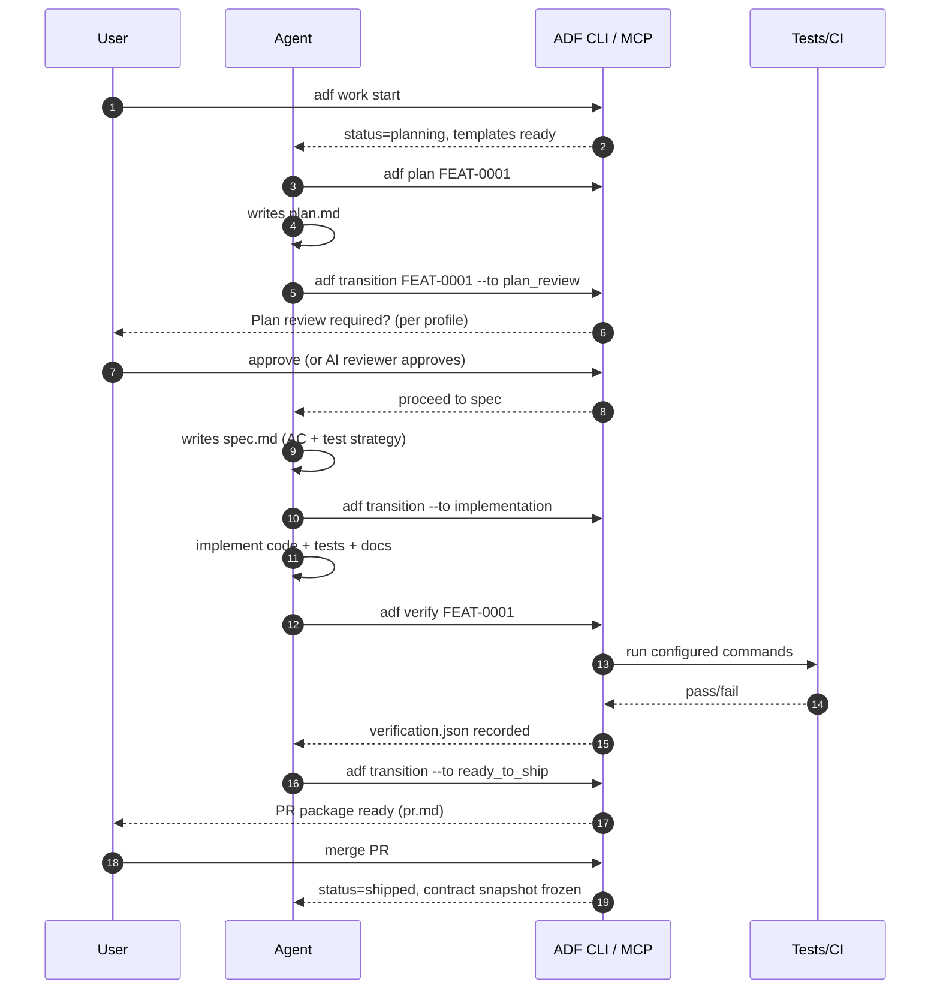

# Minimal, Reliable Agentic Development Framework for LLM Coding Agents

ChatGPT Mar 20, 2026

## Executive summary

A reliable Agentic Development Framework (ADF) for “long-term, spec-driven delivery” should **not** be a clever prompt. It should be a **file-backed workflow engine** with a **small, enforceable state machine**, **artifact contracts**, and **machine-checkable gates**. This design shifts correctness from “the model remembered to do the right thing” to “the system makes skipping impossible.” Evidence from agentic software engineering research and modern coding-tool design strongly supports this: agent performance improves dramatically when a model has a structured interface to act (tools, state, feedback loops) rather than free-form chat alone. citeturn6search1turn6search2turn6search3turn9search1

The simplest reliable architecture that still supports Claude-first and tool-agnostic operation is:

- **Repo-local canonical state** (Markdown + YAML) that new sessions can reconstruct quickly (mirrors the “persistent context via files” direction in Claude Code, Copilot, Cursor, Codex, and Gemini tooling). citeturn5search2turn12view3turn0search1turn4search0turn5search4  
- **Finite work-item state machine** with **explicit transitions** and **preconditions** checked by a CLI (and optionally exposed as an MCP server for universal tool integration). MCP is now widely supported across major agent hosts (Claude Code, Cursor, VS Code/Copilot, Gemini, Codex, OpenCode), making it the most practical “universal adapter.” citeturn2search9turn2search3turn2search2turn7search20turn1search1turn7search0turn8search0  
- **Artifact contracts** keyed by mode (**formal** vs **lean**) and development profile (**hands-on / guided / autonomous**) so “done” means acceptance criteria are satisfied with tests and docs updated, not just “code compiles.” This operationalizes spec-driven delivery as a set of required artifacts and checks. citeturn9search1turn3search0turn1search19  
- **Role-separated prompts** (planner / adversarial reviewer / implementer / verifier) and “progressive disclosure” patterns that avoid blowing context windows—consistent with how Codex Skills load metadata first and only load full instructions when needed. citeturn9search3turn9search6  
- **Verification hooks** that run automatically in the right places (local, CI, and optionally inside Claude Code via hooks) to prevent drift. Claude Code hooks explicitly support running commands automatically at lifecycle events and can enforce approvals or block sensitive actions. citeturn10search3turn10search38  

Prioritized recommendation: implement **Phase 1** as a small repo folder + CLI that enforces state/contract checks; then add **MCP** and tool-specific adapters (AGENTS.md / CLAUDE.md / GEMINI.md / Cursor rules / Copilot instructions + prompt files) so multiple tools can “snap to” the same workflow without manual re-prompting. citeturn4search0turn5search4turn0search1turn12view3turn4search1  

## Research foundations and design principles

### What the research implies about reliability

Agentic SWE results repeatedly show that **interfaces and scaffolding matter**:

- **SWE-agent** attributes significant gains to a purpose-built “agent-computer interface” that improves how an agent edits files, navigates repos, and runs tests—i.e., the mechanism around the model is decisive. citeturn6search1turn6search5turn6search17  
- **ReAct** demonstrates benefits from interleaving reasoning with actions (tool calls) to reduce hallucination and improve task trajectories—reinforcing the need for a controlled “act” loop rather than purely generative output. citeturn6search2  
- **Reflexion** shows that structured feedback + episodic memory improves subsequent attempts, supporting a workflow that records reviews, failures, and decisions as durable artifacts rather than transient chat. citeturn6search3  
- **SWE-bench** operationalizes “real-world issue resolution” evaluations; a key lesson is that long-context repo tasks are hard, and success depends on disciplined context selection and procedure, not rereading everything each time. citeturn6search0turn6search4  

### What modern coding tools imply about persistent context

Multiple mainstream tools have converged on **file-based persistent instructions** because LLM sessions are not inherently persistent:

- Cursor’s **Rules** are “persistent, reusable context at the prompt level,” explicitly noting that models don’t retain memory between completions; rules are version-controlled files under `.cursor/rules`. citeturn0search1turn3search3  
- GitHub Copilot supports repository instruction files like `.github/copilot-instructions.md` (and additional instruction file patterns), allowing persistent project guidance. citeturn12view3turn3search0  
- Claude Code uses **CLAUDE.md** and a `/memory` system to load and inspect project instructions and memories across sessions, emphasizing organized instruction management and debugging when compliance fails. citeturn5search2turn12view1  
- OpenAI Codex supports **AGENTS.md** discovery along directory paths with a defined merge order and size cap, making “project instructions” a first-class input. citeturn12view2turn4search0  
- Gemini CLI supports **GEMINI.md** context files (project instructions), and Gemini Code Assist agent mode is explicitly tool-using and approval-oriented. citeturn5search4turn1search19  

This convergence strongly supports ADF’s core choice: **canonical repo-backed state + enforceable contracts** rather than a prompt bundle.

### Why MCP is the simplest tool-agnostic integration layer

The Model Context Protocol (MCP) is an open protocol to integrate tools/resources/prompts with LLM hosts. MCP servers can expose tools and resources to multiple clients. citeturn2search9turn2search7  
Crucially, MCP is now supported by the exact tool set you care about:

- Claude Code supports connecting to tools via MCP. citeturn2search3  
- Cursor supports MCP and documents installation/config. citeturn2search2  
- VS Code/Copilot supports adding and managing MCP servers. citeturn7search20  
- Gemini Code Assist and Gemini CLI support MCP servers. citeturn1search1turn5search9  
- Codex supports MCP in CLI and IDE extension. citeturn7search0  
- OpenCode supports MCP servers. citeturn8search0turn8search14  

Therefore: build ADF as a CLI first (minimal), then add an **optional MCP server wrapper** to make it universally callable from any agent host.

## Reference architecture for a minimal file-backed workflow engine

### Canonical repo layout

A minimal, reliable layout should have **one canonical source of truth** (ADF state) plus **exports** for tool-specific context files.

Recommended canonical structure:

```text
/adf
  adf.yaml                     # global contracts: modes, gates, checks, transitions
  schemas/                     # JSON Schema for YAML/MD frontmatter
  templates/                   # plan/spec/review/journal/handoff/pr templates
  prompts/                     # role prompts (planner/reviewer/implementer/verifier)
  hooks/                       # optional tool hooks (Claude Code, pre-commit, CI)
/adf_state
  project/                     # stable memory
    vision.md
    architecture.md
    conventions.md
    glossary.md
    current_state.md
    decisions.md               # ADR-style, append-only
  backlog/
    inbox.yaml
    queue.yaml
    done.yaml
  work_items/
    FEAT-0001/
      item.yaml                # work item metadata (frontmatter-like YAML)
      plan.md
      spec.md
      journal.md
      review.md
      verification.json
      handoff.md
      contract.snapshot.md     # frozen at ship (formal mode)
      pr.md
```

Tool-specific exports (generated or synced from canonical state):

```text
AGENTS.md                      # cross-tool canonical “agent onboarding” (Codex, etc.) citeturn4search0turn4search10
CLAUDE.md or .claude/CLAUDE.md  # Claude Code persistent instructions citeturn4search1turn5search2
GEMINI.md                      # Gemini CLI instructions citeturn5search4
.github/copilot-instructions.md # Copilot instruction file citeturn12view3
.cursor/rules/*.mdc             # Cursor Rules citeturn0search1
.cursor/agents/*.md             # Cursor subagents citeturn11search3
```

Why this split works:

- Canonical state is **tool-agnostic** and enforced by your engine.
- Tool-specific files are **adapters**, not the source of truth—reducing drift and “workflow unreliability” caused by editing policy in many places.

### State machine that enforces “criteria before code”

A minimal state machine (enough for formal + lean) typically needs:

- A **planning gate**
- A **spec gate** (formal only)
- **implementation**
- **verification**
- **docs & PR packaging**
- **shipped**

You can implement this as a simple directed graph with preconditions checked by CLI.

Mermaid state machine:



This structure matches how modern agent modes encourage plan → approve → execute loops (e.g., Gemini agent mode emphasizes tool use with review/approval before changes). citeturn1search19turn1search23  

### Artifact contracts and autonomy profiles as configuration, not prompts

Define two orthogonal axes:

- **Mode**: formal vs lean (artifact rigor)
- **Profile**: hands-on vs guided vs autonomous (who approves which gates)

This keeps a single workflow with configurable review stops, rather than three separate workflows.

Mode contract example:

- **Formal** requires plan + spec + acceptance criteria + tests + docs updated before ship.
- **Lean** still requires plan + tests + journaling, enabling later formalization.

Profile contract example:

- Hands-on requires human approvals at plan/spec/code-review/merge.
- Guided requires human at plan/spec, AI for internal review gates, human merges.
- Autonomous lets agent proceed with AI review gates and tests, human only merges.

This mirrors governance features in tools:
- Copilot can run as a coding agent and raises PRs for review. citeturn0search2turn0search26  
- Claude Code hooks can require approval / block operations by policy. citeturn10search3turn10search34  

## Implementation blueprint for an LLM-driven ADF

### Core YAML schemas

#### Global configuration: `adf/adf.yaml`

Key design choices:

- Keep schema small.
- Make all workflow decisions machine-checkable.
- Put “how to verify” in configuration, not in the model prompt.

Example (illustrative) config:

```yaml
version: 1

workflow:
  states:
    - idea
    - queued
    - planning
    - plan_review
    - spec
    - spec_review
    - implementation
    - verification
    - docs
    - ready_to_ship
    - shipped
  transitions:
    - from: idea
      to: queued
    - from: queued
      to: planning
    - from: planning
      to: plan_review
    - from: plan_review
      to: spec
    - from: spec
      to: spec_review
    - from: spec_review
      to: implementation
    - from: implementation
      to: verification
    - from: verification
      to: docs
    - from: docs
      to: ready_to_ship
    - from: ready_to_ship
      to: shipped

modes:
  formal:
    required_artifacts:
      plan_review: [plan.md]
      spec_review: [spec.md]
      verification: [verification.json]
      docs: [pr.md]
      shipped: [contract.snapshot.md]
  lean:
    required_artifacts:
      plan_review: [plan.md]
      spec_review: [journal.md]     # “bridge” artifact
      verification: [verification.json]
      docs: [pr.md]

gates:
  plan_review: { default: human }   # human|ai|skip
  spec_review: { default: human }
  code_review: { default: ai }
  merge: { default: human }

verification:
  commands:
    - name: unit_tests
      run: "make test"
    - name: lint
      run: "make lint"
    - name: typecheck
      run: "make typecheck"
  require_clean_git: true
  require_no_failed_commands: true

docs_policy:
  require_docs_touched_if_code_touched: true
  docs_paths: ["docs/**", "README.md"]
```

Notes:

- The “verification” section calls arbitrary commands; this is intentionally CI-agnostic.
- `contract.snapshot.md` on ship is the simplest way to prevent spec drift.

#### Work-item metadata: `adf_state/work_items/FEAT-0001/item.yaml`

Use a strict schema here; it’s the “DB row” of your workflow engine.

```yaml
id: FEAT-0001
title: Password reset flow
type: feature            # feature|bug|chore|spike
status: planning         # must be one of workflow.states
mode: formal             # formal|lean
profile: guided          # hands_on|guided|autonomous
priority: 1

branch: feat/FEAT-0001
owner: agent             # or username
created_at: "2026-03-20"
updated_at: "2026-03-20"

depends_on: []
docs_impacted:
  - docs/auth.md
  - README.md

quality:
  require_tests: true
  require_docs: true
  require_contract_snapshot_on_ship: true
```

### Artifact templates that scale from lean to formal

ADF should standardize artifacts to be **short, checkable, diff-friendly**, and **LLM-executable**.

#### Plan template: `plan.md`

- Must be actionable steps.
- Must identify risks and verification strategy.
- Must list impacted code/doc areas.
- Should fit within “plan review” gate.

#### Spec template: `spec.md`

- Must include acceptance criteria (AC).
- Must map AC → evidence (tests).
- Must include non-functional constraints if relevant.
- Must name doc updates required.

#### Review template: `review.md`

- Must be adversarial: name risks, missing cases, and change requests.
- Must indicate “approve / request changes” outcome.

#### Journal template: `journal.md`

- Required even in lean mode.
- Records decisions, changes, and next steps.
- Functions as “episodic memory,” consistent with memory-bank methodologies. citeturn9search1turn6search3  

#### Handoff template: `handoff.md`

- Current status + what’s next.
- Where to look in code.
- Known pitfalls and commands to run.

#### PR template: `pr.md`

- Summary
- What changed
- How to verify
- AC checklist with links to tests
- Docs updated list

### CLI commands that make “skipping steps” impossible

A minimal CLI is the primary enforcement mechanism. It should:

- read config (`adf.yaml`)
- validate schemas
- enforce legal transitions
- enforce required artifacts per mode
- run verification commands and record results
- generate skeleton templates

Suggested commands (examples):

- `adf init`  
  Creates canonical folders, writes starter `adf.yaml`, templates, schemas, and tool adapter files.  
- `adf inbox add "idea text"`  
  Appends to `backlog/inbox.yaml`.  
- `adf queue add FEAT-0001 --priority 1`  
  Moves from inbox to queue.  
- `adf work start`  
  Creates branch/worktree (optional), moves queue head to `planning`.  
- `adf plan FEAT-0001`  
  Generates `plan.md` skeleton and prints “planner prompt” to run.  
- `adf review-plan FEAT-0001`  
  Requires `review.md` output; sets status based on gate policy.  
- `adf spec FEAT-0001` / `adf review-spec FEAT-0001`  
- `adf verify FEAT-0001`  
  Runs configured commands, produces `verification.json`.  
- `adf ship FEAT-0001`  
  Checks “ready_to_ship” preconditions, generates PR description file; optionally opens PR (if GitHub CLI present).  
- `adf transition FEAT-0001 --to verification`  
  Hard-fails if required artifacts are missing.

This maps closely to “tool-backed agent loops” in practice—Codex CLI is explicitly designed to read/modify/run code in a directory, which makes a local enforcement CLI practical. citeturn0search3turn0search15  

### Machine-checkable definition of done

This is the short checklist your CLI should enforce before `ready_to_ship` and again before `shipped`.

**Minimal “definition of done” checks (machine-checkable):**

1. Work item status is `ready_to_ship`.
2. Required artifacts exist for mode (formal/lean) per `adf.yaml`.
3. `verification.json` exists and all configured commands succeeded.
4. Working tree is clean (or only allowed files differ).
5. Acceptance criteria are listed in `spec.md` (formal) and each AC has at least one evidence item (test or manual step).
6. If code changed outside docs paths, docs must be updated or `docs_defer.md` exists with a linked follow-up item.
7. PR description artifact `pr.md` exists and includes verification instructions.
8. For shipped items: `contract.snapshot.md` exists and matches the shipped AC (frozen contract).

### Prompts for planner, reviewer, implementer, verifier

The prompts below are designed to be pasted into any agent host. They assume your enforcement comes from CLI/state checks, not from model obedience.

#### Planner prompt (creates `plan.md`)

> **Role:** Planner  
> **Goal:** Generate a plan that can be reviewed before implementation.  
> **Constraints:** Do not write code. Do not change files outside `adf_state/work_items/<ID>/plan.md`.

**Prompt:**

You are the Planner for work item `<ID>`.  
Read:
- `adf_state/project/vision.md`
- `adf_state/project/architecture.md`
- `adf_state/project/conventions.md`
- `adf_state/project/current_state.md`
- `adf_state/work_items/<ID>/item.yaml`

Output **only** a complete `plan.md` using this structure:
- Context & goal (2–5 sentences)
- Proposed approach (high-level)
- Step-by-step tasks (small, verifiable steps)
- Risks & edge cases (explicit)
- Test/verification strategy (what to run, what to add)
- Docs impacted (explicit list)
- Rollback / safety notes (if applicable)

Stop after writing `plan.md`. Do not proceed to coding.

#### Adversarial reviewer prompt (creates `review.md` then updates plan/spec status via CLI)

> **Role:** Plan Reviewer (adversarial)  
> **Goal:** Find flaws before coding.

**Prompt:**

You are reviewing `adf_state/work_items/<ID>/plan.md` adversarially.  
Write `adf_state/work_items/<ID>/review.md` with:
- Verdict: APPROVE or REQUEST_CHANGES
- Missing requirements / ambiguous scope
- Missing edge cases and failure modes
- Risks (security, correctness, performance, migration)
- Test plan adequacy
- Documentation adequacy
- Concrete change requests (numbered)

If APPROVE, include “Approved as written” and name the highest risk anyway.

#### Implementer prompt (code + tests + docs in one atomic batch)

This prompt explicitly reflects what modern agent modes can do (multi-file edits, tests, docs). For example, Copilot agent mode and Gemini agent mode both emphasize multi-step tasks across a workspace with tool use. citeturn0search6turn1search19  

> **Role:** Implementer  
> **Goal:** Satisfy the acceptance criteria with tests and docs updated.

**Prompt:**

Implement work item `<ID>` based on:
- `adf_state/work_items/<ID>/spec.md` (or `journal.md` in lean mode)
- `adf_state/project/conventions.md`

Constraints:
- Make changes in small commits (or one PR-ready diff) but keep scope limited to this item.
- Write/adjust tests that demonstrate each acceptance criterion is satisfied.
- Update impacted docs listed in `item.yaml` (or add them if missing).
- After code changes, run verification commands defined in `adf/adf.yaml` and record results via `adf verify <ID>`.

Deliverables before you claim “ready”:
- passing verification
- updated docs
- updated `journal.md` with decisions + what changed

#### Verifier prompt (validates and produces `verification.json` + `pr.md`)

> **Role:** Verifier  
> **Goal:** Turn “looks done” into “provably done.”

**Prompt:**

Verify work item `<ID>` and prepare to ship.

Steps:
1. Run `adf check <ID>` and fix any missing artifacts.
2. Run `adf verify <ID>`; if failures occur, identify root causes and return to implementation.
3. Confirm acceptance criteria coverage: each AC has evidence.
4. Confirm docs updated (or documented deferral with a follow-up item).

Output:
- `adf_state/work_items/<ID>/pr.md` (PR description)
- Ensure `verification.json` reflects successful runs

### Verification hooks and automatic enforcement

To improve reliability, integrate hooks in tools that support them:

- **Claude Code hooks** can run shell commands or prompts at lifecycle events and can block dangerous operations or require approval. Use hooks to:  
  - auto-run `adf check` after edits  
  - auto-run `adf verify` before “ship” steps  
  - enforce “no transition if required artifacts missing” citeturn10search3turn10search38turn10search34  

Also consider security notes from tooling:

- Gemini agent mode cautions that the agent has filesystem and terminal access, and warns to be careful with auto-approvals. citeturn1search19  
- Cursor MCP docs warn to understand what a server does before installing. citeturn2search2  
- Codex CLI’s web search uses a cache (reducing exposure to prompt injection from arbitrary live content) and still recommends treating web results as untrusted. citeturn0search23  

## Tool adapters and integration patterns

### ADF as the universal “workflow tool” via MCP

Implement ADF’s enforcement layer as:

- **CLI** (required, minimal)
- **Optional MCP server wrapper** (recommended once Phase 1 is stable)

Why MCP works: MCP defines a standard way for clients to call tools and access structured resources; servers can offer tools/resources/prompts. citeturn2search7turn2search9  
Since most target tools support MCP (Claude Code, Cursor, VS Code/Copilot, Gemini CLI, Codex, OpenCode), a single MCP server can drive the same workflow everywhere. citeturn2search3turn2search2turn7search20turn1search1turn7search0turn8search0  

Recommended MCP tools (minimal):

- `adf.get_status()`
- `adf.get_next_item()`
- `adf.read_artifact(id, name)`
- `adf.validate_transition(id, to_state)`
- `adf.transition(id, to_state, actor, note)`
- `adf.run_verification(id)` (or return commands to run)
- `adf.check_done(id)` (returns structured checklist results)

### Claude-first integration

#### Claude API (custom orchestration)

For custom orchestration using Claude API:

- Use Claude’s tool use and **schema validation** to make ADF tool calls deterministic (e.g., tool inputs validated against schemas). Claude docs emphasize strict tool use and structured outputs for schema conformance. citeturn0search0turn0search24  
- If you want persistent “agent memory” in your own client, Claude provides a **memory tool** concept that stores learnings in client-side memory directories. citeturn5search34  

#### Claude Code (fastest “Claude-native” ADF path)

Claude Code supports:

- **CLAUDE.md** for persistent instructions loaded at startup and `/memory` to inspect loaded instruction/memory files. citeturn5search2turn12view1  
- Running Claude Code programmatically via an Agent SDK (headless), enabling scripting/CI usage. citeturn1search29  
- **Hooks** to automate workflows and enforce policy at lifecycle events. citeturn10search3turn10search38  
- **Subagents** with separate contexts and tool permissions for focused roles. citeturn10search2turn10search37  
- **MCP** integration for tool-agnostic access. citeturn2search3  

Claude-first adapter pattern:

- Canonical instructions → generate CLAUDE.md that points to canonical `adf_state/project/*`.
- Define subagents: planner/reviewer/implementer/verifier with tool restrictions.
- Use hooks to call `adf check` and block transitions unless contracts pass.

### Cursor adapter

Cursor supports:

- **Rules** stored in `.cursor/rules` (version-controlled) and a simpler `AGENTS.md` alternative. citeturn0search1turn3search3  
- **MCP** integration. citeturn2search2turn11search2  
- **Subagents** defined under `.cursor/agents/` with YAML frontmatter (name, description) and prompt body; Cursor can automatically use subagents. citeturn11search3  

Cursor adapter pattern:

- Export a short `.cursor/rules/base.mdc` that (a) points the agent to `adf_state/project/current_state.md` and (b) instructs “never claim done; use `adf check`.”
- Provide `.cursor/agents/planner.md`, `.cursor/agents/reviewer.md`, etc., using the role prompts from canonical `adf/prompts/`.
- Prefer MCP calls to ADF (if you implement ADF MCP server) rather than relying on rules alone.

### GitHub Copilot adapter

Copilot ecosystem supports:

- Repository-wide custom instructions via `.github/copilot-instructions.md`. citeturn12view3turn3search0  
- Prompt files (reusable “slash commands”) in VS Code. citeturn5search7turn5search19  
- Custom agents in VS Code for specialized roles and handoffs. citeturn3search20turn4search22  
- Copilot coding agent that works on issues and raises PRs. citeturn0search2turn0search26  
- MCP server usage in VS Code/Copilot. citeturn7search20turn7search14  

Copilot adapter pattern:

- Generate `.github/copilot-instructions.md` that:
  - points to `adf_state/project/*`
  - specifies build/test commands (from `adf.yaml`)
  - defines “done = `adf check` passes”
- Add prompt files `.github/prompts/adf-plan.prompt.md`, `.github/prompts/adf-verify.prompt.md` that embed the role prompts and required output format. citeturn5search7turn5search3  
- If you adopt ADF MCP server, use VS Code “Add and manage MCP servers” to add it, enabling Copilot to call `adf.*` tools directly. citeturn7search20  

### OpenAI Codex adapter

Codex supports:

- A local coding agent (Codex CLI) that can read/change/run code in a directory. citeturn0search3turn0search15  
- **AGENTS.md** with hierarchical discovery and explicit merge order & size limits. citeturn12view2turn4search0  
- **Skills** as modular instruction packages with progressive disclosure (metadata first, full SKILL.md loaded only when used). citeturn9search3turn9search6  
- **MCP** support in CLI and IDE extension. citeturn7search0  
- OpenAI also explicitly describes orchestrating deterministic, reviewable workflows by exposing Codex via MCP and coordinating via the OpenAI Agents SDK. citeturn7search15turn8search22  

Codex adapter pattern:

- Keep canonical instructions in `AGENTS.md` (short) pointing to `adf_state/project/*`.
- Package role prompts as Skills (optional Phase 2+): each role becomes a SKILL folder (planner/reviewer/verifier) so Codex loads them only when needed. citeturn9search3  
- Add ADF MCP server to Codex so it can call `adf transition` and `adf verify` rather than “remembering the workflow.”

### Google Gemini adapter

Gemini toolchain supports:

- Gemini Code Assist agent mode in IDEs with configurable tool usage and approval steps; docs explicitly warn about filesystem and terminal access. citeturn1search19turn1search23  
- Gemini CLI with MCP support and commands (including `/memory`). citeturn1search1turn5search9  
- GEMINI.md context files for persistent project instructions (GitHub source). citeturn5search4  

Gemini adapter pattern:

- Export canonical instructions to `GEMINI.md` (short, with pointers to canonical docs).
- If using Gemini CLI: register ADF MCP server; implement ADF tools as described.
- Teach the agent to always call `adf verify` and to write artifacts into `adf_state/work_items/<id>/`.

### OpenCode adapter

OpenCode is explicitly multi-provider and supports MCP servers as tool extensions. citeturn1search2turn8search0turn8search14  
OpenCode configuration (`opencode.json`) supports configuring MCP servers and warns about context growth when too many tools are added. citeturn8search3turn8search0  

OpenCode adapter pattern:

- Add ADF MCP server under OpenCode’s MCP config.
- Provide canonical instructions via `AGENTS.md` (since OpenCode can run many providers; treat AGENTS.md as the shared convention file).
- Keep ADF enforcement in CLI/MCP, not in OpenCode config.

## Roadmap, risks, and success criteria

### Prioritized phases

The roadmap below is designed to maximize reliability early (Phase 1), then add autonomy and tool-agnostic reach.

| Phase | Scope | Estimated effort (single engineer) | Primary risks | Success criteria |
|---|---|---:|---|---|
| Phase 1 | Canonical repo layout + CLI state machine + artifact contracts + verification recording | 5–10 days | Over-scoping templates; weak schema validation; “soft enforcement” | CLI blocks invalid transitions; every shipped PR has tests + docs + journal; new session can reconstruct context from files without rereading repo |
| Phase 2 | Role prompts + adversarial review loop + instruction exports (AGENTS.md/CLAUDE.md/GEMINI.md/Copilot instructions/Cursor rules) | 4–8 days | Drift between canonical and exports; instruction bloat harms context | One canonical update syncs to all adapters; plan/spec gating works the same across two tools end-to-end |
| Phase 3 | MCP server wrapper + tool integrations (VS Code/Copilot MCP, Cursor MCP, Claude Code MCP/hooks) | 7–14 days | Tool permission friction; MCP security and tool sprawl | Agent can call `adf.*` tools from at least 2 hosts (e.g., Claude Code + Cursor) and cannot ship without passing checks |
| Phase 4 | Multi-agent orchestration: isolated worktrees, collision checks, WIP limits, automated epic decomposition | 10–20 days | Concurrency conflicts; partial work; noisy coordination | 2+ agents can work independently without file collisions; backlog remains ordered; each agent produces a PR with complete artifacts |

These phases align with how agent platforms handle “specialization” and gating:

- Claude Code subagents isolate context and tool permissions, supporting safe role separation. citeturn10search2turn10search37  
- Codex Skills support progressive disclosure for context efficiency. citeturn9search3  
- VS Code/Copilot custom instructions and prompt files provide repeatable procedural entry points. citeturn12view3turn5search7  
- MCP lets you keep one tool interface for many clients. citeturn2search9turn7search20turn7search0turn8search0  

### Trade-off tables

#### Claude-only vs tool-agnostic

| Dimension | Claude-only (Claude Code + CLAUDE.md + hooks) | Tool-agnostic (canonical + adapters + MCP) |
|---|---|---|
| Setup complexity | Lower initially | Higher, but amortized over tools |
| Enforcement strength | Strong with hooks and controlled environment citeturn10search3turn10search38 | Stronger across org if enforced via CLI + MCP across clients citeturn2search9turn8search22 |
| Portability | Lower (Claude-specific files and behaviors) | High (AGENTS.md, GEMINI.md, Copilot instructions, Cursor rules, MCP) citeturn4search0turn5search4turn12view3turn0search1turn2search9 |
| Risk of drift | Lower surface area | Higher unless you treat exports as generated artifacts |
| Recommended use | Small team standardized on Claude Code | Teams using multiple agent tools or migrating over time |

#### Single-agent vs multi-agent

| Dimension | Single-agent first | Multi-agent early |
|---|---|---|
| Reliability | Higher (simpler state + fewer collisions) | Lower until collision handling exists |
| Throughput | Lower | Higher when tasks are separable |
| Required infrastructure | Minimal | Worktrees, ownership tracking, coordination rules |
| Recommended | Build Phase 1–2 this way | Add in Phase 4 after enforcement is solid |

#### Formal vs lean modes

| Dimension | Formal mode | Lean mode |
|---|---|---|
| Artifacts | Plan + spec + AC + tests + docs + contract snapshot | Plan + journal + tests + docs, with upgrade path |
| Speed | Slower per feature | Faster for early product shaping |
| Drift risk | Lower (contract snapshot) | Higher unless journaling is disciplined |
| Best for | Mature products, teams, compliance | Early iteration, startups, discovery |
| Key safeguard | “Contract snapshot on ship” | “Journal always” + enforce tests |

### Key risks and mitigations

- **Instruction bloat reduces adherence.** Claude Code explicitly recommends keeping CLAUDE.md concise (organized, targeted; longer files consume context). citeturn5search2turn12view1  
  Mitigation: canonical docs stay small; use progressive disclosure (skills/prompts) and link-out rather than embedding everything.
- **Tool sprawl via MCP increases context and attack surface.** OpenCode warns MCP tools add to context and recommends being careful with which servers you use. citeturn8search0  
  Mitigation: ADF MCP server should expose a small tool surface; keep third-party MCP servers optional.
- **Agents “claim done” without satisfying AC.** Mitigation: only CLI/MCP can advance to `ready_to_ship` by passing checks; “done” is a machine state, not a model statement.

## Appendix: sample files and diagrams

### Workflow timeline diagram



### Sample work item `item.yaml`

```yaml
id: FEAT-0001
title: Password reset flow
type: feature
status: planning
mode: formal
profile: guided
priority: 1
branch: feat/FEAT-0001
owner: agent
created_at: "2026-03-20"
updated_at: "2026-03-20"
depends_on: []
docs_impacted:
  - docs/auth.md
  - README.md
quality:
  require_tests: true
  require_docs: true
  require_contract_snapshot_on_ship: true
```

### Sample `spec.md` template (formal)

```md
---
id: FEAT-0001
title: Password reset flow
status: spec
mode: formal
---

## Summary
One paragraph describing the user-visible behavior and scope boundaries.

## Acceptance Criteria
AC1. ...
- Evidence:
  - Unit: ...
  - Integration: ...
  - E2E/manual: ...

AC2. ...
- Evidence:
  - Unit: ...
  - Integration: ...

## Out of Scope
- Explicitly list what will not be built.

## UX / API Notes
- Endpoints, UI states, error messages, localization concerns, etc.

## Edge Cases & Failure Modes
- Rate limiting, expired tokens, invalid emails, replay protection, etc.

## Test Plan
- Map test files/suites to AC coverage.

## Docs Updates Required
- docs/auth.md: add reset flow section
- README.md: update dev setup if needed

## Migration / Compatibility
- Backward compatibility, data migrations, rollout flags (if any)

## Definition of Done (for this item)
- All AC have evidence
- `adf verify FEAT-0001` passes
- Docs updated or explicitly deferred
- PR description prepared in `pr.md`
```

### Practical adapter note: unified “instructions export”

Because each tool reads a different “always-on context” file (AGENTS.md, CLAUDE.md, GEMINI.md, Copilot instructions, Cursor rules), treat exports as generated artifacts from canonical ADF state. This matches how tools detect and load these files:

- Codex discovers and merges AGENTS.md files along the directory tree. citeturn12view2turn4search0  
- Claude Code reads CLAUDE.md and exposes loaded instruction files via `/memory`. citeturn5search2turn12view1  
- VS Code/Copilot auto-detects `.github/copilot-instructions.md`. citeturn12view3  
- Gemini CLI supports persistent GEMINI.md context (GitHub source). citeturn5search4  
- Cursor rules live in `.cursor/rules` and are included as persistent prompt context. citeturn0search1turn3search3  

This “single canonical state + generated adapters” pattern is the simplest way to keep workflows reliable across tools.