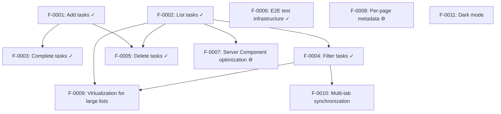

```mermaid
graph TD
    F-0001["F-0001: Add tasks ✓"]
    F-0002["F-0002: List tasks ✓"]
    F-0003["F-0003: Complete tasks ✓"]
    F-0004["F-0004: Filter tasks ✓"]
    F-0005["F-0005: Delete tasks ✓"]
    F-0006["F-0006: E2E test infrastructure ✓"]
    F-0007["F-0007: Server Component optimization ⚙"]
    F-0008["F-0008: Per-page metadata ⚙"]
    F-0009["F-0009: Virtualization for large lists"]
    F-0010["F-0010: Multi-tab synchronization"]
    F-0011["F-0011: Dark mode"]

    F-0001 --> F-0003
    F-0002 --> F-0004
    F-0001 --> F-0005
    F-0002 --> F-0005
    F-0002 --> F-0007
    F-0002 --> F-0009
    F-0004 --> F-0009
    F-0004 --> F-0010
```
